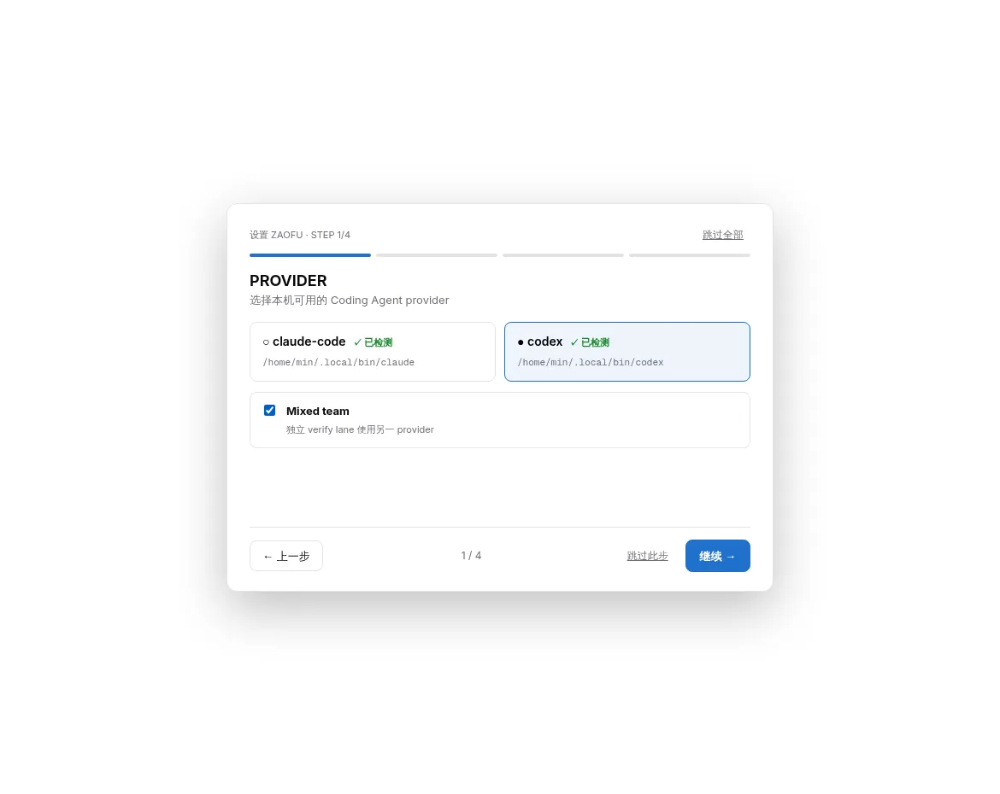
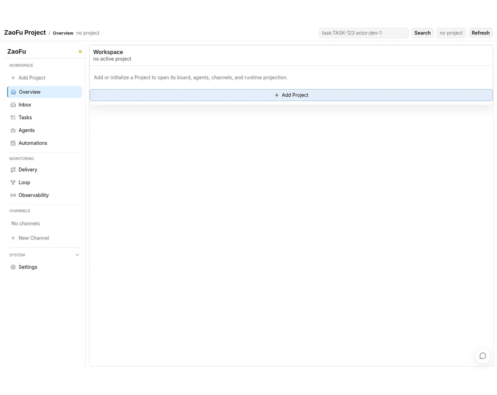
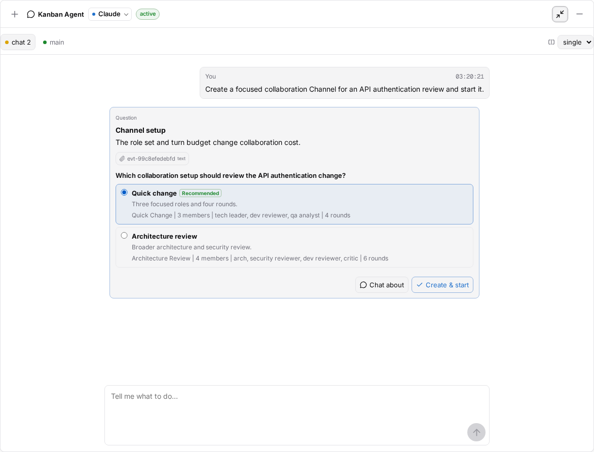
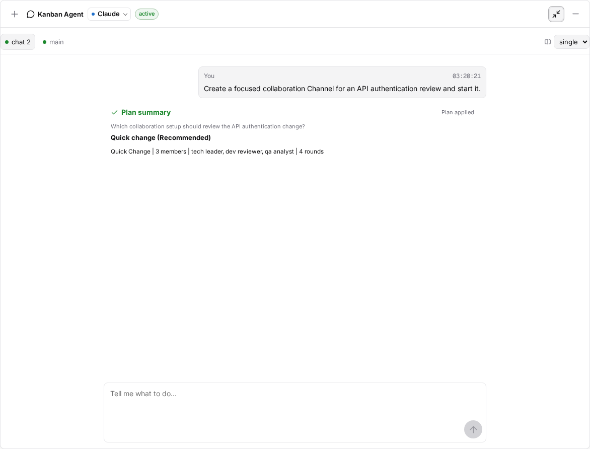
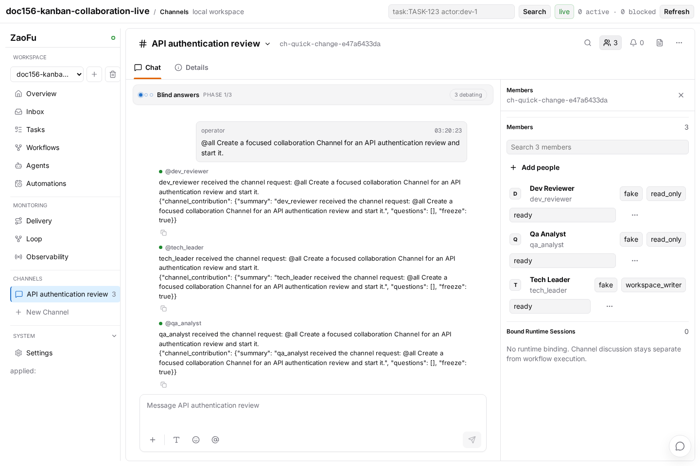
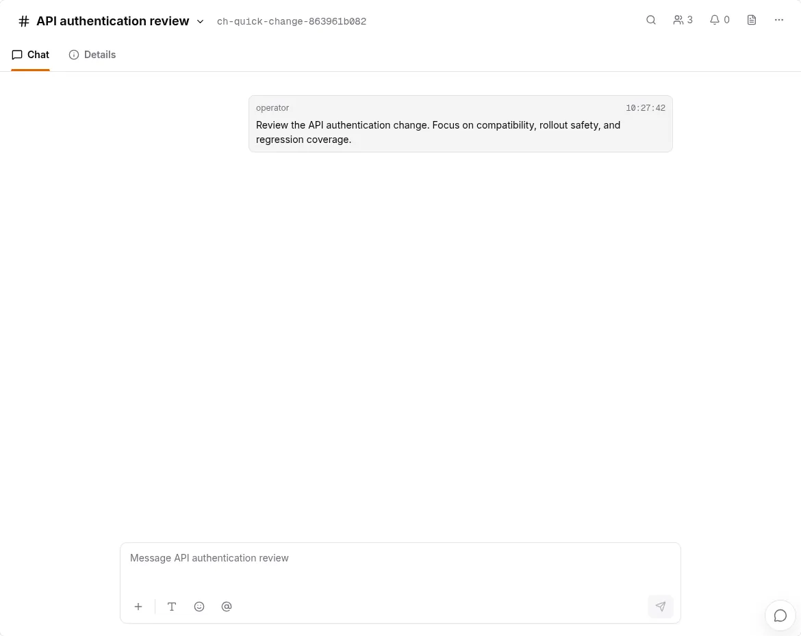
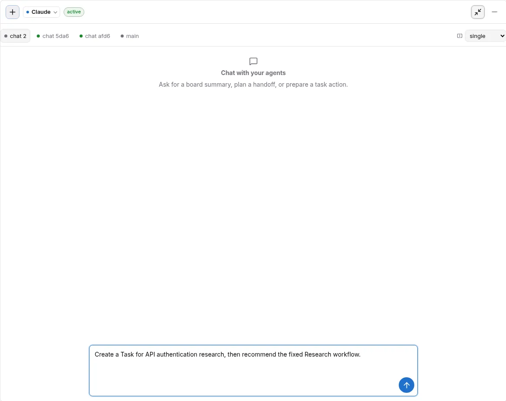

# ZaoFu Quickstart

> For operators installing ZaoFu for the first time, completing Web Bootstrap,
> creating or opening a Project, and then using the Kanban Agent with Channels,
> Research, and delivery Workflows.
>
> This route was verified against the CLI, Web UI, event ledger, and real
> browser E2E on 2026-08-03. Each animation and key screenshot is assembled
> from real Playwright interaction states; the acceptance checks also inspect
> the API, Stores, and EventLog instead of treating screenshots as runtime
> proof.
> Channel currently defaults to the `conversation` product mode. Bounded
> fanout/synthesis starts only after explicit `multi_lens` selection and Discuss.

## Completion Route

```text
Install ZaoFu
  -> Bootstrap (installation settings)
  -> Add/Open Project (project initialization)
  -> Kanban Agent
       |-> code directly
       |-> create Channel -> multi-role discussion -> confirm Create Task proposal
       |-> create Research Task -> Plan -> Approve -> Research Workflow
       `-> create regular Task -> Plan -> Approve -> Delivery Workflow
```

Keep three boundaries clear:

- Bootstrap does not create a Project. Project initialization does not create a
  Task or start a Workflow.
- A Channel is independent from a Workflow. Discussion output does not
  automatically create a Task or ignite execution.
- Research and delivery use the same Task-bound start path but select different
  active routes.

## 1. Install ZaoFu (Required)

Prerequisites:

- Python 3.11+, `uv`, Git, and `tmux`;
- at least one installed and authenticated provider CLI: Codex or Claude Code;
- the `stream-json` extra when using the Claude Code stream-json transport.

Install from a source checkout and verify the CLI:

```bash
git clone https://github.com/uisee-ai/zaofu /path/to/zaofu
cd /path/to/zaofu
uv sync --extra dev --extra web --extra stream-json

uv run zf --version
uv run zf doctor provider --backend codex
```

Start the Workspace Dashboard:

```bash
export ZAOFU_ROOT=/path/to/zaofu
"$ZAOFU_ROOT/tools/start-webkanban.sh" \
  --host 127.0.0.1 \
  --port 8001 \
  --workspace-only
```

The launcher builds Web, reuses or creates the Web action token, loads
Workspace provider environment variables, and applies the trusted-local
Codex headless sandbox policy. Open `http://127.0.0.1:8001/`. Bind to
`0.0.0.0` only on a trusted network.

Completion signal: the Dashboard opens at installation onboarding. This guide
does not require creating a throwaway Project during installation.

## 2. Bootstrap (Required)

The first-run flow has four installation-level steps:

1. **Provider**: choose Codex or Claude Code as the primary provider. Enable
   Mixed team when both are available so the other provider can run an
   independent verification lane.
2. **Environment**: verify host dependencies and provider availability.
3. **Access**: establish a controlled action session for the current browser.
4. **Ready**: enter the empty Workspace.



Bootstrap writes Workspace/onboarding settings only; it does not call Project
init. A Workspace with zero Projects is the expected result.

Completion signal: Ready reports Provider, Team, Environment, and Access as
available.

## 3. New/Open Project (Required)

In the Workspace, click `+` beside the Project selector:

1. Enter a Project path on the **server host**.
2. Click `Inspect`.
3. Review the single admission action and diagnostics returned by the server.
4. For `initialize_project` only, provide Project Name, Project Brief, Project
   Stack, Primary Provider, and optional Mixed team.
5. Run the offered `Open Project`, `Add & Open`, `Initialize & Open`, or
   `Create Project` action.



Inspect chooses an action from disk truth:

| Directory state | Behavior |
|---|---|
| Registered and healthy | Open directly |
| Valid `zf.yaml`, not registered | Register and open |
| Valid config, runtime state missing | Initialize state and open |
| No `zf.yaml` | Create a default multi-kind Project |
| Invalid config or partial non-empty state | Return `blocked`; repair it instead of overwriting by guess |

The Project Brief should contain durable background, goals, and constraints,
not a one-off Task prompt. Initialization then:

- saves `project.description` in `zf.yaml`;
- writes the managed Project Context block to `AGENTS.md`;
- writes the stack and detected build/test commands to a managed Profile block;
- keeps `CLAUDE.md` provider-specific and referencing `AGENTS.md`;
- registers the Project in the Workspace without creating a Task or starting a
  Workflow.

For a missing or empty target, `Create Project` generates a minimal
README/src/tests structure, a dedicated Git repository, and an initial HEAD so
the default worktree runtime can start. Web does not `git init` or commit an
existing non-empty code directory; the operator must establish a trusted Git
baseline first.

Registered Projects do not need re-importing. Refresh the Workspace and open
them.

### Where `zf.yaml` Fits

`zf.yaml` remains the only control plane. Add/Open Project no longer asks the
operator to select a YAML, preset, Controller, kind, scale, lane, or role:

- a valid existing `zf.yaml` remains unchanged;
- a new directory receives the default multi-kind `zf.yaml`;
- Stack controls project instructions and command profiles, not Workflow choice;
- Provider selection compiles provider policy, while Mixed team never creates
  `backend: mixed`;
- the Kanban Agent recommends only routes expanded from the current active
  catalog.

Use `zf profile bootstrap` only when explicitly selecting a single Controller,
migrating the control plane, or materializing Bootstrap recommendations.

Completion signal: Project Overview shows the correct name and Brief, and the
Project appears in the Workspace selector.

## 4. Use the Kanban Agent (Required)

The Kanban Agent is a general coding agent inside the Project, not merely a Task
creator or board supervisor. It can analyze and modify Project code and run
tests in the current provider session. Create a Task only when execution needs
durable tracking.

| Goal | Task first? | Interaction and result |
|---|---:|---|
| Analyze, modify code, or run tests | No | Work directly under current permission and Git rules |
| Create a tracked work item only | No | Confirm a `Create Task` proposal |
| Clarify or review with multiple roles | No | Choose a Channel setup Plan; creation enters natural conversation, while multi-lens work is explicit |
| Run fixed-role deep research | Yes | Choose a Research route Plan, then Approve |
| Run PRD/Issue/Refactor/Planning delivery | Yes | Choose an active route Plan, then Approve |

There are two core human stops:

- **Plan** clarifies routes, templates, members, rounds, and parameters.
  `Chat about` supports discussion and customization.
- **Approve** confirms the exact action, Task, route, objective, and parameters
  before applying side effects.

Do not preselect lanes or roles while creating a Project. The Kanban Agent
should classify the concrete request and recommend a registered single-lane,
multi-lane, Research, or other active route.

The two chat surfaces are identified by their headers:

| Surface | Header identity | Purpose |
|---|---|---|
| Kanban Agent | `Kanban Agent`, provider, and `active` status | General Project coding conversation and Plan/Approve interactions |
| Channel Group | `# Channel name`, Channel ID, and member count | Multi-role discussion inside a created Channel |

The upper-left header continues to say `Kanban Agent` in fullscreen mode.
A Channel page always starts with `#` and the Channel name.

## 5. Create a Channel with the Kanban Agent (Recommended)

The canonical model behind the product term Channel Group is a runtime
**Channel + Members**, not a static `zf.yaml` block. Ask explicitly for a
multi-role discussion:

```text
Create a focused review Channel for the API authentication change.
Use natural conversation; do not fan out, create a Task, or start a Workflow automatically.
```

The Kanban Agent returns a Channel setup Plan showing template, member roles,
member count, and discussion mode. Use `Chat about` to adjust the scope, then
select an option and click `Create & start`.



The recommended option in the screenshot has this complete configuration:

```text
Quick Change
  members: 3
  roles: tech_leader, dev_reviewer, qa_analyst
  max_rounds: 4
```

The displayed `4 rounds` is `overrides.budget.max_rounds`. It limits an
explicit bounded `multi_lens` discussion; it does not make the default
`conversation` fan out automatically and is not the Kanban Agent provider's
`max_turns`. To change roles, member count, mode, or budget, use `Chat about`
and apply the revised Plan.

One action then:

```text
creates the Channel
-> materializes template members, role context, skills, and write policy
-> posts the original request
-> initializes the declared product mode
-> conversation waits for directed human/Leader interaction
-> only explicit Discuss / multi_lens runs bounded multi-perspective work
```

There is no second manual Channel, member invitation, or message-copying step.
Channel creation does not emit `workflow.invoke.requested`.

After creation, the Kanban Agent collapses the Plan while preserving the final
template, roles, member count, and round budget:



The current Web UI does not automatically replace the main page with the new
Channel after `Plan applied`. Open it as follows:

1. Select `Minimize Kanban Agent` (`-`) in the upper-right corner.
2. Wait for the new row under the left-hand `Channels` section; its trailing
   number is the member count.
3. Select the Channel name.
4. After the header changes to `# Channel name`, select the Members icon and
   verify the roster.

```text
[Kanban Agent]  Plan applied
        |
        | Minimize
        v
left Channels -> API authentication review                         3
        |
        v
[# API authentication review]  Chat | Details              Members 3
```



Completion signal: the Plan says `Plan applied`; the new Channel row shows the
expected member count; opening it reveals the original request, member roles,
and discussion state.

## 6. Discuss Inside the Channel Group (Recommended)

A Channel thread preserves the original request, role replies, open questions,
and synthesis. The product exposes `conversation`, `clarification`, and
`multi_lens`; `manual_mention`, `mention_relay`, and
`fanout_then_synthesis` are compatibility engine mappings. Role permissions,
skills, Leader, and default responder come from the materialized template.



The number beside the Members icon comes from this Channel's canonical
`members`. It is neither the total Project agent count nor the later Workflow
role count. Select the icon to inspect each member's role, status, provider,
and write policy. The example has three members: `tech_leader`,
`dev_reviewer`, and `qa_analyst`.

After discussion:

- a person can continue the same request or enter a new one in the Channel;
- explicit Finalize can produce a PRD draft; only an Owner-confirmed revision is the canonical PRD;
- the Channel or Kanban Agent can propose `Create Task` from the result;
- a person must confirm that Task proposal; the Channel cannot auto-create it;
- PRD decomposition belongs to subsequent Workflow planning, not direct
  canonical Task mutation by the Channel or Kanban Agent.

When Feishu is enabled, the same Channel, messages, approval intents, and
results project through events and controlled actions instead of creating a
second business-state system. See
[15 Channel Collaboration](15-channel-collaboration.en.md).

To return to the general coding conversation, select `Open Kanban Agent` in the
lower-right corner. This does not close or discard the Channel thread.

Completion signal: role replies and synthesis remain visible, the composer
accepts a continuation, and no Task or Workflow appears merely because the
discussion ended.

## 7. Create a Research Workflow (As Needed)

Research is a Task-bound Workflow, not an alias for a Channel template. Create
or select a tracked Task, then ask the Kanban Agent for the Research route:

```text
Create a Task for API authentication research, then recommend the fixed Research workflow.
```



The start path is:

```text
existing Task
-> read active route catalog
-> Plan selects research:fixed and parameters
-> independent Approve
-> workflow.invoke.requested
-> research-fanout
```

The default fixed roles are `source_researcher`, `product_analyst`,
`technical_analyst`, `risk_critic`, and `synthesizer`. Research produces an
evidence-backed summary, citations, open questions, and PRD/Refactor prompt
inputs. It does not automatically create a delivery Task.

The `research-review` Channel template performs discussion/review only.
Research Workflow starts only when a Task exists, the operator explicitly
chooses Research, and the Project active catalog exposes `research:fixed`.

Completion signal: the Approve card names the exact Task and `research:fixed`;
after confirmation it shows `Workflow started`, with exactly one
Task-bound `workflow.invoke.requested` in the ledger.

## 8. Create a Task and Start Delivery Directly (Recommended)

For a concrete requirement that should use a registered delivery route, ask in
one Kanban Agent conversation:

```text
Create a Task for authentication policy validation and recommend a focused delivery workflow before starting it.
```


The closure order is fixed:

```text
Create Task proposal
-> confirm Task creation
-> Workflow Plan (active route / topology / output / parameters)
-> select, Chat about, or Customize
-> independent Approve
-> workflow.invoke.requested
```

Plan is not authorization. `Continue` only turns the selection into an exact
proposal; `Start workflow` performs ignition. Even a simple job must map to a
registered `zf.yaml` stage rather than inventing a single-agent lane that the
Kanban board cannot project.

Inspect the same surface-neutral routes from the CLI:

```bash
cd /path/to/project
uv run --project "$ZAOFU_ROOT" zf workflow routes \
  --task TASK-ID \
  --format json
```

Completion signal: the Task exists, Approve changes to `Workflow started`, and
the invoke event binds the same Task and selected pattern.

## 9. Start and Observe the Runtime (When Real Workers Are Needed)

Creating a Project or starting the Dashboard does not launch workers. From the
Project root:

```bash
cd /path/to/project
uv run --project "$ZAOFU_ROOT" zf validate --cold-start
uv run --project "$ZAOFU_ROOT" zf start
```

Observe from another terminal:

```bash
uv run --project "$ZAOFU_ROOT" zf status --workers
uv run --project "$ZAOFU_ROOT" zf kanban --board
uv run --project "$ZAOFU_ROOT" zf events --last 30
```

`zf start` starts workers, sidecars, and the watcher. Idle workers are correct
when there is no approved `workflow.invoke.requested`.

Stop with:

```bash
uv run --project "$ZAOFU_ROOT" zf stop
```

Use `zf stop --force` only if graceful shutdown fails. Do not run
`tmux kill-server` on a shared host.

## Create a Project from the CLI

Web greenfield, `zf project init`, and `tools/init-project.sh` share
`init_flow_project` semantics:

```bash
uv run --project "$ZAOFU_ROOT" zf project init \
  --name account-service \
  --description "Account and authentication service with staged security-policy migration." \
  --root /path/to/account-service \
  --create \
  --git-init \
  --backend codex \
  --verify-backend claude-code \
  --stack python \
  --workspace-register
```

This creates a Project only. It does not create a Task or ignite a Workflow.

## Next

- [Project Creation, Bootstrap, and Workflow Ignition](20-project-bootstrap-workflow-ignition.en.md)
- [`zf.yaml` Control Plane and Runtime State](02-zf-yaml-control-plane.en.md)
- [Channel Collaboration](15-channel-collaboration.en.md)
- [Web, Observability, and E2E](06-web-observability-e2e.en.md)
- [Troubleshooting](07-troubleshooting.en.md)
