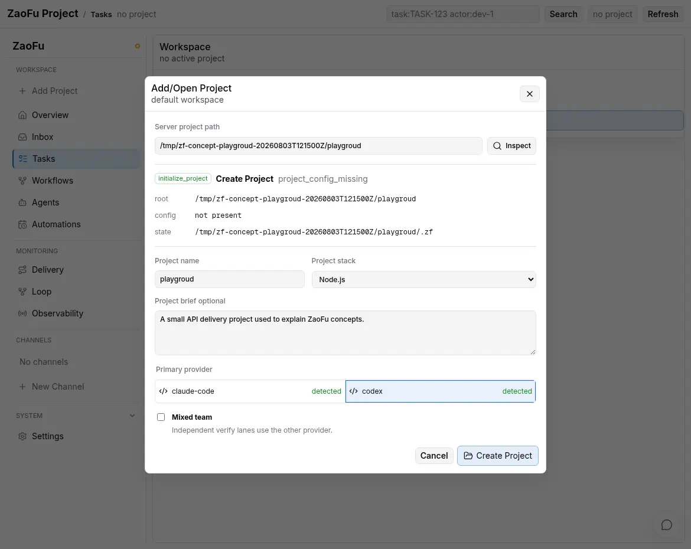

# Harness 运行流程

> 适用对象：需要理解 ZaoFu 如何把已批准目标推进为任务、执行、证据和关闭结论的操作者。
> 当前权威边界以代码、测试和本手册描述的 Product Flow / Legacy safe-team 合同为准。

## 1. 先区分事实层与执行模式

ZaoFu 不是“一个 Agent 指挥其他 Agent”的单层系统。当前运行时按事实责任分层：

| 层 | 负责什么 | 合法写入路径 |
|---|---|---|
| 控制平面 | 拓扑、角色、策略、预算、`project.state_dir` | `zf.yaml` |
| 发生账本 | occurrence、顺序、因果、判定、引用 | `EventWriter` / `EventLog` |
| 当前状态 | Task、Feature、Session、RoleSession、TaskAttempt | 对应 Store 与 Kernel action |
| 语义与证据 | plan、Task Map、矩阵、报告、大 payload | 原子 artifact/sidecar writer + ref/digest |
| 查询投影 | SQLite、Web、Trace、Graph、Loop、摘要 | projector/read model；可诊断、可重建 |

Worker 只能报告事实、证据或动作意图，不能直接修改 Kernel 管理的 canonical state。
Web、Channel、Feishu 和 Kanban Agent 同样不能旁路这些入口。

ZaoFu 同时支持两种明确配置的编排模式：

| 模式 | 快乐路径 owner | `orchestrator` role 的责任 |
|---|---|---|
| Product Flow | Kernel 根据 topology/profile 做机械调度 | 默认低频异常分诊；显式 `semantic_control` 可在预注册 checkpoint 做 shadow/blocking 判断，但不直接写状态 |
| Legacy safe-team | Layer 2 Agent 可做语义拆解、合同合成和显式 assign | 兼容早期 team；必须由 profile 明确选择 |

新建 Issue、PRD、Refactor 和长期交付流程默认按 Product Flow 理解。不要把 legacy safe-team
中的 Layer 2 行为外推成全局规则，也不要把 Python `WorkflowRuntimeCoordinator`
（兼容 alias 为 `Orchestrator`）与配置中的 `orchestrator` role Agent 混为一谈。

## 2. Product Flow 的主链路

```text
approved request / typed event / artifact
  -> freeze effective config / workflow generation / Run Contract
  -> run admission
  -> Kernel 解析 workflow topology 与当前 readiness
  -> v3 stage/fanout/barrier 或显式 v4 Task-local operation
  -> WorkflowOperation + TaskAttempt / lease / dispatch token 持久化
  -> transport 投递 briefing
  -> Worker 产出 result、artifact 和 evidence
  -> Kernel 做 schema、状态、证据存在性和安全门禁
  -> 下一 stage / fanout / barrier / bounded rework
  -> terminal predicate + closure verdict
```

这条链路有三个关键边界：

1. Agent/skill/prompt 决定项目语义、拆解方法、验收质量和方案判断。
2. Kernel 决定已声明拓扑中的 readiness、WIP、lease、dispatch、机械 gate 和状态迁移。
3. 异常中的语义判断先形成 proposal；只有 `ControlledActionService` 才能应用批准动作。



实际 stage、pipeline、fanout、terminal predicate 和返工路由，以 `zf.yaml` 及
`zf workflow inspect` 的解析结果为准，不以某份手册中的固定 dev-review-test-judge 链为准。
Research 入口还会把 prompt、effective config、route/template、role、Task contract 和 Run
Contract 绑定到 immutable `workflow_generation`；`zf start` 在 transport 初始化前隔离已漂移的
旧 generation。

## 3. 启动、Watcher 与唤醒

`zf start` 加载 `zf.yaml` 和解析后的 `project.state_dir`，启动配置的 tmux/stream-json
transport 与 sidecar，然后由 `EventWatcher` 跟随 `events.jsonl`：

- wake-worthy 事件触发 `WorkflowRuntimeCoordinator.run_once()`；
- 周期 tick 检查 stalled worker、orphan task、context pressure 和恢复请求；
- projection/sidecar 按各自合同刷新，但不能成为第二控制面。

```bash
uv run zf start
uv run zf events --last 30
uv run zf watch --follow
uv run zf status --workers
```

`--foreground` 是兼容旧命令的 no-op alias；`--no-watch` 才会明确关闭长期 watcher。
只启动 tmux 而没有 watcher，Worker 即使已返回结果，后续 stage 也可能不会被消费。

## 4. Admission、Attempt 与 Dispatch Token

调度前，Kernel 至少核对：

- run 是否获准、当前任务依赖是否满足；
- stage/role/worker 是否来自已解析拓扑；
- WIP、预算、并发、workspace 和安全策略是否允许；
- Task contract、required artifacts 和输入引用是否完整；
- TaskAttempt/lease 是否已持久化，dispatch 是否仍有效。

每次投递都有独立 `dispatch_id`。Worker 结果必须与当前 attempt/token 对齐，避免旧 session、
重放事件或重复回调误关任务。Provider transport 成功不等于语义完成；attempt delivery、
Worker result、gate verdict 和 task closure 是不同阶段。

## 5. 证据门禁与完成定义

ZaoFu 不以 Agent 的“已完成”文本作为终点。关闭至少需要：

- 合法的 stage/attempt 事件链；
- 当前 topology 的 terminal predicate 已满足；
- required artifact、test result、git evidence 和 digest/ref 可解析；
- mechanical gates 与配置的 discriminator 已通过；
- Goal/Claim/Task/Evidence 覆盖可解释，没有未裁决 blocker。

`quality_gates` 检查命令或机械事实；discriminator 检查合同证据是否足够。语义验收方法和
产品 parity 应由 skill/prompt/Agent artifact 表达，不能为了某个项目硬编码进 runtime。

直接执行 `zf kanban move <task_id> done` 也必须通过当前 topology 的 closure 检查。缺少证据时，
Kernel 会拒绝迁移并记录可审计事件。

## 6. Fanout、Barrier 与有界返工

Product Flow 可以声明串行 stage、fanout/fan-in、lane、barrier、reader/writer 分工，以及
Issue/PRD/Refactor 的自定义 topology。Kernel 只对声明后的机械依赖做调度。

当前有两条明确的 delivery execution profile：

- v3（默认）：stage/fanout/barrier 按已注册 DAG 推进；
- v4（默认关闭 canary）：每个 Task 独立执行 `Impl -> Task Verify -> Integration Admission ->
  Candidate Integration`，物理 Worker Slot settled 后可复用，最终仍对 frozen exact Candidate
  执行全局 Verify/Discovery/Goal Closure。

v4 只改变 operation placement、capacity 和 Task-local handoff，不改变 briefing/artifact/result
语义；`shadow` 不接管业务 dispatch，`blocking` 也只允许显式 canary。当前 rollout NO-GO。

返工目的地按当前合同和 topology 推导，典型优先级为：

1. 当前 Task contract 的合法 rework 指示；
2. `workflow.rework_routing`；
3. profile 的兼容默认值。

`max_rework_attempts`、no-progress detector 和 budget gate 防止无限循环。超过边界后应进入
owner-visible escalation、replan proposal 或受控恢复，而不是静默重复相同 prompt。

## 7. 长任务恢复与上下文继承

| 风险 | 运行时信号 | 处理方向 |
|---|---|---|
| Worker 无进展 | stuck/silent-stall/no-progress | checkpoint、retry、requeue 或语义分诊 |
| Task 已运行但无有效结果 | orphan/lease expiry | 校验 attempt 后恢复或升级 |
| 上下文接近上限 | context warning/compact/hard-cap | 先写 artifact/StatePacket，再 compact 或换 session |
| 当前计划不再适用 | goal gap/replan required | 产出 replan proposal，批准后受控应用 |

常用 role 配置包括：

```yaml
stuck_threshold_seconds: 180
orphan_warning_seconds: 300
orphan_escalate_seconds: 600
context_window_tokens: 200000
context_warning_threshold: ${ZF_CONTEXT_WARNING_THRESHOLD:-0.6}
context_compact_threshold: ${ZF_CONTEXT_COMPACT_THRESHOLD:-0.7}
context_hard_cap: ${ZF_CONTEXT_HARD_CAP:-0.9}
max_rework_attempts: 3
```

`.env` 只为 `zf.yaml` 中实际引用的变量提供值。旧字段是否兼容以 config loader 和
`zf validate --cold-start` 为准。

详细操作见[恢复长任务](operations/recover-long-running-run.md)和
[上下文、交接与 Artifact](operations/context-handoff-artifacts.md)。

## 8. 观测、Supervisor 与 Autoresearch

- Provider transcript/session tailer 把工具调用、文本、usage 等转换为 `agent.*` 事件或 sidecar 引用。
- Run Manager 从 current facts 选择有界恢复动作并要求 post-verification；resident Agent 只能提出建议。
- Supervisor 观察失败信号并形成 attention/projection，不直接 kill Worker 或手写状态。
- Autoresearch 执行深度诊断或隔离修复候选；默认不直接应用到主线。

当前 Supervisor 与 Run Manager 仍是两个组件；统一 Recovery Coordinator 只是候选设计，不能
假设已有一个合并后的 CLI、queue 或状态 owner。恢复动作仍由 sanctioned controlled-action 路径
应用，Autoresearch 只处理重复、复杂的 harness fingerprint。

Codex/Claude hooks 只增强 telemetry，不拥有 task truth。Hooks 未授权会造成观测缺口，但不能
据此推导代码未执行或任务已完成。

## 9. 一轮交付的签收

```bash
uv run zf kanban --board
uv run zf task trace <task_id>
uv run zf refs verify
uv run zf metrics snapshot
uv run zf doctor
```

最终检查：Task/Feature 已按 terminal predicate 关闭；Goal Dossier 中 Claim 覆盖和证据可回读；
没有未处理 fatal/blocker；git base/head/log/diff 可定位；必要测试、projection freshness 和
外部副作用均有证据。Web 观察路径见[观察一次交付](operations/observe-delivery.md)。

真实五类验证不能把入口 turn、`fanout.started` 或 Agent 自述当成功：PRD/Issue/Refactor/General
必须等待 exact Run 的 `run.goal.completed` 及适用的 Task terminal；Research 必须同时具备
completed aggregate、lineage/digest 一致的 `workflow.result.available(research_report)` 和
Task terminal。仓库终态 runner 见[Product Fanout 与五类 Workflow E2E](18-product-fanout-real-e2e.md)。
