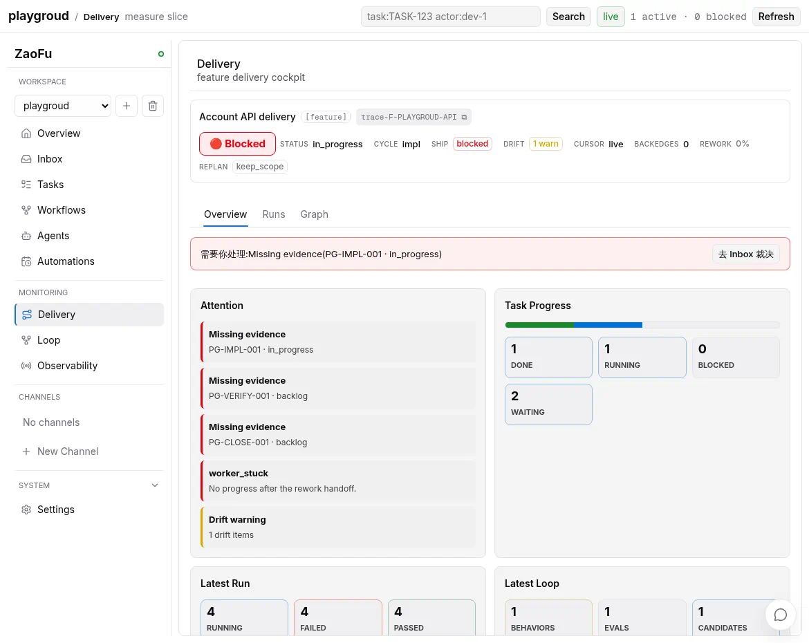

# Web Dashboard User Guide

[中文](06-web-observability-e2e.md) · [Manual home](00-index.en.md)

> For operators who manage Projects, Tasks, Workflows, Agents, and delivery evidence in ZaoFu.
> Browser tests, real-provider smoke, and release validation are in the [maintainer guide](operations/web-maintainer-validation.en.md).

## 1. Start and Select a Project

Install dependencies and use the canonical launcher:

```bash
uv sync --extra dev --extra web
tools/start-webkanban.sh --host 127.0.0.1 --port 8001
```

The launcher coordinates the Web build, action token, Workspace/provider environment, Codex headless
sandbox policy, tmux, and restart behavior. Use `--host 0.0.0.0` only on a trusted network for a container
or remote browser.

```bash
tools/start-webkanban.sh --port 8001 --status
tools/start-webkanban.sh --host 127.0.0.1 --port 8001 --no-build
tools/start-webkanban.sh --port 8001 --stop
```

For a read-oriented view of a specific state directory, use the lower-level entry point:

```bash
uv run zf web --state-dir /tmp/zf-run/.zf --host 127.0.0.1 --port 8002
```

It does not supply the launcher's trusted-local provider environment. Prefer the launcher for real
Channel/Kanban Agent provider operations.

Select the Project at the top. Project scopes every Task, Run, Channel, and projection. Before acting,
confirm that the Project name, Live state, and URL query changed together.

## 2. Workspace: Daily Operations

Workspace answers “what do I need to do?”:

| Page | Main use | Key question |
|---|---|---|
| Overview | Project goal, task flow, cost, and health summary | what is the most important progress or risk now |
| Inbox | proposals, exceptions, and notices requiring owner judgment | what semantic or action decision needs a human |
| Tasks | Kanban, Task contract, and detail | where is this Goal/PRD/Issue/Refactor now |
| Workflows | Needs decision, Active, and History | which exact proposal can be approved and which Run is active |
| Agents | role/provider/worker, usage, cost, skills, context | who is working and who is stuck or near a context boundary |
| Automations | Daily/Weekly/Project Monitor schedules | when it runs and whether its last execution succeeded |

A practical route is Overview -> Inbox -> Tasks -> Workflows, with Agents as an execution drill-down.

## 3. Tasks: From Board to Evidence

After selecting a Kanban Task, read its details in layers:

| Tab | Content |
|---|---|
| Summary | objective, contract, owner, dependencies, current stage/status |
| Activity | timeline, attempts, dispatch, rework, and key events |
| Evidence | artifact refs, tests, Git evidence, verdict, and closure basis |
| Advanced | raw contract, diagnostics, refs, and low-level runtime data |

A card state is not completion evidence. Connect Goal/Claims, current attempt, required artifacts,
verification, terminal verdict, and Git evidence.

```bash
uv run zf kanban show TASK-ID
uv run zf task trace TASK-ID
uv run zf runs for-task TASK-ID
```

Creating a Task, choosing a Workflow, and approving a proposal are distinct actions. A Task does not mean
a Workflow has started, and selecting a plan/route is not approval.

## 4. Workflows: Approve the Exact Proposal

- **Needs decision**: inspect objective, route, parameters, and risk.
- **Active**: inspect admitted Runs, current stage, and wait reasons.
- **History**: inspect closed, rejected, failed, and superseded proposals/Runs.

Before approval, verify Task, route, objective, input refs, and parameters against the current requirement.
Approval binds one exact proposal; any semantic change requires a new one. External effects use an action
token/trusted-session controlled path, and provider Agents never receive that token.

## 5. Delivery: Read the Whole Workflow

Monitoring **Delivery** is Feature-scoped and has three modes:

| Mode | Question answered |
|---|---|
| Overview | current ship readiness, Task/Run summary, and primary blocker |
| Runs | Run graph progress plus Task attempts, gates, events, evidence, and regression actions |
| Graph | whether Goal -> Claim -> canonical Task is closed across Plan, Implementation, Verification, and Closure, including Gaps/currentness |

Select the correct Feature, then inspect status/ship/drift/replan. In Runs, transport delivery, Worker
result, gate verdict, and closure are separate lifecycle points. Runs is one Run + Inspector workbench; it
does not duplicate a Stage Heatmap or delivery-synthetic Span waterfall. Graph is one lightweight coverage
surface, and node count is not a quality measure. Use `Traces` for a Span Tree/Waterfall; Runs exposes that
handoff only for a verified canonical Trace reference.

Overview evaluates ship readiness through the existing graph/drift/ship
projection. Runs reports ship as `not_evaluated / summary_only` and never infers
ready from all Tasks being done. Delivery v2 does not provide a Latest Loop
summary; open the top-level `Loop` surface for behavior/evaluation/improvement.

Goal Dossier summarizes Goal -> Claim -> Task -> Evidence -> Verdict. Before closure, inspect mandatory
Claim coverage, terminal Tasks, missing evidence, current generation, and owner decisions.

## 6. Loop, Traces, and Operations

**Loop** shows convergence through plan/execute/verify/rework, GAN/critic, recovery, autoresearch, or other
profile-defined loops. Check whether each round reduces the gap, adds evidence, or crosses a no-progress,
budget, or replan boundary.

Loop owns only its scoped projection; opening it does not fetch the Delivery feature list. For a Task with
many attempts, the drawer shows the first 100 and expands through **Load more**. Counts, Timeline, the
Completion Promise, and Business Loops still use the complete projection rather than treating the visible
window as complete history. Semantic events invalidate the view through a bounded refresh, while mechanical
heartbeat/tick pump events do not issue page requests.

**Traces** is the canonical low-level causation surface. Filter the bounded list by Task, actor, status,
duration, role, or backend; selecting a row then reads bounded detail and lifecycle spans in parallel. The
wide viewer presents sourced Span Tree/Waterfall data and a selected-span Inspector before ZaoFu's
Execution Route and Event evidence. Raw remains lazy inside selected evidence. Current spans come only
from allowlisted kernel/runtime started-to-terminal lifecycle pairs and carry source, truth class, coverage,
and degradation metadata. Events, stages, causation links, and Delivery synthetic spans are never relabeled
as provider-native LLM/tool spans. A trace without a trustworthy pair explains its coverage and falls back
to Execution/Events. A direct `?page=traces&project=...&trace_id=...&span_id=...` link stays project scoped
and does not bootstrap the full dashboard snapshot first. A focused item resolves spans outside the initial
bounded window in that same response; **Load earlier spans** expands history through the bound cursor.

Events, Event Logs, Runs, Fanouts, Candidates, Integration, and Repair remain low-frequency compatibility
diagnostics. Operations still shows provider capability, OTLP exporter, SSE, and runtime health and remains
reachable through `?page=observability&obs_tab=operations`. Runtime Logs no longer has a standalone Web
panel, while its redacted rotating store and bounded HTTP API remain. Raw is expanded only inside a selected
object detail.

Use Tasks, Delivery, and Goal Dossier for normal acceptance. Use Traces/Operations to explain why execution
did not continue or which attempt/projection failed.

### Optional OTLP, Provider telemetry, and Operations

The OTLP exporter is off by default and is scheduled only by the `zf start` runtime tick. Running `zf web`
alone only reads existing state; it never starts an exporter, collector, or extra background thread. Store
only environment-variable names under `ZfConfig.spec` in `zf.yaml` (or at the root of a legacy single-document
config):

```yaml
observability:
  otlp_exporter:
    enabled: true
    endpoint_env: ZF_OTLP_ENDPOINT
    headers_env: ZF_OTLP_HEADERS # optional JSON-object environment variable name
    batch_size: 64
    healthy_sample_rate: 0.1
  alerts:
    enabled: true
    cooldown_seconds: 300
```

Provide endpoint/header values only through controlled runtime environment variables. Do not commit URLs,
Bearer tokens, or header JSON to YAML, events, or screenshots. Operations shows health, backlog, last
success/failure, sampling/drop/redaction counters, and the SSE-gap summary. The exporter emits redacted
ZaoFu synthetic spans only; it does not query provider raw waterfalls in the Web UI and cannot change a
Delivery Graph, Gate, or Task state. For the complete operations path, metrics token gate, Runtime Logs API,
Provider support matrix, canary, and rollback, see
[Metrics, Observability, and Operations](21-metrics-observability-operations.en.md) and
[Provider Native Telemetry and OTLP](22-provider-native-telemetry.en.md).



## 7. Channels: Discussion Is Not Execution

Open a Channel from the Project rail. Humans, provider Agents, personas, owner delegates, and observers can
clarify an ambiguous requirement in shared context.

- ordinary messages remain conversation and do not auto-fanout;
- explicit Discuss enters multi-lens relay/critique/synthesis;
- Finalize creates a draft/canonical candidate; Owner confirm makes it a Task/PRD source;
- only an exact leader with `propose_workflow` may propose a Workflow handoff;
- handoff still needs separate approval and never runs because discussion ended.

See [Channel Collaboration](15-channel-collaboration.en.md) and
[Channel to PRD](workflows/channel-to-prd.en.md).

## 8. Live, Degraded, and Write Actions

Web is a read projection plus controlled-action surface, not a canonical state owner:

- **Live**: SSE/polling is synchronized to the current Project;
- **Reconnecting**: the last known snapshot remains while a gap is recovered;
- **Degraded**: missing projection/sidecar data is explicit rather than shown as fresh;
- when freshness fails, inspect projection/refs/doctor before recovering a Run.

Creating a Task or Channel member, applying a Workflow, maintenance prepare, and runtime resume all use
token/passcode/trusted-session controlled actions and leave audit events. After a UI success message, read
back Task/Event/Workflow state to confirm the effect.

## 9. Delivery Sign-off Route

```text
Tasks: contract and current state
  -> Delivery: stages, attempts, and dependencies
  -> Goal Dossier: Claim coverage and evidence
  -> Inbox: unresolved owner decisions
  -> Observability: only when diagnosis is needed
```

```bash
uv run zf kanban --board
uv run zf task trace TASK-ID
uv run zf refs verify
uv run zf metrics snapshot
uv run zf doctor
```

For browser validation and real E2E, see [Web Maintenance and E2E Validation](operations/web-maintainer-validation.en.md).
