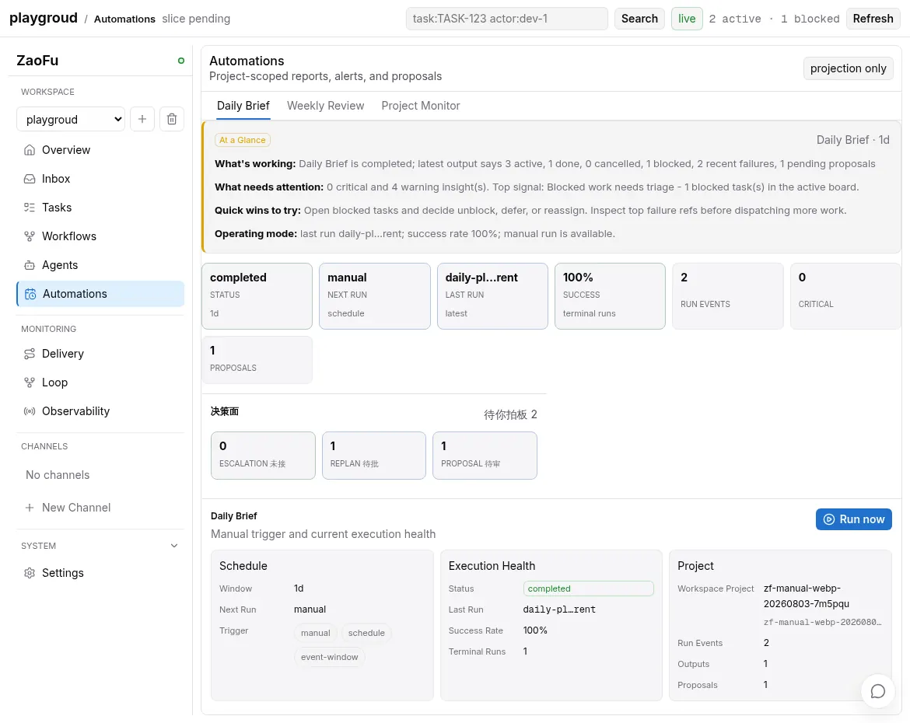

# Feishu Automation / Kanban Sync 使用手册

> 状态: active
> 适用范围: 把 ZaoFu 的只读投影同步到飞书文档和飞书多维表格。
> 主入口: 飞书直连链路见 [19-feishu-ai-native-direct-bridge.md](19-feishu-ai-native-direct-bridge.md)。本文只保留 Automation / Kanban 同步专题细节。

## 边界

本功能只做单向同步:

- Automations 的 `daily-brief`、`weekly-review`、`project-monitor` 汇总为轻量 Overview,追加到飞书文档。
- Automation 的 Project Status / Action Required / Delivery Health / Runtime Health 结构化同步到 Automation Insights 多维表格,这是飞书侧的主入口。
- 当前 Kanban projection 渲染为多维表格记录,以 `Task ID` 为稳定键创建或更新行。
- 飞书文档 / 表格不是 ZaoFu 的控制面,不会反向修改 `events.jsonl`、`kanban.json` 或任务状态。

Automation 文档定位是项目 Overview 封面,不是原始运行日志或诊断台。飞书
多维表格才是日常查看入口,默认使用 `ZaoFu Overview`、`ZaoFu Action Required`、
`ZaoFu Highlights`、`ZaoFu Delivery Health`、`ZaoFu Runtime Health`、
`ZaoFu History` 六个视图组织总览、高亮事项、人工介入、交付健康、运行健康
和历史查询。
详细 trace、events、agent/session、task drilldown 留在 ZaoFu Web / CLI;
详细任务列表仍以 Kanban 多维表格为准。

同步前先在 Web `Automations` 核对 Daily Brief、Weekly Review 和 Project Monitor
的 schedule、execution health、insights、outputs 与 recent runs：



## 环境变量

真实同步需要飞书应用凭据。可以直接 `export`,也可以写到项目根目录 `.env`;
`zf feishu` 会在命令启动时读取 `.env`,但不会覆盖 shell 已有环境变量。

```bash
export FEISHU_APP_ID="cli_xxx"
export FEISHU_APP_SECRET="xxx"
export FEISHU_AUTOMATION_DOCUMENT_ID="docx_xxx"
export FEISHU_AUTOMATION_BITABLE_APP_TOKEN="bascn_xxx"
export FEISHU_AUTOMATION_BITABLE_TABLE_ID="tbl_xxx"
export FEISHU_BITABLE_APP_TOKEN="bascn_xxx"
export FEISHU_BITABLE_TABLE_ID="tbl_xxx"
export FEISHU_FOLDER_TOKEN="fld_xxx"
```

也可以使用 URL,CLI 会自动解析文档 token、Base token 和 `table=` 查询参数:

```bash
export FEISHU_AUTOMATION_DOCUMENT_URL="https://xxx.feishu.cn/docx/docx_xxx"
export FEISHU_AUTOMATION_BITABLE_URL="https://xxx.feishu.cn/base/bascn_xxx?table=tbl_xxx"
export FEISHU_BITABLE_URL="https://xxx.feishu.cn/base/bascn_xxx?table=tbl_xxx"
```

也可以直接设置 `FEISHU_TENANT_ACCESS_TOKEN`,跳过 app_id/app_secret 换 token。

Docx/Base 真实同步推荐使用 `lark-cli` backend。需要确保 `lark-cli >= 1.0.47`
可从 `PATH` 找到。ZaoFu 会把上述凭据映射给子进程,固定使用 Feishu 品牌、
bot 身份和 JSON 输出,不会把 secret 放进命令参数。只有 app ID/secret 时,
ZaoFu 会 mint 并短时复用 tenant token;显式
`FEISHU_TENANT_ACCESS_TOKEN` 优先。

```bash
lark-cli --version
```

Backend 含义:

- `--backend lark-cli`: 推荐的 Docx/Base 外部执行端口。
- `--backend mock`: 只用于本地 deterministic 测试。
- 旧 `--transport real` 仍兼容,等价于 `--backend lark-cli`;不要同时传
  `--backend` 和 `--transport`。

飞书群聊、流式卡片、WebSocket、callback 和 approval 仍使用 ZaoFu 原生
`FeishuHttpTransport`,不会经过 `lark-cli`。已经移除的只是 Docx/Base 原生
投影 client；实时消息 transport 仍是必要组件。

## 初始化飞书目标

如果还没有文档或多维表格,先用显式初始化命令创建目标,不要让 daily/hourly
同步命令隐式创建外部资源:

```bash
uv run zf feishu init-targets \
  --backend lark-cli \
  --write-env
```

常用参数:

- `--folder-token <token>`: 指定飞书云盘目录;不指定则由飞书应用默认位置决定。
- `--document-title <title>`: Automation 文档标题。
- `--base-name <name>`: Kanban 多维表格名称。
- `--table-name <name>`: Kanban 表名称,默认 `Kanban`。
- `--automation-table-name <name>`: Automation Insights 表名称,默认 `Automation Insights`。
- `--field key=字段名`: 创建字段前覆盖默认字段名。
- `--overwrite-env`: `.env` 已有 target key 时允许覆盖。

初始化会创建:

- Automation 文档,用于追加 daily / weekly / project 报告。
- Automation Insights Table,并补齐 summary / insight / highlight 字段和六个推荐视图。
- Kanban Base + Table,并补齐 `Task ID`、`Title`、`Status`、`Assigned To`
  等同步字段,以及用于飞书 Kanban 分组的 `Board Column` 单选字段。
- Kanban Table 默认创建 `ZaoFu Grid` 和 `ZaoFu Kanban` 两个视图。所有视图
  共享同一批记录,但飞书内的筛选、分组、排序可以按视图独立配置。
  初始化会同时设置推荐的可见字段、排序和 Kanban 分组。
- 使用 `--write-env` 时,把 `FEISHU_AUTOMATION_DOCUMENT_ID`、
  `FEISHU_AUTOMATION_BITABLE_APP_TOKEN`、`FEISHU_AUTOMATION_BITABLE_TABLE_ID`、
  `FEISHU_BITABLE_APP_TOKEN`、`FEISHU_BITABLE_TABLE_ID` 写入项目 `.env`。

先看计划但不调用飞书:

```bash
uv run zf feishu init-targets --dry-run
```

本地测试 CLI 写 `.env` 行为可用 mock:

```bash
uv run zf feishu init-targets --backend mock --write-env
```

真实创建需要飞书应用具备创建文档、多维表格、字段的 OpenAPI 权限。即使
`.env` 里有个人 app secret,OpenAPI 调用仍以该应用的 tenant token 身份执行;
若指定 `--folder-token`,还要确保应用对该云盘目录有写权限。

完整初始化至少涉及 `base:app:create`、`base:table:read/create/update/delete`。
对已有表执行投影至少涉及 `base:field:read/create`、`base:view:read`、
`base:view:write_only`、`base:record:read/create/update`;真实删除恢复测试另需
`base:record:delete`。scope 已开通仍不等于资源已授权,目标 Base/Table 还必须对
该应用可见。

只缺少 `base:view:write_only` 时,全量同步命令可通过
`--no-ensure-layouts` 同步记录、字段和视图,但不会自动设置筛选、可见字段、
排序和 Kanban 分组。常驻 projector 当前要求其配置的完整结构权限,不会静默
降级或切换应用。

## Dry Run

先在本地确认输出内容:

```bash
uv run zf feishu sync-automations --dry-run
uv run zf feishu sync-automation-insights-table --dry-run
uv run zf feishu sync-kanban-table --dry-run
```

只同步某一类 automation:

```bash
uv run zf feishu sync-automations \
  --dry-run \
  --automation daily-brief
```

## 真实同步

Automation 报告同步到飞书文档:

```bash
uv run zf feishu sync-automations \
  --backend lark-cli \
  --document-id "$FEISHU_AUTOMATION_DOCUMENT_ID"
```

也可以直接传文档 URL:

```bash
uv run zf feishu sync-automations \
  --backend lark-cli \
  --document-url "$FEISHU_AUTOMATION_DOCUMENT_URL"
```

Automation Insights 同步到飞书多维表格:

```bash
uv run zf feishu sync-automation-insights-table --backend lark-cli
```

如果 `.env` 已有 `FEISHU_BITABLE_APP_TOKEN` 但还没有
`FEISHU_AUTOMATION_BITABLE_TABLE_ID`,命令会在同一个 Base 下创建
`Automation Insights` 表、补齐字段,并写回
`FEISHU_AUTOMATION_BITABLE_APP_TOKEN` 和 `FEISHU_AUTOMATION_BITABLE_TABLE_ID`。
后续同步按 `Row Key` 更新当天的 summary / insight 行。
默认会确保六个分析视图存在:

- `ZaoFu Overview`: 只看 summary 行。
- `ZaoFu Highlights`: 通过 `Highlight` 彩色单选字段聚合 P0、决策、阻塞、
  运行告警、频道关注和交付风险。
- `ZaoFu Action Required`: 只看 critical/error/warn 事项。
- `ZaoFu Delivery Health`: 聚焦 weekly-review。
- `ZaoFu Runtime Health`: 聚焦 project-monitor。
- `ZaoFu History`: 按日期查看历史 summary / insight。

只同步某一类 automation:

```bash
uv run zf feishu sync-automation-insights-table \
  --backend lark-cli \
  --automation daily-brief
```

Kanban 同步到飞书多维表格:

```bash
uv run zf feishu sync-kanban-table \
  --backend lark-cli \
  --app-token "$FEISHU_BITABLE_APP_TOKEN" \
  --table-id "$FEISHU_BITABLE_TABLE_ID"
```

或直接传多维表格 URL:

```bash
uv run zf feishu sync-kanban-table \
  --backend lark-cli \
  --bitable-url "$FEISHU_BITABLE_URL"
```

默认会同步 active board 加最近 30 天 terminal archive,避免刚完成的 task
因归档而留在表格旧状态。同步前还会确保:

- `Board Column` 单选字段存在,值来自 ZaoFu task status 映射后的看板列名。
- `ZaoFu Grid` 表格视图存在,适合批量筛选和编辑显示列。
- `ZaoFu Kanban` 看板视图存在,适合按 `Board Column` 分组查看任务流转。
- `ZaoFu Grid` / `ZaoFu Kanban` 的可见字段和排序按推荐布局配置。

Gantt 视图暂不默认创建。飞书 Gantt 需要明确的日期型 `start_time` /
`end_time` 字段;当前 Kanban 同步里的 `Started At` / `Completed At` 仍按
文本兼容旧表写入,不适合直接当作 Gantt 时间轴。只想镜像 active
`kanban.json` 时使用:

```bash
uv run zf feishu sync-kanban-table --backend lark-cli --active-only
```

如果只想写记录,不自动补字段和视图,使用:

```bash
uv run zf feishu sync-automation-insights-table --backend lark-cli --no-ensure-views
uv run zf feishu sync-kanban-table --backend lark-cli --no-ensure-views
```

如果要保留飞书页面里手工调整过的视图布局,但仍希望补齐字段和缺失视图,使用:

```bash
uv run zf feishu sync-automation-insights-table --backend lark-cli --no-ensure-layouts
uv run zf feishu sync-kanban-table --backend lark-cli --no-ensure-layouts
```

如果 Kanban 远端记录被删,同步会按 `Task ID` 重新创建记录并修复本地 ledger。
如果 `.env` 指向的 Kanban 表或 Base 已被删除,`sync-kanban-table` 会创建新的
Base/Table、补字段、覆盖 `.env` 里的 `FEISHU_BITABLE_APP_TOKEN`、
`FEISHU_BITABLE_TABLE_ID` 和 `FEISHU_BITABLE_URL`,然后重试同步。
需要失败而不是自动重建时使用 `--no-recreate-missing`。

多维表格字段名可按现有表头覆盖:

```bash
uv run zf feishu sync-kanban-table \
  --backend lark-cli \
  --field task_id=任务ID \
  --field title=标题 \
  --field status=状态 \
  --field assigned_to=负责人
```

## 事件驱动 Kanban 闭环

小时级 cron 仍可作为独立全量同步,但低延迟路径可由 `zf start` 管理常驻
projector。启用后,它消费 `task.status_changed`,按 Task ID 合并连续变化,读取
TaskStore 最新状态后写入 Base:

```yaml
runtime:
  feishu_projection:
    enabled: true
    backend: lark-cli
    auto_create_target: false
    poll_interval_seconds: 2
    reconcile_interval_seconds: 3600
    include_archive_days: 30
    max_actions_per_tick: 20
```

一次运行或前台观察:

```bash
uv run zf feishu project-kanban --once --backend lark-cli
uv run zf feishu project-kanban --watch --backend lark-cli
uv run zf feishu project-kanban --once --reconcile --backend lark-cli
```

如果当前项目还没有 Kanban Base/Table，可显式允许 projector 首次创建:

```yaml
runtime:
  feishu_projection:
    enabled: true
    backend: lark-cli
    auto_create_target: true
    base_name: "ZaoFu Kanban - my-project"
    table_name: Kanban
    time_zone: Asia/Shanghai
```

此模式要求 `FEISHU_APP_ID`、`FEISHU_APP_SECRET`（或 tenant token）以及
`FEISHU_FOLDER_TOKEN`。也可以只执行一次:

```bash
uv run zf feishu project-kanban \
  --once \
  --create-target-if-missing \
  --folder-token "$FEISHU_FOLDER_TOKEN"
```

创建流程会补齐字段、Grid/Kanban 视图和推荐布局，然后把非 secret 的
`app_token` / `table_id` 原子写入:

```text
<project.state_dir>/integrations/feishu/kanban-target.json
```

该项目级目标优先于进程中继承的全局 `FEISHU_BITABLE_*`，避免多个项目写入同一
张表。首次创建带单写锁；如果字段或视图初始化中断，下次启动会继续补齐已有
Base/Table，不会重复创建。`auto_create_target` 默认关闭，且仅处理“本项目尚无
目标”的初始化；远端 Base/Table 被人工删除时仍会 fail closed，由操作者清理该
项目目标记录后重新初始化，避免静默改投新资源。

`zf start`/`zf stop` 管理 sidecar 生命周期。cursor 位于
`project.state_dir/integrations/feishu/kanban-projector-cursor.json`;
日志位于 `project.state_dir/logs/feishu-kanban-projector.log`。失败会保留
pending 并持久退避,不会回滚 canonical TaskStore 状态。cursor 损坏、事件日志
截断或 reconcile 周期到期时执行全量收敛。一个项目同一时刻只允许一个 projector
owner。

当本地 sync ledger 丢失时,同步会先按 `Task ID` / `Row Key` 搜索远端并验证
精确相等:唯一命中会修复 ledger,零命中才创建,多个精确命中会 fail closed。

## Cron

生成推荐 crontab:

```bash
uv run zf feishu cron-template --daily-time 09:00 --hourly-minute 5
```

默认策略:

- Automation 每天同步一次。
- Automation Insights 每天同步一次。
- Kanbanboard 每小时同步一次。
- 生成命令固定使用 `--backend lark-cli`。
- 日志写到 `project.state_dir/logs/feishu-automation-sync.log` 和 `project.state_dir/logs/feishu-kanban-sync.log`。

安装时把输出粘贴到 `crontab -e`。cron 运行目录会固定到当前项目根目录,并显式带 `--state-dir`,不会误写到 `$PWD/.zf`。
