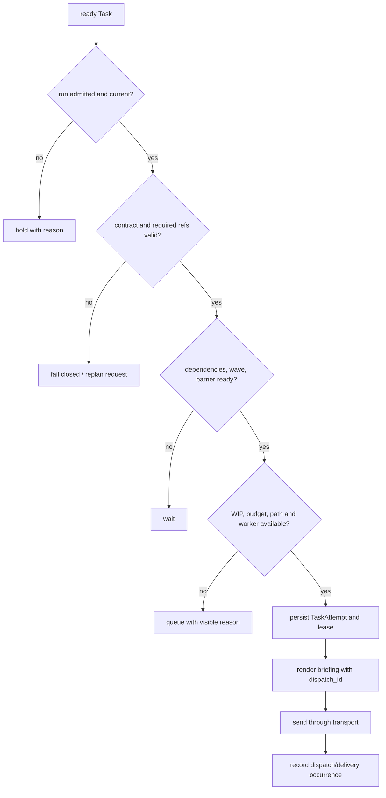

# Plan, Task Map, and Kernel Dispatch

> For operators who need to understand how ZaoFu compiles a clarified goal into a verifiable task graph and executes it across Agents under control.
> The filename remains for compatibility. In Product Flow, the Kernel owns happy-path dispatch, not a configured `orchestrator` role Agent.

## 1. The Model in One Flow

```text
Goal / Requirement
  -> semantic plan, Goal Claims, and evidence contract
  -> task-map.v1 + source-index.v1 + coverage-report.v1
  -> immutable Plan Artifact Package + generation admission
  -> deterministic Task contract materialization + Kernel dispatch
  -> Worker artifacts/evidence
  -> exact-target verify, replan, Candidate freeze, and closure
```

The Kernel does not interpret prose and invent a task breakdown. Ownership is explicit:

| Decision | Owner |
|---|---|
| requirement meaning, solution, task slices, acceptance quality, project constraints | Planner/Architect/domain Agent plus skills/prompts |
| schema, refs, dependency, currentness, authorization, WIP, lease, dispatch | deterministic Kernel |
| registered semantic checkpoints | Orchestrator Agent under explicit `semantic_control`; default remains `exception_advisor` |
| semantic exception triage and replan direction | Agent/Run Manager/Autoresearch proposal |
| approved state changes and external effects | `ControlledActionService` / sanctioned CLI |

Legacy safe-team may explicitly let a Layer 2 Orchestrator Agent decompose and assign work. That is a
compatibility mode, not the default model for Issue/PRD/Refactor Product Flow.

## 2. From Requirement to Executable Run

### 2.1 Establish a Real Task

An Idea, Issue, Refactor, or Channel discussion first converges into a traceable Task with:

- Goal, Non-goals, and acceptance criteria;
- inputs, outputs, risks, budget, and affected code scope;
- test matrix, evidence producers, and closure boundary;
- semantic decisions or external effects that need human approval.

Channel Finalize/Owner confirm publishes a canonical PRD/Task source; it does not automatically start a
Workflow. Use [Controlled Workflow Start](workflows/controlled-workflow-start.en.md) to select a route,
preview, propose, and independently apply it.

### 2.2 Planning Agents Produce Durable Artifacts

A profile may use a planner, architect, researcher, critic, or other roles. Role names are not the
contract; artifacts and evidence are. Common artifacts include:

| Artifact | Question answered |
|---|---|
| requirement/spec | what must change and what is out of scope |
| implementation plan | solution, phases, risks, and interface changes |
| acceptance/test matrix | which check and evidence prove each Claim |
| `task-map.v1` | how this delivery becomes a schedulable task graph |
| `source-index.v1` | where each Task originated in the requirement/plan |
| `coverage-report.v1` | covered source and unresolved unknowns |

Artifacts are persisted atomically and bound through refs/digests. An event preview does not replace a
required artifact body.

### 2.3 Pass Readiness and Currentness

An executable plan means at least:

- Goal/Claims, Non-goals, inputs, outputs, and boundaries are explicit;
- each blocking Claim has acceptance, a test method, and an evidence producer;
- each task slice has an owner role, scope, dependencies, and independent verification;
- source index covers Tasks and no blocking unknown remains unresolved in coverage;
- artifacts are based on the current source revision and have not been invalidated by later facts.

When these conditions fail, the Planner updates artifacts or asks for clarification. Workers do not guess,
and the Kernel's mechanical checks do not replace domain judgment.

## 3. The `task-map.v1` Contract

`task-map.v1` bridges a plan and canonical Task contracts. It binds the scheduling graph to Goal coverage,
code scope, and verification evidence. A reduced example:

```json
{
  "schema_version": "task-map.v1",
  "feature_id": "FEATURE-123",
  "goal_claims": [
    {"goal_claim_id": "CLAIM-A", "text": "API behavior is preserved", "mandatory": true}
  ],
  "source_refs": {
    "spec_ref": "docs/specs/feature.md",
    "plan_ref": "docs/plans/feature.md",
    "source_index_ref": ".zf/artifacts/FEATURE-123/source-index.json",
    "coverage_report_ref": ".zf/artifacts/FEATURE-123/coverage-report.json"
  },
  "tasks": [
    {
      "task_id": "TASK-001",
      "title": "Implement the verified API slice",
      "owner_role": "dev",
      "wave": 1,
      "blocked_by": [],
      "allowed_paths": ["src/api/**", "tests/test_api.py"],
      "allowed_paths_reason": "one vertical slice owns runtime and regression test",
      "exclusive_files": ["src/api/handler.py"],
      "goal_claim_ids": ["CLAIM-A"],
      "source_key": "docs/specs/feature.md#api-compatibility",
      "source_ref": "docs/specs/feature.md#api-compatibility",
      "source_excerpt": "Preserve the documented API behavior.",
      "acceptance_criteria": [
        {
          "id": "AC-API-COMPAT",
          "statement": "The compatibility cases pass on the Task target.",
          "mandatory": true,
          "verification_owner": "task_verify",
          "verification_tier": "task_non_smoke",
          "verification_command_ids": ["api-regression"]
        }
      ],
      "validation": {
        "commands": [
          {
            "id": "api-regression",
            "command": "uv run pytest tests/test_api.py -q --no-cov",
            "acceptance_ids": ["AC-API-COMPAT"],
            "owner": "task_verify",
            "tier": "task_non_smoke",
            "deterministic": true,
            "reusable": true,
            "timeout_seconds": 120
          }
        ]
      }
    }
  ]
}
```

Common fields:

| Field | Purpose |
|---|---|
| `goal_claims` / `goal_claim_ids` | establish Goal -> Claim -> Task coverage |
| `blocked_by` / `wave` | express dependencies, batches, and fan-in waits |
| `allowed_paths` plus reason | declare unique write ownership and explain it; legacy `scope` is compatibility input only |
| `exclusive_files` | prevent concurrent writers on the same path |
| `shared_files` | shared read-only context, not write permission |
| `acceptance_criteria` | structured product outcomes bound to mandatory, owner, tier, and command IDs |
| `validation.commands[]` | canonical command registry; downstream consumers execute and read back the exact command/digest |
| source refs | trace a Task back to its Goal, plan, review, and coverage report |

Prefer independently verifiable vertical slices. A shared schema/API may be an early wave, but avoid
splitting into “all schemas, all backend, all frontend” unless each slice has an observable completion rule.

## 4. Deterministic Task Map Gate

Agents can propose any decomposition. Execution requires deterministic validation, including:

- schema version, a non-empty Task list, and unique Task IDs;
- existing `blocked_by` references with no dependency on a later wave;
- verification/acceptance, command safety, and allowed scope;
- `exclusive_files` conflicts, shared/exclusive conventions, and assembly ownership;
- required plan ports, source refs, and workspace-root ownership requirements;
- Goal Claim coverage, evidence producers, and topological order;
- source-index, coverage/currentness, and product-delivery ingest requirements.

Failures are fail-closed: update the artifact, adjust wave/scope, or request owner judgment. Never bypass
the gate by editing `kanban.json`, deleting checks, or accepting a Worker's self-declaration.

## 5. Materialize Task Contracts

Product-delivery ingest turns a validated task map into canonical Tasks:

```text
accepted artifact package
  -> validate task-map/source-index/coverage
  -> create/update Feature projection
  -> create Task contracts and task docs
  -> emit task.created / wave-ready facts
  -> wait for run admission and readiness
```

The original Markdown plan is not dispatch truth. Task contracts hold structured dispatch fields and link
back through `spec_ref`, `plan_ref`, `source_index_ref`, and `task_map_ref`. `contract` is the only Task
contract field; do not introduce a second `sprint_contract` or side schema.

## 6. How the Kernel Dispatches



The Kernel can map a logical role such as `dev` to an available instance and execute declared fanout,
lanes, barriers, reader/writer ownership, and bounded rework. It cannot invent product stages or decide
which technical solution is best.

After transport delivery, Workers report artifacts/evidence through `zf emit` or sanctioned actions. A
result must match the current TaskAttempt/dispatch token. Reviewers, tests, judges, and custom verifiers
consume the Task contract, artifact refs, and Git evidence instead of reinterpreting the raw prompt.

### 6.1 Default v3 Dispatch and the v4 Task Pipeline Canary

The production default remains the v3 stage/fanout/barrier path. PRD, Issue,
and Refactor also have a default-off v4 canary:

```text
Task Pipeline identity (Task + task-map generation)
  -> Impl operation
  -> Task Verify operation
  -> Integration Admission
  -> serial Candidate Integration receipt

physical Worker Slot
  -> serves one operation
  -> settles and becomes reusable
  -> preserves Task-stage session/workspace affinity separately
```

v4 changes scheduling and placement, not Stage briefings, Task Contracts,
required reads, result artifacts, or Completion Gate:

- Task A may enter its Verify immediately after Impl admission without waiting for sibling Tasks;
- an idle Impl slot may serve Task C without leaking Task A session context;
- a Verify failure opens bounded rework for that Task only;
- a Task becomes `done`, and unblocks dependents, only after its integration receipt is admitted;
- all local receipts freeze one exact Candidate before global Verify, Discovery, and Goal Closure;
- a partial Candidate cannot auto-ship, and default `verify_admitted` adds no Agent turn;
- profile, operation, attempt, lease, workspace, session, and generation must all be current.

Only explicit profiles such as
`examples/prod/controller/*-task-pipeline-v4-canary*.yaml` may enable this path.
They declare `preferred: false` and default `ZF_TASK_PIPELINE_MODE` to `shadow`.
Switching to `blocking` is still a canary; the current rollout decision is
NO-GO and must not replace ordinary v3 routes.

### 6.2 Orchestrator Agent Checkpoint Boundary

`workflow.orchestration.mode` defaults to `exception_advisor`. Explicit
`semantic_control` may configure `shadow` or controlled `blocking` policy for
registered checkpoints such as `plan_candidate`, but the OA submits only typed
decisions/artifacts. The Kernel still owns operations, dispatch, TaskAttempts,
WIP, state transitions, and side effects. Normal `Impl -> Verify` handoff adds
no OA turn. The OA P0-P15 harness is implemented, while its real canary remains
on HOLD.

## 7. Replanning During Execution

Re-evaluate the plan instead of mechanically replaying old work when:

- planned files, interfaces, dependencies, or assumptions contradict repository facts;
- repeated rework does not reduce the same Goal gap;
- verification cannot run or its evidence cannot prove a Claim;
- scope/file ownership makes the planned concurrency invalid;
- a new requirement or external state invalidates artifact currentness.

Recommended path:

```text
finding / no-progress / goal gap
  -> checkpoint current attempt and evidence
  -> semantic triage produces replan proposal
  -> owner/control policy approves the exact change
  -> ControlledActionService applies a new artifact/task-map generation
  -> untouched Tasks continue; affected Tasks replace, pause, or requeue
```

Never silently rewrite a completed Task. If a new plan invalidates its result, create a correction Task and
a new evidence chain.

## 8. Observe Whether the Plan Was Followed

```bash
uv run zf workflow inspect
uv run zf kanban --board
uv run zf task trace TASK-ID
uv run zf events --last 80
uv run zf refs verify
```

Use Web Task, Delivery, Runs, Coverage, Work, and Goal Dossier views to check:

- source, Goal Claims, wave/dependencies, and owner role;
- current attempt, worker instance, dispatch ID, and wait reason;
- scope/shared/exclusive files and the actual Git diff;
- required artifacts, test evidence, verdicts, and currentness;
- replan generation, replaced Tasks, and unresolved Goal gaps.


Agent prose, a running tmux pane, or a changed Kanban status alone does not prove Task Map execution.

## 9. Code and Test Entry Points

| Location | Responsibility |
|---|---|
| `src/zf/runtime/task_map.py` | deterministic task-map Goal/evidence/topology validation |
| `src/zf/runtime/product_delivery.py` | accepted task map to canonical Task contracts |
| `src/zf/runtime/orchestrator_dispatch.py` | mechanical dispatch from readiness to worker instance |
| `src/zf/runtime/task_attempt_runtime.py` | attempt/lease/delivery lifecycle |
| `src/zf/runtime/task_pipeline_runtime.py`, `task_pipeline_reconciler.py` | v4 Task-local operations, capacity, rework, and projection |
| `src/zf/runtime/orchestrator_agent_reactor.py` | event/artifact handoff for explicit OA semantic checkpoints |
| `src/zf/runtime/injection.py` | briefing, active-task pin, and Worker protocol |
| `src/zf/core/task/contract_validation.py` | pre-dispatch Task contract checks |
| `src/zf/core/verification/scope_ratchet.py` | scope snapshot, diff, and violation checks |
| `tests/test_task_map.py`, `tests/test_product_delivery.py` | task-map and ingest regressions |
| `tests/test_task_pipeline_profile.py`, `tests/test_task_pipeline_rollout.py` | v4 profile, default-off behavior, and rollout gates |

Related: [Harness Runtime Flow](04-harness-runtime.en.md), [Delivery Control Model](concepts/delivery-control-model.en.md),
and [Observe a Delivery](operations/observe-delivery.en.md).
