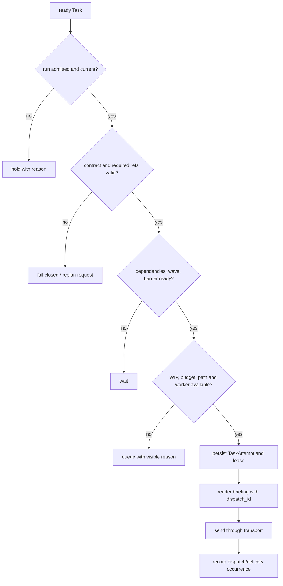

# Plan、Task Map 与 Kernel 调度

> 适用对象：需要理解 ZaoFu 如何把已澄清目标编译为可验证任务图，并在多 Agent 间受控执行的操作者。
> 文件名为兼容旧链接保留；Product Flow 的快乐路径调度 owner 是 Kernel，不是配置中的 `orchestrator` role Agent。

## 1. 一句话模型

```text
Goal / Requirement
  -> semantic plan, Goal Claims, and evidence contract
  -> task-map.v1 + source-index.v1 + coverage-report.v1
  -> immutable Plan Artifact Package + generation admission
  -> deterministic Task contract materialization + Kernel dispatch
  -> Worker artifacts/evidence
  -> exact-target verify, replan, Candidate freeze, and closure
```

这不是“Kernel 自动理解自然语言并拆任务”。责任边界如下：

| 决策 | Owner |
|---|---|
| 需求含义、方案、任务切片、验收质量、项目约束 | Planner/Architect/领域 Agent + skill/prompt |
| schema、引用、依赖、currentness、权限、WIP、lease、dispatch | deterministic Kernel |
| 预注册语义 checkpoint | 显式 `semantic_control` 下的 Orchestrator Agent；默认仍为 `exception_advisor` |
| 异常中的语义分诊和 replan 方向 | Agent/Run Manager/Autoresearch 产出 proposal |
| 批准后的状态变更和外部副作用 | `ControlledActionService` / sanctioned CLI |

Legacy safe-team 可以显式让 Layer 2 Orchestrator Agent 拆解并 assign；它是兼容模式，不是
Issue/PRD/Refactor Product Flow 的默认心智。

## 2. 从需求到可执行 Run

### 2.1 先形成真实 Task

Idea、Issue、Refactor 或 Channel 讨论先收敛为可追踪 Task，并明确：

- Goal、Non-goals 和 acceptance criteria；
- 输入、输出、风险、预算和受影响代码范围；
- 测试矩阵、evidence producer 和完成边界；
- 需要人工确认的语义或外部副作用。

Channel 的 Finalize/Owner confirm 只发布 canonical PRD/Task 来源，不会自动启动 Workflow。
Workflow 应按[受控 Workflow 启动](workflows/controlled-workflow-start.md)选择 route，执行
preview、propose 和独立 apply。

### 2.2 规划 Agent 生成 durable artifacts

具体 profile 可以使用 planner、architect、researcher、critic 或其他角色。角色名不是合同；
产物和证据才是。典型 artifact 包括：

| Artifact | 回答的问题 |
|---|---|
| requirement/spec | 要解决什么，明确不做什么 |
| implementation plan | 采用什么方案，阶段、风险和接口如何变化 |
| acceptance/test matrix | 每个 Claim 由什么检查和证据证明 |
| `task-map.v1` | 这次交付如何切成可调度任务图 |
| `source-index.v1` | 每个 Task 来自哪段原始需求/计划 |
| `coverage-report.v1` | 哪些来源已覆盖，哪些 unknown 尚未关闭 |

Artifact 必须原子持久化并通过 ref/digest 绑定。事件中的摘要不能替代 required artifact 正文。

### 2.3 通过 readiness 和 currentness

Plan 可执行至少意味着：

- Goal/Claim、Non-goals、输入输出和边界明确；
- 每个 blocking Claim 有验收条件、测试方式和 evidence producer；
- task slice 有 owner role、scope、依赖和独立验证入口；
- source index 覆盖 Task，coverage report 没有未裁决 blocking unknown；
- artifact 基于当前 source revision，没有被后续需求或代码事实淘汰。

不满足时，Planner 应补充 artifact 或提出澄清，不应让 Worker 猜测。Kernel 只验证机械完整性，
不能代替领域 Agent 判断计划是否合理。

## 3. `task-map.v1` 的核心合同

`task-map.v1` 是计划与 canonical Task contract 之间的桥。它既表达调度图，也绑定 Goal
覆盖、代码范围和验证证据。精简示例：

```json
{
  "schema_version": "task-map.v1",
  "feature_id": "FEATURE-123",
  "goal_claims": [
    {"goal_claim_id": "CLAIM-A", "text": "API behavior is preserved", "mandatory": true}
  ],
  "source_refs": {
    "spec_ref": "docs/specs/feature.md",
    "plan_ref": "docs/plans/feature.md",
    "source_index_ref": ".zf/artifacts/FEATURE-123/source-index.json",
    "coverage_report_ref": ".zf/artifacts/FEATURE-123/coverage-report.json"
  },
  "tasks": [
    {
      "task_id": "TASK-001",
      "title": "Implement the verified API slice",
      "owner_role": "dev",
      "wave": 1,
      "blocked_by": [],
      "allowed_paths": ["src/api/**", "tests/test_api.py"],
      "allowed_paths_reason": "one vertical slice owns runtime and regression test",
      "exclusive_files": ["src/api/handler.py"],
      "goal_claim_ids": ["CLAIM-A"],
      "source_key": "docs/specs/feature.md#api-compatibility",
      "source_ref": "docs/specs/feature.md#api-compatibility",
      "source_excerpt": "Preserve the documented API behavior.",
      "acceptance_criteria": [
        {
          "id": "AC-API-COMPAT",
          "statement": "The compatibility cases pass on the Task target.",
          "mandatory": true,
          "verification_owner": "task_verify",
          "verification_tier": "task_non_smoke",
          "verification_command_ids": ["api-regression"]
        }
      ],
      "validation": {
        "commands": [
          {
            "id": "api-regression",
            "command": "uv run pytest tests/test_api.py -q --no-cov",
            "acceptance_ids": ["AC-API-COMPAT"],
            "owner": "task_verify",
            "tier": "task_non_smoke",
            "deterministic": true,
            "reusable": true,
            "timeout_seconds": 120
          }
        ]
      }
    }
  ]
}
```

常用字段的语义：

| 字段 | 用途 |
|---|---|
| `goal_claims` / `goal_claim_ids` | 建立 Goal -> Claim -> Task 覆盖关系 |
| `blocked_by` / `wave` | 表达依赖、批次和 fan-in 等待 |
| `allowed_paths` + reason | 声明唯一写入范围并解释 ownership；旧 `scope` 仅作兼容输入 |
| `exclusive_files` | 防止并行 writer 同时写同一路径 |
| `shared_files` | 共享只读上下文，不授予写权限 |
| `acceptance_criteria` | 结构化产品结果，绑定 mandatory、owner、tier 和 command IDs |
| `validation.commands[]` | canonical 命令注册表；下游按原始 command/digest 执行和回读 |
| source refs | 让 Task 可以回溯原始 Goal、计划、评审和覆盖报告 |

一个 Task 应对应可独立验证的 vertical slice。公共 schema/API 可以成为早期 wave，但不要仅按
“所有 schema、所有后端、所有前端”横切，除非每一片本身都有可观察的完成定义。

## 4. Deterministic Task Map Gate

Agent 可以提出任意拆解建议；进入执行前必须通过确定性校验。当前 Kernel/helper 会检查包括：

- schema version、非空 Task 列表和唯一 Task ID；
- `blocked_by` 引用存在且不依赖更晚 wave；
- verification/acceptance、verification command 安全和允许范围；
- `exclusive_files` 冲突、shared/exclusive 约定和 assembly ownership；
- required plan ports、source refs 和 workspace-root owner 要求；
- Goal Claim 覆盖、evidence producer 和 topological order；
- source index、coverage/currentness 与 product delivery ingest 的必要合同。

失败应 fail closed：修正 artifact、调整 wave/scope，或请求 owner 裁决。不能通过手写
`kanban.json`、删 gate 或让 Worker 自己宣布通过来绕开。

## 5. Materialize Task Contract

通过的 task map 由 product-delivery ingest 转为 canonical Task：

```text
accepted artifact package
  -> validate task-map/source-index/coverage
  -> create/update Feature projection
  -> create Task contracts and task docs
  -> emit task.created / wave-ready facts
  -> wait for run admission and readiness
```

原始 Markdown plan 不是调度 truth。Task contract 保存 dispatch 所需的结构字段，并通过
`spec_ref`、`plan_ref`、`source_index_ref`、`task_map_ref` 等回到 durable source。
`contract` 是唯一 Task 合同字段；不要创建第二套 `sprint_contract` 或旁路 schema。

## 6. Kernel 如何派发



Kernel 可以从声明的 topology 将 `dev` 等逻辑 role 解析为可用实例，并执行 fanout、lane、
barrier、reader/writer 和 bounded rework。它不能自行发明新的产品 stage 或判断哪个技术方案更好。

Transport delivery 之后，Worker 必须经 `zf emit` 或 sanctioned action 报告 artifact/evidence；
result 要与当前 TaskAttempt/dispatch token 对齐。Review、test、judge 或自定义 verifier 应读取
Task contract、artifact refs 和 git evidence，而不是重新猜 raw prompt。

### 6.1 v3 默认调度与 v4 Task Pipeline canary

当前生产默认仍是 v3 stage/fanout/barrier。PRD、Issue、Refactor 另有默认关闭的 v4 canary：

```text
Task Pipeline identity (Task + task-map generation)
  -> Impl operation
  -> Task Verify operation
  -> Integration Admission
  -> serial Candidate Integration receipt

physical Worker Slot
  -> serves one operation
  -> settles and becomes reusable
  -> preserves Task-stage session/workspace affinity separately
```

v4 的关键变化是调度和 placement，不改写 Stage briefing、Task Contract、required-read、result
artifact 或 Completion Gate：

- Task A 的 Impl admitted 后可立即进入自己的 Verify，不等待同批 Task；
- 已空闲 Impl slot 可以承接 Task C，不能把 Task A 的 session 上下文泄漏给 Task C；
- Verify 失败只对当前 Task 生成有界 rework attempt；
- Task 只有在 integration receipt admitted 后才 `done`，依赖 Task 才能解锁；
- 所有局部 receipt 收敛后冻结 exact Candidate，再运行全局 Verify/Discovery/Goal Closure；
- partial Candidate 禁止 auto-ship；默认 `verify_admitted` 不增加 Agent turn；
- profile、operation、attempt、lease、workspace、session 和 generation 必须同时 current。

只有 `examples/prod/controller/*-task-pipeline-v4-canary*.yaml` 这类显式 profile 才能启用。
示例 `preferred: false`，默认 `ZF_TASK_PIPELINE_MODE=shadow`；切到 `blocking` 仍属于 canary，
当前 rollout 结论是 NO-GO，不应覆盖常规 v3 route。

### 6.2 Orchestrator Agent checkpoint 边界

`workflow.orchestration.mode` 默认是 `exception_advisor`。显式 `semantic_control` 可以为
`plan_candidate` 等已注册 checkpoint 配置 `shadow` 或受控 `blocking`，但 OA 只提交 typed
decision/artifact。Kernel 继续拥有 operation、dispatch、TaskAttempt、WIP、状态迁移和副作用。
正常 `Impl -> Verify` handoff 不增加 OA turn；OA P0-P15 harness 已实现，但真实 canary 仍 HOLD。

## 7. 执行中 Replan

出现以下信号时，应比较“当前计划是否仍然成立”，而不是机械重复旧任务：

- 计划中的文件、接口、依赖或假设与代码事实不符；
- 多轮 rework 没有缩小同一个 Goal gap；
- verification 无法执行，或证据无法证明 Claim；
- scope/file ownership 使既定并发策略不可行；
- 新需求或外部状态使 accepted artifact 失去 currentness。

推荐路径：

```text
finding / no-progress / goal gap
  -> checkpoint current attempt and evidence
  -> semantic triage produces replan proposal
  -> owner/control policy approves exact change
  -> ControlledActionService applies a new artifact/task-map generation
  -> untouched Tasks continue; affected Tasks replace, pause, or requeue
```

已完成 Task 不应被静默改写；计划推翻既有结果时应形成 correction Task 和新证据链。

## 8. 如何观察是否真的按计划执行

```bash
uv run zf workflow inspect
uv run zf kanban --board
uv run zf task trace TASK-ID
uv run zf events --last 80
uv run zf refs verify
```

在 Web 的 Task、Delivery Overview、Runs Inspector、Graph 和 Goal Dossier 中核对：

- Task 来源、Goal Claim、wave/依赖和 owner role；
- 当前 attempt、worker instance、dispatch id 与等待原因；
- scope/shared/exclusive files 和实际 git diff；
- required artifacts、test evidence、verdict 和 currentness；
- replan generation、被替换 Task 和尚未闭合的 Goal gap。


只看到 Agent 文本、tmux pane 在运行或 Kanban 状态变化，都不足以证明 Task Map 合同已执行。

## 9. 代码与测试入口

| 位置 | 责任 |
|---|---|
| `src/zf/runtime/task_map.py` | task-map schema、Goal/evidence/topology 确定性校验 |
| `src/zf/runtime/product_delivery.py` | accepted task map 到 canonical Task contract |
| `src/zf/runtime/orchestrator_dispatch.py` | readiness 到 worker instance 的机械派发 |
| `src/zf/runtime/task_attempt_runtime.py` | attempt/lease/delivery 生命周期 |
| `src/zf/runtime/task_pipeline_runtime.py`、`task_pipeline_reconciler.py` | v4 Task-local operation、capacity、rework 与 projection |
| `src/zf/runtime/orchestrator_agent_reactor.py` | 显式 OA semantic checkpoint 的 event/artifact 接力 |
| `src/zf/runtime/injection.py` | briefing、active-task pin 和 Worker protocol |
| `src/zf/core/task/contract_validation.py` | dispatch 前 Task contract 校验 |
| `src/zf/core/verification/scope_ratchet.py` | scope snapshot、diff 和越界检查 |
| `tests/test_task_map.py`、`tests/test_product_delivery.py` | task map 与 ingest 回归 |
| `tests/test_task_pipeline_profile.py`、`tests/test_task_pipeline_rollout.py` | v4 profile、默认关闭和 rollout 门禁 |

相关阅读：[Harness 运行流程](04-harness-runtime.md)、[交付控制模型](concepts/delivery-control-model.md)、
[观察一次交付](operations/observe-delivery.md)。
