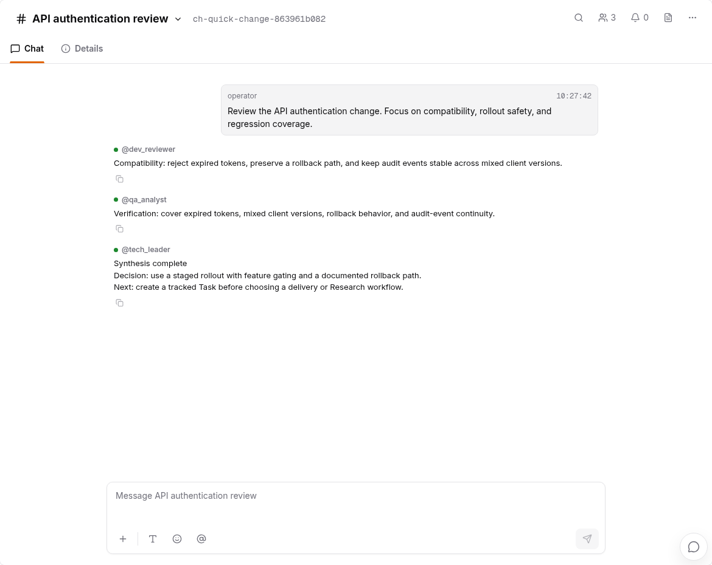
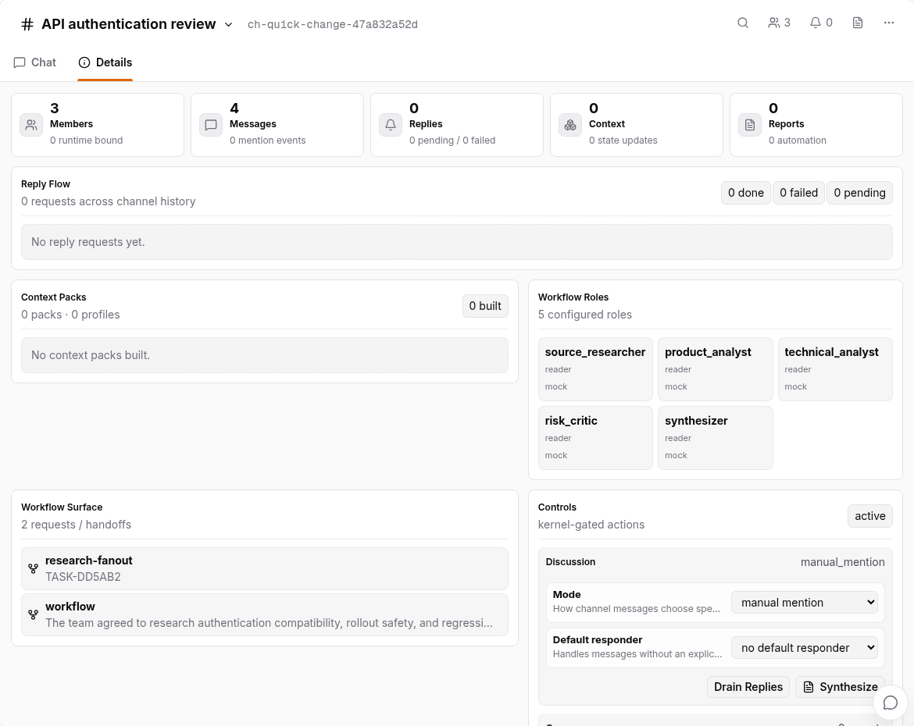

# Channel Collaboration

> Audience: operators who want multiple agents to collaborate around one
> requirement and continue the conversation in Web or Feishu.
>
> Status: Kanban Plan Channel creation, template members, original requirement
> posting, `fanout_then_synthesis`, and continued conversation are implemented.
> This manual reflects real E2E checked on 2026-07-28.

## 0. Preflight Before Starting

Start WebKanban for real Codex Channels through the canonical trusted-local
launcher:

```bash
tools/start-webkanban.sh --host 127.0.0.1 --port 8001
tools/start-webkanban.sh --port 8001 --status
```

Some Channel templates contain `artifact_writer`, `project_writer`, or
`workspace_writer` members. Direct `zf web` without an explicit sandbox
environment maps those members to Codex `workspace-write`; a host without
namespace/bubblewrap support returns `sandbox_unsupported`. Trusted-local
status should report `codex_headless_sandbox: danger-full-access`,
`tmux: running`, and `api: ok`. Shared or untrusted hosts must repair normal
sandbox support instead of relying on bypass. See
[16 Real Codex Provider Preflight](16-real-codex-provider-preflight.en.md).

## 1. Current Channel Group model

The product may call the experience Channel Group. The kernel canonical model
is:

```text
Channel
├── Members (provider agent / runtime role / human / observer)
├── Messages and threads
├── Discussion policy
├── Writer role and writer scope
└── Synthesis artifacts and event refs
```

A Channel is a dynamic runtime object established by `channel.created` and
subsequent `channel.*` events. There is no static `channel group` block in
`zf.yaml`. The control plane still supplies provider, runtime-role, permission,
and integration constraints.

Channel is independent from Workflow:

- creating or discussing in a Channel does not require a Task;
- Channel supports clarification, review, debate, and consensus;
- Channel output does not automatically create a Task;
- Channel does not directly start Research or delivery;
- to execute, confirm a `Create Task` proposal and then choose a Workflow for
  that Task.

## 2. Recommended entry: Kanban Agent creates the Channel

Do not start by selecting `New Channel`, inviting each member, or copying the
first requirement. Tell Kanban Agent that the requirement needs collaboration:

```text
Create a PRD clarification Channel for the login security change. Include
product, architecture, critic, and security views, use at most 12 rounds, and
produce a traceable synthesis.
```

Kanban Agent returns an action-bound Channel setup Plan. Each option binds:

- `template_id`;
- optional Channel name;
- exact member roles and count;
- optional provider/model overrides;
- budget such as `max_rounds`;
- writer role and restricted writer scope.


Select an option and `Create & start`. One atomic action:

```text
channel-create-and-start
-> creates the Channel
-> materializes Members, role context, skills, and permissions
-> posts the original requirement that triggered the Plan
-> starts discussion
-> fanout blind replies
-> relay / critique
-> synthesis
```

There is no second Approve card. Channel setup is the bounded direct-apply
exception for Plan; the browser action session/token must still be valid. Other
risky actions retain separate approval.

### `Chat about`

`Chat about` does not apply or discard the Plan. It sends additional context to
the same Kanban Agent session, allowing changes to:

- discussion rounds;
- optional roles;
- scope and expected output;
- primary provider, model, or budget;
- writer scope.

The agent should update the Plan rather than asking the operator to edit JSON.

## 3. Built-in Channel templates

All current built-in templates use `fanout_then_synthesis`. Role context
defines identity and stop rules; template `skill_refs` define the method for
the current discussion:

| Template | Default members | Writer | Method boundary |
|---|---|---|---|
| `prd-clarification` | `product_pm`, `arch`, `critic`, `synthesizer`, optional `security_reviewer` | `product_pm`, normally limited to `docs/design/**` and `docs/impl/**` | participant question ledger plus synthesis; roles that translate owner intent load `grill` |
| `research-review` | `researcher`, `arch`, `critic`, `synthesizer` | `researcher`, limited to research artifacts | evidence-led discussion only; no Research trigger or Refactor task-map synthesis |
| `architecture-review` | `arch`, `security_reviewer`, `dev_reviewer`, `critic` | `arch` | ZaoFu architecture, design-vs-implementation, security, and candidate gate methods |
| `quick-change` | `tech_leader`, `dev_reviewer`, `qa_analyst` | `tech_leader` | bounded change recommendation plus generic verification; browser E2E is on demand |
| `incident-triage` | `tech_leader`, `qa_analyst`, optional `security_reviewer` | `tech_leader` | diagnosis and controlled-action proposal only; Run Manager/Kernel execute recovery |

Templates are not arbitrary role-name collections. Required roles cannot be
disabled. Only allowed optional roles, backend, model, writer, writer scope,
and budget overrides are accepted. Non-writers normally remain read-only so
every participant cannot modify the Project concurrently.

A template role may bind multiple ordered `skill_refs`. Before Channel
creation, every ref must resolve and materialize under
`<project_root>/skills/<name>/SKILL.md`; a missing ref rejects before
`channel.created`, preventing path-only members. In `grill`, atomic questioning
means one decision per question. One blind-answer turn may still raise several
independent questions.

## 4. Discussion, synthesis, and continuation

`fanout_then_synthesis` has three phases:

1. `phase1_blind`: independent replies avoid anchoring;
2. `phase2_relay`: participants relay, challenge, and add evidence;
3. `phase3_synthesis`: the template synthesizer/default responder converges.

The event chain covers Channel/Member creation, message posting, reply
request/start/delta/complete, discussion phases, and synthesis refs. Observe it
through Web, `zf events`, or Feishu projections.

After synthesis the Channel remains interactive. A human can ask follow-up
questions, add another requirement, or continue the original topic without
recreating the Channel:



PRD Clarification can produce a canonical PRD or requirement snapshot. It is
still a collaboration artifact, not an execution Task. To proceed:

```text
Create a Task proposal from the current synthesis. Do not start a Workflow yet.
```

After Task confirmation, enter the Task-bound Workflow Plan. PRD decomposition,
the planning artifact, and `task_map` belong to the selected Workflow planning
stage; Channel and Kanban Agent must not fabricate them early.

## 5. Channel versus Research Workflow

`research-review` is a Channel template for multi-role review or lightweight
discussion around existing material. It does not implicitly start the fixed
Research fanout.

Research Workflow requires:

1. a real Task;
2. an explicit Research fanout request;
3. available `research:fixed` in the current Project's
   `zf workflow routes`;
4. a Kanban Plan route selection;
5. separate approval of the exact proposal.

The fixed roles are `source_researcher`, `product_analyst`,
`technical_analyst`, `risk_critic`, and `synthesizer`:



Research returns a summary, evidence refs, open questions, and PRD/Refactor
prompt inputs. The operator then decides whether to create a delivery Task.
ZaoFu does not automatically convert the result into a PRD Workflow.

## 6. Low-level CLI: post to an existing Channel

The stable CLI command is `zf channel say`:

```bash
zf channel say <channel_id> \
  --text "Add failure scenarios and ask @critic to review." \
  --member-id reviewer \
  --mention critic
```

| Argument | Meaning | Default |
|---|---|---|
| `channel_id` | Target Channel | Required |
| `--text` | Message body | Required |
| `--member-id` | Sender member identity | `agent` |
| `--mention` | Mentioned member, repeatable | Empty |
| `--state-dir` | Explicit runtime state directory | Project context |

The command runs the `channel-post-message` ControlledAction and appends
`channel.message.posted`. It does not write `events.jsonl` directly or hold
Feishu credentials.

`list`, `show`, `invite`, and `synth` are not stable Channel CLI subcommands.
Creation, invitation, permission, discussion, and synthesis use Kanban Plan,
Web APIs, or other ControlledAction surfaces.

## 7. Feishu association

A Feishu group can target an existing Channel or an agent-direct session:

```yaml
integrations:
  feishu_routing:
    oc_<chat_id>:
      target: channel
      channel_id: ch-login-security
```

`target: agent` establishes an agent Channel session for that chat.
`target: channel` posts into the selected multi-member Channel. Inbound intent,
button approval, and outbound projection still close through events and
ControlledAction; they do not mutate Task or Workflow canonical state.

See [19 Feishu AI-Native Direct Bridge](19-feishu-ai-native-direct-bridge.en.md).

## 8. Member and permission values

Common ControlledAction `member_type` values include:

`provider_agent`, `runtime-role`, `human`, `observer`, `readonly-reviewer`,
and `owner_delegate`.

Common `channel_role` values include:

`product_pm`, `arch`, `critic`, `synthesizer`, `researcher`,
`security_reviewer`, `dev_reviewer`, `qa_analyst`, and `tech_leader`.

Bind a role declared in `zf.yaml` with `runtime-role` and
`workflow_role_binding: {"role": "<instance_id>"}`. Channel member
`skill_refs` materialize literal skill paths and do not reuse Workflow-role
skill-pool conflict resolution.

Templates or token-gated actions validate permission, writer role, and scope.
Starting the host with danger-full-access does not automatically grant every
Channel member Project write access.

## 9. Observation and diagnosis

```bash
zf events --last 100 | grep channel.
zf status --workers
```

Check:

- `channel.created` and the expected template digest;
- all required Members are added and connected;
- the original requirement has exactly one `channel.message.posted`;
- discussion reaches the expected phase;
- the synthesis artifact/ref exists;
- retries reuse the same Channel through idempotency;
- provider login, budget, or writer scope is not blocking replies.

## Related

- [01 Quick Start](01-quickstart.en.md)
- [20 Project Creation, Bootstrap, and Workflow Ignition](20-project-bootstrap-workflow-ignition.en.md)
- [19 Feishu AI-Native Direct Bridge](19-feishu-ai-native-direct-bridge.en.md)
- [`zf.yaml` Control Plane and Runtime State](02-zf-yaml-control-plane.en.md)
