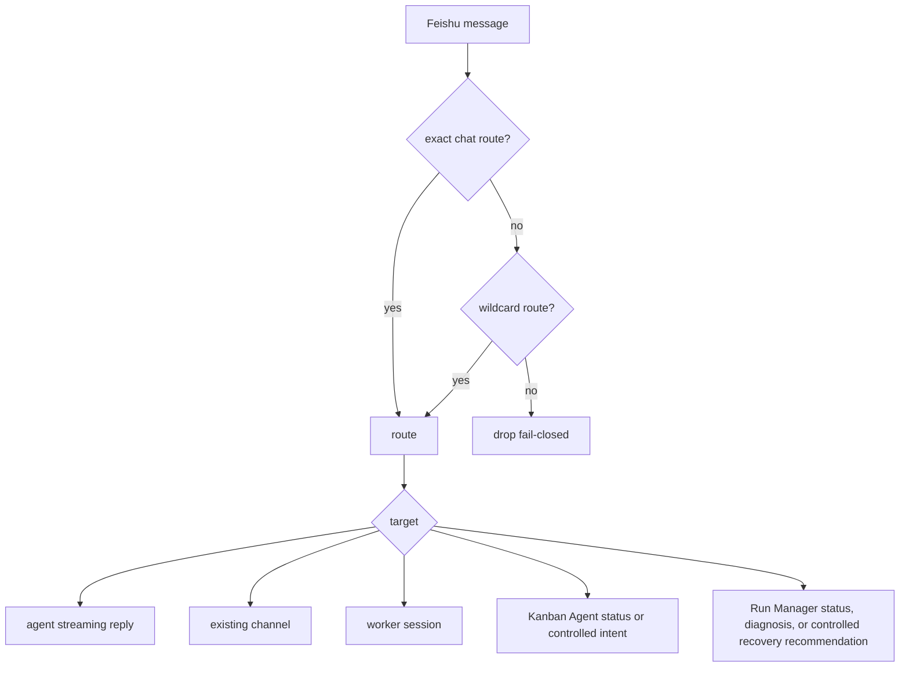

# Feishu AI-Native Direct Bridge

> Status: active. This bridge drives real ZaoFu coding agents directly from
> Feishu group chats and DMs, including streaming replies and plan approval.
> It replaces the deprecated OpenClaw message-forwarding path.

## 0. Summary

`zf feishu bridge --watch` maintains one process-level Feishu connection. A
group mention or DM reaches a real Codex or Claude Code agent, whose response is
streamed into a rich card. Plan approval buttons go through identity checks and
controlled actions to unlock delivery. No public webhook or OpenClaw relay is
required.

OpenClaw can still be a remote execution backend; it is no longer the Feishu
message transport.

## 1. Direct Architecture

```text
Feishu group mention or DM
  |
  | official WebSocket long connection
  v
zf feishu bridge --watch
  |- reply only to this bot in multi-bot groups
  |- debounce messages per chat
  |- dispatch asynchronously and stream progress
  |- catch up messages received during restart gaps
  v
real headless backend: codex or claude-code
  v
streaming rich card -> FeishuHttpTransport -> source chat

card.action.trigger
  -> approver identity gate
  -> ControlledAction
  -> plan.approved
  -> Kernel fanout from the approved topology
```

One Feishu application uses one WebSocket connection for all its groups and DMs.

## 2. One-Time Setup

### 2.1 Create the Application

In the Feishu developer console, create an internal application, enable its bot,
grant message and chat permissions, publish the application version, and configure
long-connection events and callbacks. For a static route, add the bot to the target
group yourself. For a managed Project collaboration group, let ZaoFu create the
group, add its members, and verify the result as described in section 3.2.

To obtain a group `chat_id`, mention the bot and read `chat=oc_...` in bridge
logs. To obtain an approver `open_id`, read `by ou_...`. Keep credentials and
real IDs in `.env`; never commit them.

An `open_id` is scoped to one Feishu application. The same person commonly has
different `ou_...` principals in different applications. For multiple apps or
bridges, observe the sender ID in each bridge and map every app-scoped principal
explicitly to the same canonical operator. Never reuse another app's `open_id`
or authorize by display name; an unmapped principal fails closed.

### 2.2 Install the Optional SDK

```bash
uv sync --extra dev --extra stream-json --extra feishu
uv run python -c "import lark_oapi; print('lark_oapi ok')"
```

For an editable pip environment, install `.[feishu]`. The bridge fails at import
when the optional SDK is absent and fails fast when app credentials are missing.

### 2.3 Configure Feishu

In the application console:

1. Receive `im.message.receive_v1` through a long connection, not a public URL.
2. Receive card callbacks through the same long-connection mode.
3. Grant message, group-read, and bot-info permissions.
4. For a static `feishu_routing` group, add the bot to the target group. Static
   groups process only a mention of that bot, while DMs do not require one. A
   managed Project collaboration group is the controlled exception: an
   unmentioned message with no other bot mention is handled by
   `primary_responder`; an explicit mention reaches only the mentioned bot.

### 2.4 Credentials

```bash
FEISHU_APP_ID=cli_xxxxxxxxxxxx
FEISHU_APP_SECRET=xxxxxxxxxxxxxxxxxxxxxxxx
```

Place these in the project `.env` or export them.

## 3. Configuration

```yaml
integrations:
  feishu_routing:
    oc_<chat_id>:
      target: agent
      backend: codex
      cwd: /path/to/repo
      default_member: zf-coder
    "*":
      target: agent
      backend: codex
      cwd: /path/to/repo
      default_member: zf-coder

  feishu_identity:
    enabled: true
    users:
      ou_<open_id>:
        operator: owner
        level: approver
```

For multiple applications, add the `open_id` actually observed by each app;
several entries may map to the same `operator`. Restart the affected bridge and
verify that its logged `by ou_...` value exactly matches the configured entry.

Adapter settings may instead live in a sibling `feishu.yaml`, either at the top
level or under `integrations`. The loader merges them into the same validated
`ZfConfig`; this is not a second control plane. Defining the same key in both
files is an error rather than silent precedence.

### 3.1 Route Targets

| Target | Purpose | Required field |
|---|---|---|
| `agent` | Create a temporary channel and one streaming agent | `backend`, `cwd` |
| `channel` | Deliver into an existing multi-member ZaoFu Channel | `channel_id` |
| `worker` | Bridge into an existing worker session | `worker_session_id` |
| `kanban_agent` | Return read-only project status or record operator intent | none |
| `run_manager` | Deliver to the resident Run Manager Agent for status, diagnosis, and controlled recovery recommendations | none |

`default_member` supplies the default mention. Routing is fail-closed: exact
chat ID, then wildcard, otherwise drop without replying.



### 3.2 Project Collaboration Groups: Automatic Provisioning and Multi-Project Routing

`feishu_routing` is appropriate for an existing group or DM. When one Workspace
contains multiple active Projects, configure `feishu_project_group` to manage one
collaboration chat per Project. The real `chat_id`, member verification, and
Workspace route index are runtime binding state; they never rewrite `zf.yaml`.

```yaml
runtime:
  feishu_inbound:
    enabled: true

integrations:
  feishu_project_group:
    enabled: true
    auto_provision: true
    binding_id: project-collaboration
    name_template: "ZaoFu - {project_name}"
    owner_open_id_env: ZF_FEISHU_PROVISIONER_OWNER_OPEN_ID
    provisioner_purpose: run_manager
    bot_purposes: [kanban_agent, run_manager]
    primary_responder: kanban_agent
    channel_id: zaofu
```

The project `.env` needs the Owner's `open_id` as visible to the **Run Manager
App**, plus independent credentials for the two bot applications:

```bash
ZF_FEISHU_PROVISIONER_OWNER_OPEN_ID=ou_xxx
FEISHU_KANBAN=cli_kanban_app
FEISHU_KANBAN_SECRET=...
FEISHU_RUNM=cli_run_manager_app
FEISHU_RUNM_SECRET=...
```

The default group members are the Owner, `kanban_agent` (the ZF Product Manager
bot), and `run_manager` (the ZF Architect bot). Codex, Claude Code, and OpenClaw
are internal ZaoFu Channel members, not impersonated Feishu group members; their
results are projected by the appropriate bot. Each purpose must resolve to a
distinct Feishu App ID.

`auto_provision: false` is the default. In that mode, `zf init` only registers
the Project and records a pending binding; it makes no external Feishu write.
With `auto_provision: true`, `zf init` registers the Project, creates the group,
adds the Owner and configured bots, verifies membership, and builds the Workspace
`(app_id, chat_id) -> Project` route. A failure never falls back to a wildcard
route: the binding becomes `repair_required` with an auditable event.

```bash
# Automatic provisioning after setting auto_provision: true
uv run zf init --workspace default
uv run zf feishu group status

# Explicit provisioning with the default auto_provision: false
uv run zf feishu group provision --workspace default --confirm

# Attach an existing group and verify/add the required members
uv run zf feishu group attach --chat-id oc_xxx --confirm
```

Provisioning and member readback require the provisioner bot to have
`im:chat:create`, `im:chat.members:read`, and `im:chat.members:write_only`, as
well as `lark-cli >= 1.0.64`. The `open_id` must be observed by the provisioner
App; reusing one from another App yields `open_id cross app` and leaves the
binding in `repair_required`. See
[Feishu Automation and Kanban Sync](11-feishu-automation-kanban-sync.en.md) for
the complete lifecycle, repair path, and Drive/Bitable synchronization.

## 4. Start the Bridge

Recommended tmux wrapper:

```bash
cd /path/to/project
scripts/feishu-bridge-watch.sh start
scripts/feishu-bridge-watch.sh attach
scripts/feishu-bridge-watch.sh status
scripts/feishu-bridge-watch.sh stop
```

For a development checkout, override `ZF_BIN` and `PYTHONPATH` as needed.

Foreground mode:

```bash
zf feishu bridge --watch --debounce-ms 600
```

Startup should show the application, bot ID, debounce interval, and WebSocket
connection. Code changes require a bridge restart; catchup replays the restart
gap.

The bridge also owns a restart-safe control-card projection loop for Kanban
Plans/Proposals and Channel Question/Progress/Result cards. A separate
`zf feishu push --watch` process is no longer required to make those gates
visible. One projector failure is logged and does not terminate the WebSocket or
starve the other control cards.

After a Project collaboration group is active, prefer `zf start` to manage its
inbound sidecar and lease. One Feishu App must have one shared WebSocket on one
host; do not start one bridge per Project. For shared-route diagnosis only, use
the single explicit entrypoint:

```bash
zf feishu bridge --watch --all-workspaces --app-id "$FEISHU_APP_ID"
```

## 5. Usage

### 5.1 Streaming Group and DM Replies

Mention the bot in a group or message it directly. A card appears quickly,
streams text and tool activity, and folds longer tool histories. In multi-bot
groups, messages mentioning another bot are ignored.

A fast reply with no streaming deltas is projected as one readable completion
card in the originating Feishu thread. Its title uses the Agent display name and
its body is the committed Channel sidecar reply; it does not expose an open ID,
provider, request ID, artifact, or run reference. A streamed reply keeps only
its streaming card and does not receive a second Delivery receipt.

#### Long Answers, PRDs, and Reports

One Agent reply owns one in-place streaming card. It is suitable for short and
medium-length answers, summaries, and execution results. The current renderer
caps reasoning summaries and tool output, but **does not automatically split a
very long answer into cards or create a Feishu document for an arbitrary chat
reply**. Near a Feishu CardKit element or total-card capacity limit, a send or
update can be rejected. A full body retained in a Channel sidecar is therefore
not proof that Feishu displayed it in full.

- For ordinary conversation, show the conclusion, key evidence, and next action
  in Feishu; inspect the complete context in ZaoFu Web Channel or CLI.
- Keep full PRDs, code-review results, and scan reports as ZaoFu artifacts or
  Channel sidecars; use the chat card as a concise delivery notice.
- Publish scheduled Daily Brief, Weekly Review, and Project Monitor reports to
  a configured Feishu Doc with `zf feishu sync-automations --backend lark-cli`,
  rather than placing them in one chat card.

The Feishu “thinking” indicator is a bounded progress/tool summary. It must not
be used to expose raw provider chain-of-thought as a long-form output surface.

### 5.2 Plan Approval

When `task_map.ready` arrives with plan approval enabled, writer fanout is held
and an inline approval card lists tasks and scope. An identity-authorized button
click goes through `ControlledAction`, emits operator-owned `plan.approved`, and
allows the Kernel to fan out from the approved topology. The card does not depend on Web deep links.
Use `zf plan approve <plan_id>` as the offline CLI fallback when available in the
current CLI.

### 5.3 Outbound Alerts

```bash
zf feishu push --watch
```

This sends integration, development, rework, delivery, approval, and Run Manager
cards directly through Feishu transport. Keep it for the complete outbound alert
surface; it is not required solely for the Kanban-Agent-to-Channel control loop.

### 5.4 Kanban Agent Inbound

With `target: kanban_agent`, a requirement can produce a Channel Setup Plan.
After selection, an exact-origin progress card guides one controlled step at a
time: Finalize PRD, Owner Confirm, Create Task from PRD, and Plan Workflow.
Finalize and Confirm use ControlledAction; task and workflow handoffs wake the
Kanban Agent to prepare a Plan/Proposal. No click auto-confirms a later gate, and
no Task or Workflow starts without its explicit approval.

Status and progress questions remain read-only and write no event. The agent
recommends and plans but does not approve its own action.

The Kanban Agent is not a runtime or tmux control plane. The path is always
intent, controlled action, then kernel.

### 5.5 Run Manager Human Decisions

Run Manager escalations can render cards with approved controlled action,
Autoresearch diagnosis, and safe shutdown options. Button clicks pass through
identity and controlled-action gates; later ticks observe the applied decision
and send receipt or progress cards. Feishu only notifies and requests authorized
mutation; it never bypasses runtime truth.

## 6. Robustness

- `ws-<app_id>.lock` prevents competing consumers for one app.
- Catchup replays deduplicated messages after restart gaps, but does not replay all history on first deployment.
- Multi-bot mention filtering prevents unintended replies.
- Per-chat debounce merges bursts and serializes work in one chat.

## 7. Troubleshooting

| Symptom | Action |
|---|---|
| Card callback is not configured or offline | Configure long-connection callbacks; allow stale connections to expire |
| Mention gets no reply | Mention this bot, then restart and let catchup replay if needed |
| Approval has no permission | Map the sender as `approver` in `feishu_identity` |
| Rich-card HTTP 400 | Inspect stderr for invalid card JSON |
| Long PRD/report card is rejected or incomplete | Long chat bodies are not automatically split or written to Drive; send a concise summary and use the ZaoFu artifact/Channel, or publish scheduled reports through `sync-automations` |
| Code change has no effect | Stop and restart the resident bridge |
| WebSocket 1011 ping timeout | Reduce host load and restart; catchup covers the gap |

## 8. OpenClaw Boundary

The deprecated OpenClaw-to-Feishu forwarding bridge is not the message path.
`backend: openclaw` remains valid for remote agent execution independently of
Feishu delivery.

## 9. Related

- [Channel Collaboration](15-channel-collaboration.en.md)
- [Feishu Automation and Kanban Sync](11-feishu-automation-kanban-sync.en.md)
- `examples/feishu-bridge-watch.yaml`
- `scripts/feishu-bridge-watch.sh`
