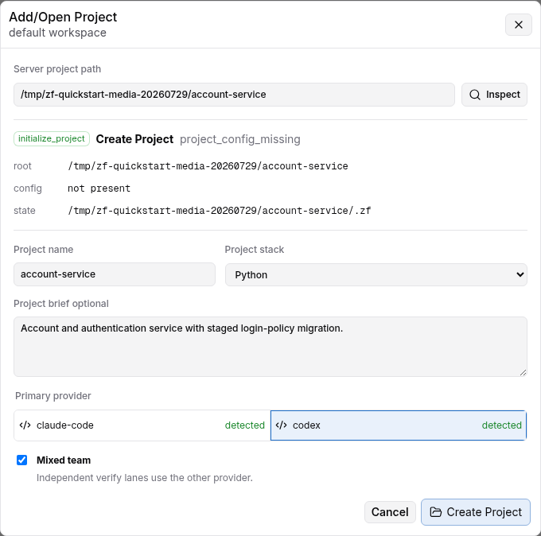
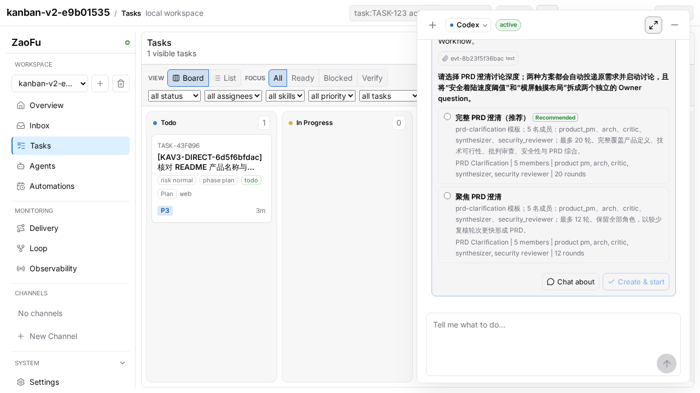
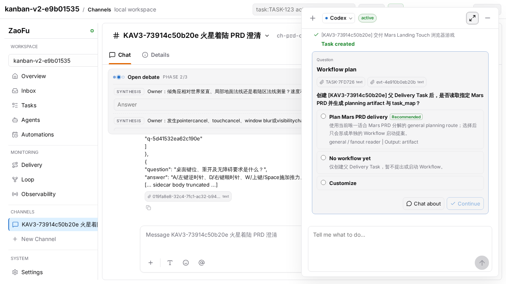
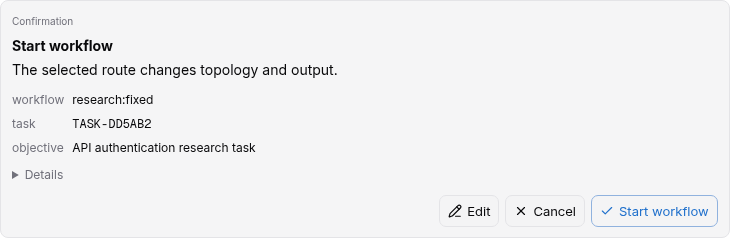

# 20 Project Creation, Bootstrap, and Workflow Ignition

> Audience: operators creating a ZaoFu Project from an empty directory or an
> existing repository, then safely igniting the first Workflow through Kanban
> Agent, Channel, Research, or CLI.
>
> Last verified against the CLI and Web UI: 2026-07-29.

## 1. Project, Request, and Run are different lifecycles

| Object | Meaning | Long lived |
|---|---|---|
| Project | Project root, canonical `zf.yaml`, state dir, workspace, and integrations | Yes |
| Request | One requirement clarification, acceptance contract, kind proposal, and ignition request | No; many per Project |
| Run | Immutable execution snapshot of an approved Request | No; many per Project |

Rules:

- `zf project init` creates a Project. It does not start a workflow by default.
- The default Project is a multi-kind container for PRD, Issue, Feature, and
  Refactor requests.
- A Request emits `workflow.invoke.requested` only after readiness passes and an
  explicit approval is applied.
- Keep one canonical `zf.yaml` and one configured `project.state_dir` for the
  Project. Do not create another control plane for later issues or features.

The ZaoFu source repository's root `zf.yaml` now defaults to the standard
`PrdFlow` for ZaoFu's own delivery work. It is not the new-project template.
New Projects still default to multi-kind and no ignition.

## 2. Five commands that serve different purposes

| Command | Purpose | Starts a workflow |
|---|---|---|
| `zf profile bootstrap` | Detect stack and recommend/materialize a Controller, checks, and instruction docs | No |
| `zf project init` | Create the Project container, `zf.yaml`, state dir, and optional workspace registration | No by default |
| `zf init` | Initialize or repair runtime state for an existing `zf.yaml` | No |
| `zf start` | Start workers, sidecars, and the watcher, then wait for entry events | Does not invent a Request |
| `zf workflow routes/start` | Query routes for an existing Task, propose, and apply with authorization | Only `start --apply` ignites |

For a typed Flow intake, ignition is `zf flow submit --apply`, or the explicit
`zf project init ... --apply` fast path. The unified Task-bound entry for
Kanban Agent, Channel members, Coding Agents, and CLI is `zf workflow start`:
first `--propose`, then an operator applies the exact proposal with
authorization.

For a light topology, `flow submit --apply` appends both the acceptance events
and the correlated `prd.requested`
or `issue.requested` entry event in one `EventWriter` transaction. Do not emit
a second entry event manually; that would create another run identity.

## 3. CLI: create a default multi-kind Project

Set stable paths first:

```bash
export ZAOFU_ROOT=/path/to/zaofu
export TARGET_PROJECT=/path/to/my-product
```

### 3.1 Optional: inspect Bootstrap recommendations

For an existing repository, inspect without writing:

```bash
uv run --project "$ZAOFU_ROOT" zf profile bootstrap \
  "$TARGET_PROJECT" \
  --intent build \
  --backend claude-code \
  --scale launch
```

For an uninitialized new Project, stop after Inspect and use `project init` in
the next section to materialize the default multi-kind Project. `profile
bootstrap --apply` is a separate materialization path for explicitly choosing
the recommended single archetype as the initial config. Do not run both write
commands unconditionally against the same new Project.

Apply the Bootstrap result only when that is the selected path:

```bash
uv run --project "$ZAOFU_ROOT" zf profile bootstrap \
  "$TARGET_PROJECT" \
  --intent build \
  --backend claude-code \
  --scale launch \
  --apply
```

For an empty project, declare `--stack python|node|go|rust`. Add `--scaffold`
only when the minimal `src/`, `tests/`, and README skeleton is wanted.
Bootstrap never launches a provider. Multi-document Flow configs own their
gates, so Bootstrap Apply does not automatically fill `required_checks` into an
existing multi-kind `zf.yaml`; provide real project commands in the next step.

### 3.2 Initialize the Project container

Omit `--kind` to create the default multi-kind Project:

```bash
uv run --project "$ZAOFU_ROOT" zf project init \
  --name my-product \
  --description "Durable project background, goals, and constraints" \
  --root "$TARGET_PROJECT" \
  --create \
  --git-init \
  --backend codex \
  --verify-backend claude-code \
  --stack python \
  --workspace-register
```

This creates the root and canonical config, allocates Project-specific runtime
and session names, materializes Issue/PRD/Refactor routes, writes Project Brief
to `zf.yaml` and the managed `AGENTS.md` context, creates a Stack command
Profile, compiles the optional verify backend into an independent verification
lane, and registers the Project. Issue defaults to one lane, PRD to two, and
Refactor to five. It does not submit a Request or emit a workflow invoke.

Remove `--git-init` for an existing Git repository. Remove `--create` when the
directory must already exist.

### 3.3 Review the materialized Project

`project init` creates a fail-closed template. Before ignition, replace the
selected kind document's `TODO` refs and configure executable mechanical gates
under the final `ZfConfig.spec`. For example:

```yaml
# PrdFlow.spec
prdRef: docs/intake/prd-account-security.md
targetRoot: app

# ZfConfig.spec
quality_gates:
  static:
    required_checks:
      - "cd app && npm run typecheck"
      - "cd app && npm test"
    on_fail: "candidate tree failed static gate; repair before reintegration"
workflow:
  rework_routing:
    static_gate.failed: prd-dev-lane-0
    test.failed: prd-dev-lane-0
```

Use commands that exist in the target repository and route failures to a real
implementation owner for that kind; multi-lane flows should preserve affinity.
Do not copy placeholders or bypass delivery verification with
`workflow.allow_unverified_candidate`.

```bash
cd "$TARGET_PROJECT"

uv run --project "$ZAOFU_ROOT" zf validate --path zf.yaml
uv run --project "$ZAOFU_ROOT" zf validate --cold-start
uv run --project "$ZAOFU_ROOT" zf skills doctor
uv run --project "$ZAOFU_ROOT" zf workflow inspect
uv run --project "$ZAOFU_ROOT" zf start --dry-run --no-watch
```

`workflow inspect` renders the full multi-kind static graph. It may include
diagnostics for an unselected kind or flag an event produced only by a runtime
bridge as having no static producer. The active Request's `flow preflight
--kind ...` is the ignition decision. Genuine `STOP` findings such as an
invalid rework target, missing role, or missing gate must still be fixed.

Before a real run, verify Project/state/session identity, provider login,
kind routes, executable quality checks, skill sources, workdir and Git refs,
and every remaining validation STOP or placeholder.

When `flow preflight` or `flow submit --dry-run` returns `STOP`, no invoke event
is emitted. Apply its `fix-it` guidance and rerun preflight. This is expected
readiness protection, not a failed runtime start.

## 4. CLI: clarify and ignite the first PRD

### 4.1 Create the Request intake

```bash
mkdir -p docs/intake

uv run --project "$ZAOFU_ROOT" zf flow intake \
  --kind prd \
  --objective "Implement the account security settings page" \
  --target app \
  --acceptance "Users can enable and disable two-factor authentication" \
  --acceptance "Unit and browser acceptance tests pass" \
  --request-id prd-account-security \
  --output docs/intake/prd-account-security.md
```

Incomplete input remains `clarifying` and does not create execution tasks.

### 4.2 Clarify and confirm the requirement snapshot

```bash
uv run --project "$ZAOFU_ROOT" zf flow clarify \
  --config zf.yaml \
  --intake docs/intake/prd-account-security.md \
  --constraint "Existing login sessions must remain compatible" \
  --acceptance "Failure cases show an actionable error" \
  --confirm \
  --json
```

Readiness requires a non-empty objective and acceptance contract, no open
questions, a resolved kind, the required roots, and a usable backend/profile/
lane/environment preflight. PRD requires a target root; Refactor requires both
source and target roots.

### 4.3 Preflight and preview without mutation

```bash
uv run --project "$ZAOFU_ROOT" zf flow preflight \
  --config zf.yaml \
  --kind prd \
  --intake docs/intake/prd-account-security.md \
  --json

uv run --project "$ZAOFU_ROOT" zf flow submit \
  --dry-run \
  --config zf.yaml \
  --intake docs/intake/prd-account-security.md \
  --kind prd \
  --json
```

Use `--allow-missing-env` only for a controlled dry-run or CI preview. Do not
hide a missing provider, Git, tmux, or test tool before a real run.

### 4.4 Start runtime, then explicitly ignite

Terminal A:

```bash
cd "$TARGET_PROJECT"
uv run --project "$ZAOFU_ROOT" zf start
```

Terminal B:

```bash
cd "$TARGET_PROJECT"
uv run --project "$ZAOFU_ROOT" zf flow submit \
  --apply \
  --config zf.yaml \
  --intake docs/intake/prd-account-security.md \
  --kind prd \
  --json
```

Stock kind routes already provide a pattern, so `--pattern-id` is normally
unnecessary. Supply it only for a custom route without a configured default.

Inspect the result:

```bash
uv run --project "$ZAOFU_ROOT" zf events --last 30
uv run --project "$ZAOFU_ROOT" zf status --workers
uv run --project "$ZAOFU_ROOT" zf kanban --board
```

A normal chain includes `workflow.submit.accepted` and
`workflow.invoke.requested`. Scan, plan, task-map, and Kanban tasks appear only
after the running runtime consumes the invoke.

## 5. One-command fast path for a complete requirement

Use this only when the requirement and acceptance contract are already clear:

```bash
uv run --project "$ZAOFU_ROOT" zf project init \
  --name account-service \
  --root /path/to/account-service \
  --create \
  --git-init \
  --backend claude-code \
  --request-kind prd \
  --objective "Deliver the account security settings page" \
  --target app \
  --acceptance "Unit and browser acceptance tests pass" \
  --workspace-register \
  --apply \
  --json
```

`--apply` cannot bypass missing fields or open questions. An incomplete Request
stays `clarifying` and fails closed without ignition.

## 6. When to use a single-kind Project

Compatibility entry points remain available:

```bash
zf project init --kind issue ...
zf project init --kind prd ...
zf project init --kind refactor ...
```

Use them only for a bounded Project that will not carry another request kind.
Long-lived products should stay multi-kind. Features use a light PRD route;
Issues default to one lane.

## 7. Web global onboarding and Add/Open Project

Enable controlled Web mutations and start the workspace shell:

```bash
"$ZAOFU_ROOT/tools/start-webkanban.sh" \
  --host 127.0.0.1 \
  --port 8001 \
  --workspace-only
```

The launcher reuses or creates the action token and consistently loads the
Workspace/provider environment and trusted-local Codex headless sandbox
policy. Direct `zf web` is a low-level debugging entry point, not the default
Channel or Kanban Agent launcher.

In first-run onboarding:

1. Select Codex or Claude Code as the primary provider, and optionally enable
   Mixed team when both providers are detected.
2. Pass the environment preflight.
3. Authorize the browser action session.
4. Complete onboarding into the Workspace. Zero Projects is valid.

To add a Project, enter its server path and inspect it. The backend returns one
action: open, register, initialize state, initialize Project, or block. Only
Project initialization asks for a name, optional Project brief, detected or
declared stack, primary provider, and Mixed team policy.




The brief remains canonical as `project.description`, appears in Project
Overview, and is projected into the managed Project Context section in
`AGENTS.md`. The detected or declared stack and build/test/gate commands enter
the managed Profile section. `CLAUDE.md` points to `AGENTS.md` instead of
duplicating that provider-neutral context.

Web greenfield creation, CLI `project init`, and `tools/init-project.sh` reuse
`init_flow_project`. Web creates the seed and Git HEAD for a missing or empty
target; the script additionally handles interactive Git readiness for existing
directories, validation, and startup dry-run. These paths create and register
the Project but do not ignite a Workflow. Requirements may be discussed
through Kanban Agent, Channel, or CLI. A Task-bound Workflow starts only after a
Task is explicitly created/confirmed and its Plan and Approve steps complete.

## 8. Controlled ignition from Kanban Agent, Channel, and Research

### 8.1 Choose the requirement entry after Project creation

| Entry | Existing Task required | Direct ignition |
|---|---:|---:|
| Normal Kanban Agent coding | No | No; ordinary provider-session work |
| `Create Task` | No | No; creates tracking only |
| Channel setup/discussion | No | No; creates collaboration, while default conversation waits for directed interaction |
| Research Workflow | Yes | Separate Approve after Plan |
| PRD/Issue/Refactor/Planning Workflow | Yes | Separate Approve after Plan |

After the Project opens, Kanban Agent classifies the concrete requirement,
complexity, and acceptance target. It may recommend only active routes from the
current `zf.yaml` catalog and must not invent topology, pattern, lanes, or roles
from chat text.

### 8.2 Channel produces collaboration artifacts only

Selecting a Channel setup Plan may directly execute
`channel-create-and-start`, atomically creating the Channel and template
Members, posting the original requirement, and initializing the discussion mode:



This is the bounded Plan direct-apply exception. It does not allow Channel to
ignite a Workflow. Default `conversation` does not fan out; only explicit
Discuss / `multi_lens` runs bounded multi-perspective work. Explicit Finalize
creates a PRD draft, and only an Owner-confirmed revision is the canonical PRD.
Neither synthesis nor a confirmed PRD automatically creates a Task. The
operator explicitly requests and confirms a `Create Task` proposal. PRD
decomposition, the planning artifact, and `task_map` are produced later by the
selected Workflow planning stage.

### 8.3 Task-bound Workflow uses Plan then Approve

All surfaces use the same service for an existing Task:

```text
zf workflow routes --task TASK-ID
-> semantic planner recommends an active route
-> Plan selects route and parameters
-> workflow start proposal
-> separate approval of the exact proposal
-> workflow.invoke.requested
```






Plan supports `Chat about` and `Customize` for source/input refs, expected
output, scope, or another route-changing parameter. Selecting a route creates a
proposal; it does not mean the Workflow is running.

CLI uses the same surface-neutral service:

```bash
zf workflow routes --task TASK-ID --format json

zf workflow start \
  --task TASK-ID \
  --route research:fixed \
  --objective "Research account recovery and produce evidence-backed advice" \
  --parameters-json '{"expected_output":"research synthesis plus PRD inputs"}' \
  --propose \
  --format json
```

Only an authorized operator applies the exact proposal:

```bash
zf workflow start \
  --proposal-event-id EVENT-ID \
  --authorization-ref APPROVAL-REF \
  --authorization-token "$ZF_WORKFLOW_ACTION_TOKEN" \
  --apply \
  --format json
```

Provider and Coding Agent processes must not receive or inspect
`ZF_WORKFLOW_ACTION_TOKEN`.

### 8.4 Research is a registered Workflow route

The fixed route is `research:fixed` and is selectable only when available in
the current Project catalog. It requires a Task and uses
`source_researcher`, `product_analyst`, `technical_analyst`, `risk_critic`,
and `synthesizer`. Outputs include summary, evidence refs, open questions, and
PRD/Refactor prompt inputs.

The `research-review` Channel template is discussion only; it does not
implicitly start Research Workflow. After Research, the operator still decides
whether to create or update a delivery Task. ZaoFu does not automatically
ignite a PRD Workflow.

## 9. Troubleshooting

### Initialize completed but no tasks exist

This is expected. Initialize creates only the Project. Normal coding can start
directly. For a controlled Workflow, create or confirm a Task, complete the
Workflow Plan and Approve steps, then verify that the running watcher consumed
`workflow.invoke.requested`.

### Channel produced a PRD but no Task exists

This is the intended boundary. Channel output is a collaboration artifact, not
an execution commitment. Ask Kanban Agent for a `Create Task` proposal, confirm
it, and then select a Workflow for that Task.

### `zf start` produced idle panes

`zf start` starts runtime only. Workers correctly wait when there is no accepted
entry event.

### `flow submit --apply` was rejected

Inspect objective, acceptance, open questions, required roots, and preflight.
Do not forge an invoke event to bypass readiness.

### Dashboard says Project needs initialization

Verify that workspace `root`, `config_path`, and `state_dir_hint` identify the
same Project, then run `zf validate --cold-start` from the Project root.

### The repository root is PRD but a new Project is multi-kind

The root config is ZaoFu's own default workflow. `project init` is the product
Project-container entry point. Do not create an external Project by copying the
repository root config.

## 10. Completion checklist

- One canonical `zf.yaml` exists for the Project.
- `project.name`, `project.description`, provider policy, and the managed
  `AGENTS.md` Project Context/Profile match the Project Brief, Stack, and real
  commands.
- State dir, tmux session, branch prefixes, and ports do not collide.
- Workspace registration and Dashboard switching resolve the correct Project.
- Bootstrap recommendations were reviewed and checks execute in the target.
- Channel output intended for delivery was explicitly confirmed as a real
  Task; no implicit Task creation occurred.
- The Task-bound route comes from the current catalog and binds the exact
  Task/config digest.
- The Request or Task has objective, acceptance, correct refs/roots, and no
  open questions.
- Submit/proposal preview has no STOP; explicit approval precedes apply.
- The `zf start` watcher stays alive and events, tasks, and workers are visible.
- Stop only the configured Project with `zf stop`; never use `tmux kill-server`.
