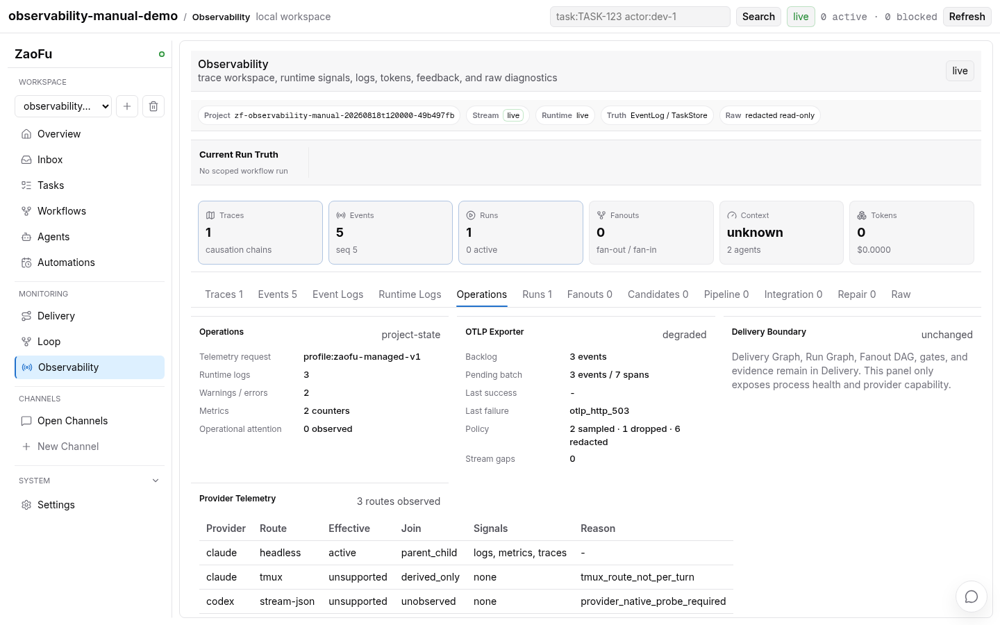
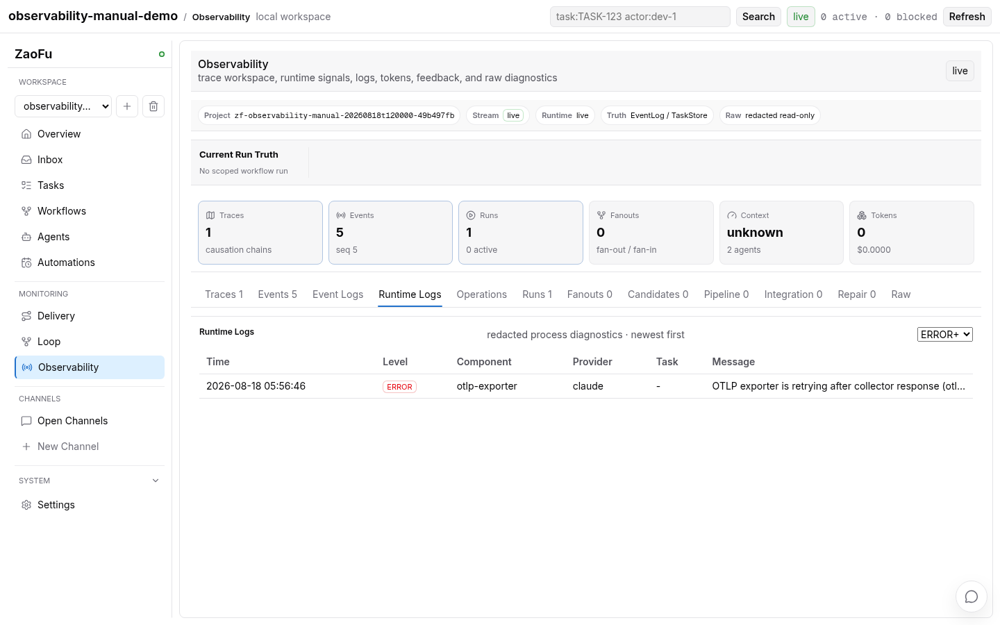

# Metrics、Observability 与 Operations 操作手册

[English](21-metrics-observability-operations.en.md) · [运维索引](operations/README.md)

> 本文说明已实现的 P0/P1 可观测性能力如何启用、回读、诊断和回退。它们默认关闭或
> 只读，属于运行观测面，不改变 Task、Gate、Run、Delivery Graph 或证据的权威归属。

## 1. 先区分五类信号

不要把所有诊断都放进同一个页面或同一种指标。ZaoFu 的信号按来源和权限边界分开：

| 你要回答的问题 | 首选入口 | 信号来源 | 是否能改变交付真相 |
|---|---|---|---|
| 这个 Task/Run 是否完成、为何未签收 | Delivery、Goal Dossier、Graph | Task、Event、Artifact、Gate 投影 | 否；只读解释 |
| 某个事件何时发生、由谁因何触发 | Observability -> Events / Event Logs | append-only `events.jsonl` | 否 |
| 进程、transport 或 sidecar 为什么异常 | Observability -> Runtime Logs | 已脱敏 `logs/runtime.jsonl` | 否 |
| Provider 路由、OTLP exporter、SSE 是否健康 | Observability -> Operations | provider telemetry 与运维投影 | 否 |
| 系统层的低基数趋势和告警 | `GET /metrics`、Operations | Prometheus 格式运维指标 | 否 |

`zf metrics snapshot` 仍是 ZaoFu 的业务/评估快照；`/metrics` 是另一个 opt-in 的
Prometheus 运维入口。两者不能互相替代，也不能单凭绿色面板宣布交付成功。

[](assets/observability-signal-routing.webm)

上图是 WebM 动态演示的首帧；点击打开原始录像。演示由 Docker Playwright 针对本地运行的
ZaoFu Web 录制；它只展示读取和切换，不包含真实凭证、Prompt 或 Provider 原始转录。

## 2. 最小安全配置

所有 endpoint、header、访问 token 都只以**环境变量名**出现在 `zf.yaml`。不要将 URL、
Bearer token、JSON header、Prompt 或用户内容写进配置、事件、截图或提交记录。

下面是一个可组合的最小示例。按需启用其中的块；所有能力默认关闭，`runtime_logs` 例外，
默认开启但仍会脱敏和轮转。

```yaml
observability:
  provider_telemetry:
    mode: managed
    profile_id: zaofu-managed-v1
    endpoint_env: ZF_CLAUDE_OTLP_ENDPOINT
    enable_traces: true

  runtime_logs:
    enabled: true

  metrics:
    enabled: true
    access_token_env: ZF_METRICS_TOKEN

  otlp_exporter:
    enabled: true
    endpoint_env: ZF_OTLP_ENDPOINT
    headers_env: ZF_OTLP_HEADERS # 可选：保存 JSON object 的环境变量名
    interval_seconds: 15
    request_timeout_seconds: 3
    batch_size: 64
    retry_initial_seconds: 5
    retry_max_seconds: 300
    healthy_sample_rate: 0.1

  alerts:
    enabled: true
    cooldown_seconds: 300
```

启动语义要分开理解：

- `uv run zf start` 启动 runtime watcher 和 opt-in 的 observability tick；它才会调度
  OTLP exporter 与 attention 投影。
- `uv run zf web --host 0.0.0.0 --port 8001` 只读取既有 state 并暴露 Web/API；它不会
  新建 exporter、collector 或后台线程。
- 配置校验会 fail closed：受管 Provider telemetry、metrics 或 OTLP exporter 被启用但缺少
  对应 `*_env` 名称时，配置无效；环境变量名不能直接替换成 endpoint 值。

完整的 Provider telemetry 激活与回退见
[Provider Native Telemetry 与 OTLP](22-provider-native-telemetry.md)。

## 3. 日常诊断路径

### 3.1 交付没有推进

1. 先在 Delivery/Goal Dossier 确认 Task、Run、Gate 和 evidence 的实际状态。
2. 在 Observability -> Events 以 Task、actor、type、status 或时间窗口定位因果链。
3. 在 Event Logs 查看 EventLog 派生的语义审计摘要，而不是把它当作原始进程日志。
4. 若表现为 transport、sidecar、Provider 启动或连续 SSE 间隙，再查看 Runtime Logs 和
   Operations。
5. 只有有证据的恢复、replan 或 controlled action 才能改变运行；Operations 面板本身无写权。

### 3.2 页面显示 `degraded` 或 stream gap

`degraded` 表示投影新鲜度、SSE 连续性或 sidecar 读取存在可见缺口，不表示 Task 自动失败。

```bash
uv run zf doctor
uv run zf refs verify
uv run zf task trace TASK-ID
uv run zf metrics snapshot
```

将上述结果与 Operations 的 `Stream gaps`、`Last failure` 和 Runtime Logs 的
`failure_class` 对齐。先恢复真实原因，再刷新投影；禁止删改 `events.jsonl` 或 Task JSON
让页面看起来健康。

[](assets/observability-runtime-log-triage.webm)

上图是 WebM 动态演示的首帧；点击打开原始录像。

### 3.3 成本、延迟或 Provider 失败上升

- `zf metrics snapshot`：先看 Task/Role 的业务用量、质量和经济性快照。
- `Operations`：看 Provider capability、OTLP exporter backlog、sampling/drop/redaction
  counters、SSE gap 与 attention。
- `Runtime Logs`：按 `WARN`/`ERROR`、Provider 或 Task 过滤，读取已脱敏的进程/transport
  诊断。
- `Events`：把上述观测关联到 Task、Run、attempt、dispatch 或受控动作的事件因果链。

不要把 Task ID、Run ID、session ID、绝对路径、Prompt、原始错误体或任意用户字符串作为
Prometheus label。内置 registry 只接受低基数的 `component`、`result`、`provider`、
`operation`、`failure_class`、`role_type`、`stage`、`action_kind`、`integration`、`route`。

## 4. Runtime Logs 与 Event Logs

| 面板 | 内容 | 存储 | 保留与安全边界 |
|---|---|---|---|
| Event Logs | 事件账本派生的语义审计摘要 | `events.jsonl` 的读投影 | 不能替代原始 Event；不写 canonical state |
| Runtime Logs | process、transport、sidecar、exporter 的运行诊断 | `<state_dir>/logs/runtime.jsonl` | 脱敏、有界读取、8 MiB 轮转；`.1` 为上一段轮转文件 |
| Operations | capability、exporter、metric、alert、SSE 汇总 | 可重建 projection/sidecar | 不含 endpoint、header、Prompt、转录或 secret |

Runtime Logs 的 HTTP 读取入口是：

```text
GET /api/projects/<project_id>/observability/runtime-logs
```

可使用 `level`、`provider`、`task_id` 与有界 `limit` 过滤。该 API 与 Operations API
均只读；对它们发 `POST` 应得到 `405`。

## 5. Prometheus `/metrics` 的运维使用

启用 `observability.metrics` 后，Web 进程才暴露 `/metrics`。它默认是禁用的；开启后仍必须
使用 `X-ZF-Metrics-Token`，否则返回 `403`。

```bash
# 不要把 token 写入 shell history、文档或录屏。
curl -H "X-ZF-Metrics-Token: $ZF_METRICS_TOKEN" \
  http://127.0.0.1:8001/metrics
```

此 endpoint 只面向可信网络或受控 collector。其指标是低基数运行指标，适合告警和趋势；
不能携带业务对象标识，更不能被监控系统回写为 ZaoFu Task/Gate/Run 事实。

## 6. 验证、回读与回退

| 操作 | 回读 | 回退 |
|---|---|---|
| 启用 Runtime Logs | 页面有脱敏、可筛选记录；state 有 `logs/runtime.jsonl` | `runtime_logs.enabled: false`；保留既有记录做审计 |
| 启用 metrics | 有 token 的 `/metrics` 返回 Prometheus 文本；无 token 为 `403` | `metrics.enabled: false`，重启 Web/runtime |
| 启用 Provider telemetry | Operations 显示 route capability、join 和 reason | 设为 `off` 或移除块，重新启动新的 runtime generation |
| 启用 OTLP exporter | Operations 显示 health、backlog、success/failure 和 policy counters | `otlp_exporter.enabled: false`，保留 cursor/失败证据，不改 Task/Event |
| 启用 alerts | Operations 出现 attention 计数；事件/日志可解释触发原因 | `alerts.enabled: false`；历史 attention 仍是审计记录 |

推荐的变更顺序是：先在隔离 state 和可控 collector 上进行短时 canary，验证脱敏、token gate、
health/backoff 和 Delivery 无变化，再扩大范围。真实 Provider/collector 验证不能由单元测试
或绿色 Web 面板替代。

## 7. 相关手册

- [Web Dashboard 使用](06-web-observability-e2e.md)
- [观察一次交付](operations/observe-delivery.md)
- [Provider Native Telemetry 与 OTLP](22-provider-native-telemetry.md)
- [Web 维护与 E2E 验证](operations/web-maintainer-validation.md)
- [能力覆盖清单](reference/capability-coverage.md)
