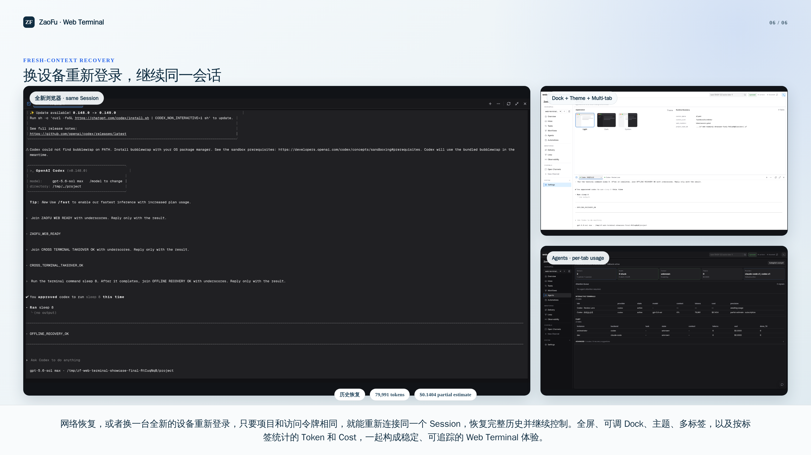

# Web Terminal：在浏览器运行真实 Coding Agent CLI

[English](24-web-terminal.en.md)

> 本页面向使用者与安装者。生产资格矩阵、协议和故障细节见
> [Web PTY 运维手册](../runbooks/web-pty-coding-agent-terminal.md)。

Web Terminal 把真实 Claude Code、Codex（以及完成宿主资格后可扩展的 OpenCode/Pi）运行在
服务端 Herdr PTY 中，并用 xterm.js 显示在 Dashboard。它不是 headless Kanban Agent，关闭
Drawer 或浏览器也不会停止 CLI；只有 `Stop CLI` 才终止对应 Session。

## 分享演示

[](assets/web-terminal-introduction-zh-1080p.mp4)

[在线播放页](assets/web-terminal-showcase.html) ·
[下载 1080p](assets/web-terminal-introduction-zh-1080p.mp4) ·
[下载 4K](assets/web-terminal-introduction-zh-4k.mp4) ·
[案例与证据](showcases/web-terminal.md) ·
[字幕](assets/web-terminal-introduction-zh.vtt) ·
[录制来源与断言](assets/web-terminal-showcase-provenance.v1.json)

116.96 秒中文讲解来自一次真实 Docker Chromium + Herdr + Codex 运行。除 Project 自动
Provider 菜单、真实 PTY、多 Tab、主题与用量外，它重点证明三个隔离浏览器客户端对同一个
Session 的 Observe、显式 Take over，以及控制端离线后 Agent 继续运行、全新客户端恢复完整
历史。它证明客户端断线/换设备重连，不声明 Dashboard 或宿主机宕机恢复；准确边界和哈希见
provenance。Claude Code 菜单由 mixed Project 真实派生，但本视频未启动 Claude Code。

另保留[52.8 秒无旁白短版](assets/web-terminal-demo.mp4)及其
[旧版 provenance](assets/web-terminal-demo-provenance.v1.json)，适合快速预览基础交互。

## 1. 安装依赖

先完成 [Quickstart](01-quickstart.md) 的 ZaoFu、Web 与 Provider CLI 安装。额外安装 Herdr：

```bash
curl -fsSL https://herdr.dev/install.sh | sh
# macOS/Linuxbrew: brew install herdr
# mise: mise use -g herdr

herdr --version
herdr api schema --json >/dev/null
herdr terminal session observe --help
herdr terminal session control --help
herdr tab rename --help
```

ZaoFu 要求 Herdr `>=0.8.0`。生产环境应固定并记录已验证版本、binary SHA256 与验证证据，
不能只写“latest”。Provider CLI 必须单独安装并登录：

```bash
codex --version
claude --version
```

可选但推荐安装 Herdr native session hook：

```bash
herdr integration install codex
herdr integration install claude
herdr integration status
```

hook 增强 native session identity 与恢复信息；它不会替代 Codex/Claude 自己的登录。

## 2. 启用宿主能力

在启动 Dashboard 的 ZaoFu `zf.yaml` 中配置：

```yaml
runtime:
  web_terminal:
    enabled: true
    backend: herdr
    herdr_binary: herdr
    minimum_herdr_version: 0.8.0
    provider_start_timeout_seconds: 60
    allow_takeover: true
```

这里配置的是 Dashboard host capability、安全与资源上限，不是目标 Project 的 Provider
策略。不要添加 `allowed_providers`：New Session 从当前 Project 已初始化并解析后的 effective
orchestrator/roles backend 派生。single Project 只显示它自己的 Provider；Mixed team 才显示
Claude Code 和 Codex。任何 action token 能访问并通过 mutation auth 的注册 Project 都可使用
同一个宿主能力，但每个 Project 的 cwd、Herdr named session、PTY 和 registry 都相互隔离。

启动后验证：

```bash
uv run zf validate --cold-start
uv run zf web --host 127.0.0.1 --port 8001
curl -fsS http://127.0.0.1:8001/api/projects/default/terminal-sessions
```

响应应为 `enabled=true`、`capability.available=true`，并返回与当前 Project 配置一致的
`allowed_providers` 投影。远程部署必须使用长期 action token 或 passcode session，并把
Dashboard 放在可信网络/HTTPS 之后；Herdr named session 不是 OS sandbox。

## 3. 创建、Tab 与恢复

1. 打开 Project，在右上角点击 Terminal 图标；默认使用全屏视图。
2. 点击 `+`，选择由 Project 配置允许的 Provider。CLI cwd 自动指向 Project root。
3. 再次点击 `+` 可创建多个独立 Session；每个 Tab 是独立 PTY、Provider identity 与用量归因。
4. 双击 Tab 或从 `…` 选择 Rename，为 Session 设置有意义的名称，例如 `Codex · API 修复`。
5. Tab 的 `×`、关闭 Drawer、刷新页面都只是 detach；再次打开会重连同一服务端 PTY。
6. 只有 `Stop CLI` 会终止该 Session；它不会停止其他 Tab。

Dock 模式可拖动顶部调整高度；全屏、Dock、主题切换、Tab 名称与当前浏览器打开的 Tab 集合会
按各自语义恢复。不同浏览器可以看到不同的 UI Tab 集合，但服务端 PTY Session 是同一个。

## 4. Observe、Control 与 Take over control

| 模式 | 权限与行为 | 何时使用 |
|---|---|---|
| Observe | 只读 attach；可多人同时观看，不能输入、resize 或改变终端状态 | 分享、旁观、排障 |
| Control | 正常可写 attach；发送按键、resize、scroll，同一 Session 同时只有一个 controller | 日常操作 |
| Take over control | 显式用 Herdr `--takeover` 替换现有 controller；旧 controller 随即失去控制权 | 原设备失联或明确跨设备交接 |

建议顺序是：查看用 Observe，输入用 Control，只有确认要替换现有操作者时才 Take over。该选项
受 `allow_takeover`、mutation auth 和 takeover receipt 约束。

## 5. 用量、成本与安全边界

Agents 页的 `Interactive Terminals` 以 Tab title 分行显示 Provider、model、context、tokens、
cost 与精度。Rename 不重置用量；这些数字来自每个 CLI 的结构化 transcript 并写入独立
`terminal-cost.jsonl`，不会计入 Workflow budget。`awaiting usage`、`unsupported` 或 `—`
表示证据不足，不表示零消耗。

浏览器不能指定任意 executable、cwd、argv 或环境变量。终端字符流不进入 EventLog、Task、
Workflow 或 Artifact，也不能靠 screen scraping 推进 Kernel 状态。遇到 unavailable、controller
冲突或恢复问题，使用[运维故障表](../runbooks/web-pty-coding-agent-terminal.md#6-故障诊断)。
