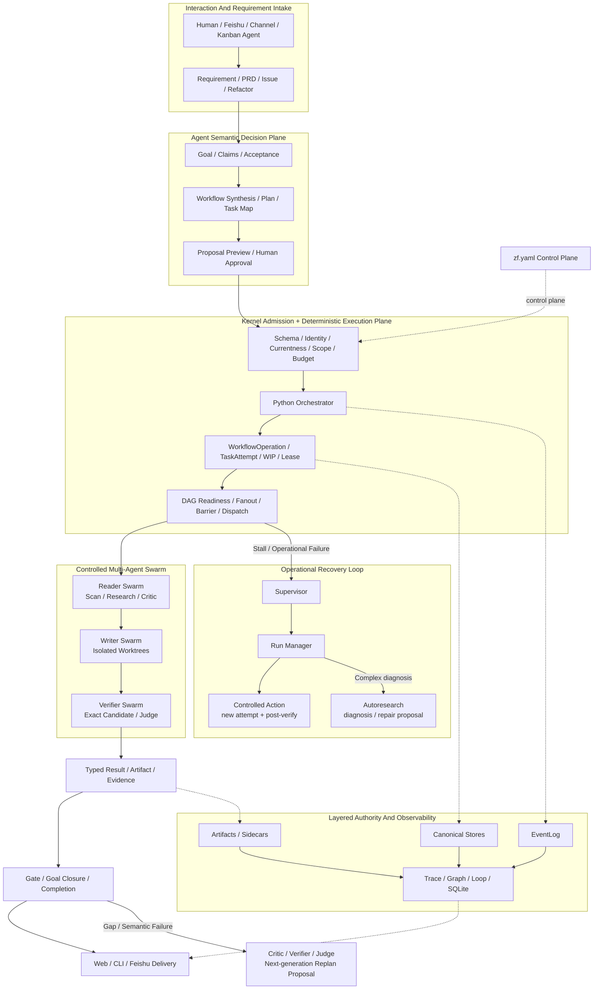
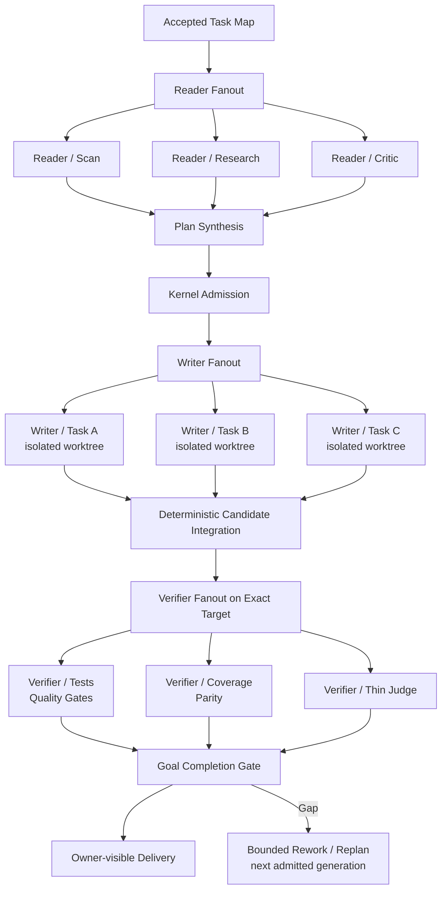

# ZaoFu Architecture Overview

[中文](architecture.md) · [Concept index](concepts/README.en.md)

> For operators and contributors who need runtime boundaries. First-time users
> should begin with the
> [first verified delivery](getting-started/first-verified-delivery.en.md).
> This page follows current code and tests and does not generalize the
> historical three-layer safe-team model.

## 1. Product Position

ZaoFu is an AI Agent Delivery Control Plane and Coding Harness for long-horizon
software delivery. It brings Goal, Task, Agent, code, tests, evidence, recovery,
and human decisions into one observable, recoverable, auditable delivery system.

ZaoFu does not replace Codex, Claude Code, or another provider agent. Providers
keep semantic judgment, code implementation, and tool execution. ZaoFu owns the
deterministic runtime boundary and team delivery state.

```text
idea / PRD / issue / refactor
  -> intake / confirmed goal
  -> approved workflow / task map
  -> contracted agent attempts
  -> independent verification
  -> goal closure / completion gate
  -> owner delivery or bounded terminal blocker
```


## 2. Five Architecture Pillars

ZaoFu is a delivery system built from five engineering mechanisms rather than
a loose collection of Agents:

| Pillar | Problem it solves | Current boundary |
|---|---|---|
| Goal Engineering | Fix a requirement as Goal, Claims, Acceptance, Non-goals, and completion definition | Task done does not automatically close the Goal |
| Graph Engineering | Compile a Goal into Workflow, Task Map, dependencies, waves, fanout, barriers, and evidence producers | Agents produce the semantic graph; the Kernel executes only an admitted graph |
| Swarm Engineering | Let roles, providers, and Workers research, implement, verify, and aggregate in parallel | Bounded fanout/fan-in; no unlimited recursive recruitment or state-machine bypass |
| Loop Engineering | Converge through verification, rework, replan, recovery, and completion | Every loop has attempt, budget, evidence, and termination bounds |
| Harness Engineering | Govern context, tools, worktrees, events, state, artifacts, security, and observability | Provider Agents never own canonical state |

Together they answer what to build, how to decompose it, who should execute it,
how it should converge, and what proves completion. Graph, Swarm, and Loop all
operate inside the same Harness authority boundary rather than creating their
own task truth.

## 3. Layered Runtime Authority

ZaoFu is neither pure event sourcing nor a system where one JSON file owns every
fact.

| Layer | Carrier | Authority | Legal writer |
|---|---|---|---|
| Control plane | `zf.yaml` | topology, roles, policy, budget, safety, and `project.state_dir` | human or controlled config tool |
| Occurrence ledger | `events.jsonl` plus archive segments | occurrence, ordering, causation, verdict, and refs | sanctioned `EventWriter` / `EventLog` path |
| Current state | Task, Feature, Session, RoleSession, TaskAttempt stores | current status, assignment, lease, and attempt | Kernel store/helper |
| Complete semantics | artifacts, sidecars, accepted packages | plans, Task Maps, results, evidence, and large payloads | atomic sanctioned writer |
| Query projection | SQLite, Trace, Graph, Loop, Web summaries | query, aggregation, visualization, and freshness | projector/read-model builder |
| Active transport | SSE, LiveDeltaBus, provider streams | ephemeral deltas | transport/runtime |

Key boundaries:

- an event may prove an action occurred and reference its result while the full body lives in a sidecar;
- TaskStore answers current Task state while EventLog proves a transition and its causation;
- a required artifact is not a disposable projection;
- SQLite, Graph, Trace, and Web pages are rebuildable and cannot write scheduler truth;
- not every canonical store can currently be rebuilt from `events.jsonl` alone.

## 4. Semantic Decision And Deterministic Execution Planes

ZaoFu separates open-ended Agent judgment from reliable Runtime execution:



| Actor | Current responsibility |
|---|---|
| Kernel / Python `Orchestrator` runtime | config loading, identity, mechanical dispatch, schema/gates, replay, transitions, and external effects |
| Worker Agents and Skills | planning, implementation, review, verification, diagnosis, and product judgment; report typed results or intent only |
| configured `orchestrator` role Agent | stable session identity, exceptional semantic triage, and replan/proposal; not a full-run blocking semantic owner in current Product Flow |
| Supervisor | observe, correlate, and raise attention; no direct repair |
| Run Manager | own operational liveness, choose bounded recovery, and require post-verification |
| Autoresearch | reproduce repeated harness fingerprints and propose isolated diagnosis/repair |
| ControlledActionService | apply approved, auditable deterministic side effects |
| Web / CLI / Feishu | read projections, submit intent, and request token-gated controlled actions |

The deterministic Python `Orchestrator` and an Agent role named `orchestrator`
are different objects. Current code keeps the former as the Product Flow
happy-path coordinator. Candidate designs for full OA semantic control or
blocking checkpoints are not current production defaults.

## 5. Two Orchestration Modes

### Product Flow

For PRD, Issue, Refactor, Research, and long-horizon product delivery:

```text
typed event/artifact
  -> Kernel topology/profile route
  -> deterministic WIP/role/worker dispatch
  -> Worker result/evidence
  -> mechanical gate/reducer
  -> exceptional semantic triage/replan proposal
  -> ControlledActionService applies an approved action
```

The Kernel owns happy-path dispatch from the approved topology/profile. Agents
decide project semantics, plans, and solutions. The Kernel does not hard-code
acceptance, scan methods, or product judgment in Python.

### Legacy Safe-Team

An explicit compatibility profile may let a Layer 2 Agent decompose goals,
synthesize contracts, and assign before Kernel validation and mechanical
transition. This is useful for compatibility, teaching, or manual orchestration;
it is not global Product Flow ownership.

Documentation, tests, and extensions must name the mode they target.

## 6. Controlled Multi-Agent And Swarm Execution

ZaoFu supports swarms as a **bounded, typed, observable swarm**. Multiple
Agents can work in parallel, verify independently, and aggregate results while
every child, Task, and attempt retains identity, scope, budget, context, and
evidence. The Kernel remains the only scheduling state machine.

### Current Support Matrix

| Capability layer | Current status | Runtime boundary |
|---|---|---|
| Multi-role Channel Group | Implemented | People and Agents use natural conversation or explicit `multi_lens`; Owner confirms the PRD, and discussion never auto-creates a Task or starts a Workflow |
| Reader fanout/fan-in | Implemented | Read-only roles research or scan in parallel and aggregate through `wait_for_all` or a synth contract |
| Writer fanout | Implemented | Independent Task Map tasks use isolated branches/worktrees; conflict, scope, and candidate admission fail closed |
| Task Map waves and lanes | Implemented | The Kernel releases work from dependencies, waves, WIP, and currentness rather than a lead Agent manually dispatching every step |
| Static replicas and compatible role autoscaling | Implemented, configuration required | `zf.yaml` sets bounds; Runtime uses ready Tasks, cooldown, and worker health, while a dirty worktree blocks retirement |
| On-demand Worker lifecycle | Implemented, provider resume support required | Dormant roles activate before dispatch and may suspend after settlement and idle admission |
| Cross-provider collaboration | Implemented | Codex, Claude Code, and other configured backends can be assigned by role; independent verification does not trust implementer prose |
| Provider-native compound children | Opt-in Research pilot | Only the root is a ZaoFu protocol actor; the current pilot is read-only, depth one, and limited to four children that cannot create canonical Tasks |
| Task-centric elastic Stage Worker Pool | Not implemented | Logical Task, attempt, session, worktree, and physical placement are not fully decoupled; generic autoscaling is not an elastic lane pipeline |

A typical software-delivery swarm is:



### Controlled Dynamic Workflows

Dynamic does not mean arbitrary live graph mutation. The releasable path is:

```text
Requirement
  -> Agent/Skill synthesizes a typed FlowSpec
  -> graph/config diff + preflight
  -> exact proposal approval
  -> frozen effective config + Run Contract
  -> Kernel executes registered operations and typed dependencies
```

Changes to an active Run enter through controlled replan, a new generation, or
a registered read-only continuation. An Agent cannot hot-edit `zf.yaml`, invent
arbitrary handlers or events, or recruit unbounded recursive Agents. Stable
controllers serve common PRD, Issue, and Refactor flows; static-safe Generic
Workflow serves long-tail compositions.

### Swarm Invariants

- A child cannot directly write TaskStore, EventLog files, or Run terminal state; it submits sanctioned result/evidence.
- Fanout carries parent, Run, generation, and child identity plus aggregation, timeout, and failure contracts.
- Writers use explicit scope and isolated workdirs; the Kernel serializes or rejects shared/exclusive path conflicts.
- A provider-native child is not another ZaoFu Agent or Task and cannot recurse past configured budget.
- Autoscaling changes compatible instances only inside a `zf.yaml` role policy; it never mutates canonical topology.
- Aggregate, Verify, or Judge prose cannot bypass Completion Gate and self-declare Goal completion.

## 7. Current Runtime Path

```text
zf start
  -> load zf.yaml + project.state_dir
  -> start tmux and/or stream-json transports and sidecars
  -> EventWatcher tails events.jsonl
  -> wake-worthy event calls Orchestrator.run_once()
  -> topology/profile selects mechanical next work
  -> briefing + contract + required inputs reach worker
  -> worker emits facts/results/evidence
  -> reducers/gates update sanctioned state
```

Periodic watcher ticks also drive liveness, continuation, projection refresh,
and recovery scans. Starting tmux without the watcher may strand a long-running
Workflow.

## 8. Task, Workflow, And Run

- A Task is a canonical work unit with one `contract` for behavior, scope, acceptance, verification, and owner.
- A Workflow is a registered topology/route, not Kernel control logic invented from chat.
- Task Map connects Goal Claims, Tasks, dependencies, waves, scope, and evidence producers.
- A dynamic Workflow first becomes a typed proposal and executes only after approval freezes it into the Run Contract.
- TaskAttempt persists identity and lease before transport; late results must pass currentness checks.
- Run freezes proposal, effective config, goal, and generation and converges to an exclusive terminal.
- `Task done` is not Goal closure; Closure and Completion Gate re-check mandatory Claims.

## 9. Delivery And Recovery Loops

| Loop | Shape |
|---|---|
| Delivery | intake -> plan -> task map -> implementation -> verification -> Thin Judge -> completion gate -> ship |
| Quality | contract -> typed result -> evidence gate -> pass / negative handoff |
| Recovery | failure/stall -> Supervisor -> Run Manager -> controlled action -> post-verification |
| Harness improvement | repeated fingerprint -> Autoresearch -> isolated proposal -> verify/apply |
| Human approval | Plan hold -> approve/reject -> execute, repair, or stop |

Run continuation selects zero or one current operation per tick. Repeated
no-progress recovery must converge to blocked with evidence instead of remaining
active or retrying without bound.

## 10. Safety And Constraints

- Workers and Agents report facts/intent only through `zf emit`, controlled CLI, artifacts, or controlled actions.
- Integrations and Web do not write canonical business state directly.
- Protected paths, scope, tool closure, budget, nonce/signature, and related controls follow `zf.yaml`.
- Provider CLIs can change code and spend budget; validate, preflight, and review scope before real execution.
- Operator tokens do not enter provider sessions.
- Project-specific acceptance, parity, and semantic gates belong in skills, prompts, and artifacts; the Kernel enforces mechanical boundaries.

Some security controls require explicit configuration. “Supported by code” does
not mean “enabled in every Project.”

## 11. `project.state_dir`

The default `.zf/` is runtime state, not source code:

| Content | Type |
|---|---|
| `events.jsonl` | append-only occurrence ledger |
| `kanban.json`, `feature_list.json` | canonical current stores |
| `task_attempts.json`, session stores | attempt, lease, and session identity |
| `artifacts/`, sidecars, accepted packages | complete semantics and evidence |
| `projections/`, SQLite, Trace/Graph/Loop | rebuildable read models |
| `workdirs/` | isolated worktrees/checkouts |
| `logs/`, transcripts | runtime logs and provider payloads |

Do not edit canonical files by hand. Use Store/helpers, `zf` CLI, or controlled
actions.

## 12. Next

- [From goal to verified delivery](concepts/delivery-control-model.en.md)
- [Harness runtime](04-harness-runtime.en.md)
- [Plan, Task Map, and dispatch](13-plan-task-map-orchestrator-dispatch.en.md)
- [Product fanout real E2E](18-product-fanout-real-e2e.en.md)
- [Context, Artifacts, and Handoff](operations/context-handoff-artifacts.en.md)
- [Observe a delivery](operations/observe-delivery.en.md)
- [Recover a long-running Run](operations/recover-long-running-run.en.md)
