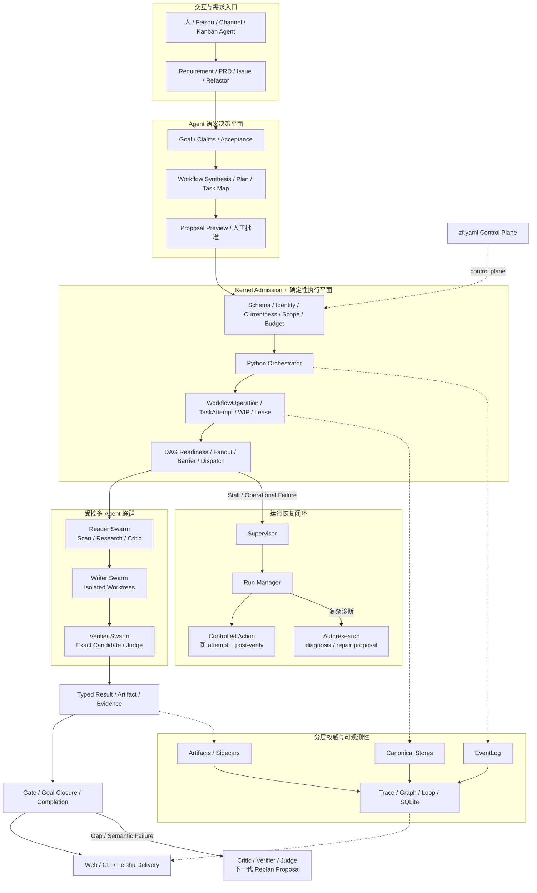
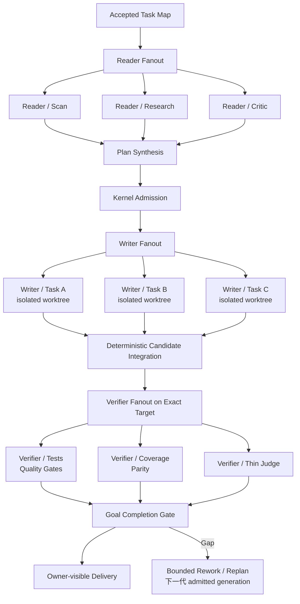

# ZaoFu 架构总览

[English](architecture.en.md) · [概念索引](concepts/README.md)

> 面向需要理解运行边界的操作者和贡献者。第一次使用优先走
> [首个可验证交付](getting-started/first-verified-delivery.md)。本文按当前代码和测试
> 描述 Product Flow 与兼容模式，不把历史三层 safe-team 外推为全局事实。

## 1. 产品定位

ZaoFu 是面向 long-horizon 软件交付的 AI Agent Delivery Control Plane / Coding
Harness。它把 Goal、Task、Agent、代码、测试、证据、恢复和人工决定组织进同一个可观察、
可恢复、可审计的交付系统。

ZaoFu 不替代 Codex、Claude Code 或其他 Provider Agent。Provider 继续负责语义理解、
代码实现和工具执行；ZaoFu 管理确定性运行边界和团队交付状态。

```text
idea / PRD / issue / refactor
  -> intake / confirmed goal
  -> approved workflow / task map
  -> contracted agent attempts
  -> independent verification
  -> goal closure / completion gate
  -> owner delivery or bounded terminal blocker
```


## 2. 五个架构支柱

ZaoFu 的能力不是若干 Agent 的简单集合，而是五类工程机制共同组成的交付系统：

| 支柱 | 解决的问题 | 当前边界 |
|---|---|---|
| Goal Engineering | 把需求固定为 Goal、Claims、Acceptance、Non-goals 和完成定义 | Task done 不自动等于 Goal closed |
| Graph Engineering | 把 Goal 编译为 Workflow、Task Map、依赖、wave、fanout、barrier 和 evidence producer | Agent 生成语义图，Kernel 只执行已准入图 |
| Swarm Engineering | 让多个角色、Provider 和 Worker 并行研究、实现、验证与聚合 | 有界 fanout/fan-in；不允许无限递归招募或旁路状态机 |
| Loop Engineering | 让交付在 verify、rework、replan、recovery 和 completion 中持续收敛 | 每个 loop 有 attempt、预算、证据和终止上限 |
| Harness Engineering | 管理上下文、工具、worktree、事件、状态、artifact、安全和可观测性 | Provider Agent 不拥有 canonical state |

这五个支柱共同回答“做什么、如何拆、由谁做、如何迭代、凭什么算完成”。其中
Graph、Swarm 和 Loop 都运行在同一 Harness 权威边界内，不各自建立新的任务真相。

## 3. 分层运行权威

ZaoFu 不是纯 event-sourcing，也不是由一个 JSON 文件独占全部事实。

| 层 | 载体 | 权威范围 | 合法写入者 |
|---|---|---|---|
| 控制平面 | `zf.yaml` | topology、role、policy、budget、safety、`project.state_dir` | 人或受控配置工具 |
| 发生账本 | `events.jsonl` + archive segments | occurrence、ordering、causation、verdict、ref | `EventWriter` / `EventLog` sanctioned path |
| 当前状态 | Task、Feature、Session、RoleSession、TaskAttempt stores | 当前状态、assignment、lease、attempt | Kernel store/helper |
| 完整语义 | artifacts、sidecars、accepted packages | plan、Task Map、result、evidence、大 payload | 原子 sanctioned writer |
| 查询投影 | SQLite、Trace、Graph、Loop、Web summaries | 查询、聚合、可视化、freshness | projector/read-model builder |
| 活跃传输 | SSE、LiveDeltaBus、provider stream | 短时 delta | transport/runtime |

重要边界：

- event 可以权威证明一次动作发生并引用结果，但完整正文可以在 sidecar；
- TaskStore 回答当前 Task 状态，EventLog 回答某次 transition 是否发生及其因果；
- required artifact 不是可丢弃 projection；
- SQLite、Graph、Trace 和 Web 页面可以重建，但不能反向写调度 truth；
- 当前并非所有 canonical stores 都能只靠 `events.jsonl` 完整重建。

## 4. 语义决策平面与确定性执行平面

ZaoFu 将 Agent 擅长的开放式判断与 Runtime 必须保证的可靠执行分开：



| 组件 | 当前职责 |
|---|---|
| Kernel / Python `Orchestrator` runtime | 配置加载、identity、机械 dispatch、schema/gate、replay、状态迁移和外部副作用 |
| Worker Agents + Skills | 计划、实现、评审、验证、诊断和产品判断；只报告 typed 结果或意图 |
| configured `orchestrator` role Agent | 稳定 session identity、异常语义分诊、replan/proposal；在当前 Product Flow 中不是全程 blocking 的 semantic run owner |
| Supervisor | 观察、关联和 attention；不直接修复 |
| Run Manager | 处理 operational liveness，选择有界恢复动作并要求 post-verification |
| Autoresearch | 复现重复 harness fingerprint，产出隔离 diagnosis/repair proposal |
| ControlledActionService | 应用已批准、可审计的确定性副作用 |
| Web / CLI / Feishu | 读取 projection、提交 intent、请求 token-gated controlled action |

确定性 Python `Orchestrator` 与名为 `orchestrator` 的 Agent role 是两个不同对象。当前代码
仍以前者作为 Workflow 快乐路径执行协调器；候选设计中的 OA 全程 semantic-control 或
blocking checkpoint 不能当作现行生产默认。

## 5. 两种编排模式

### Product Flow

适用于 PRD、Issue、Refactor、Research 和长期产品交付：

```text
typed event/artifact
  -> Kernel topology/profile route
  -> deterministic WIP/role/worker dispatch
  -> Worker result/evidence
  -> mechanical gate/reducer
  -> exceptional semantic triage/replan proposal
  -> ControlledActionService applies an approved action
```

快乐路径由 Kernel 根据已批准 topology/profile 调度。Agent 决定项目语义、计划和方案；
Kernel 不把 acceptance、scan 方法或产品判断硬编码进 Python。

### Legacy safe-team

显式兼容 profile 可以让 Layer 2 Agent 做目标拆解、合同合成和 assign，再由 Kernel 校验
和执行机械转移。它适合兼容、教学或手工编排，不代表 Product Flow 的全局 ownership。

文档、测试和扩展必须标明自己针对哪种模式。

## 6. 受控多 Agent 与蜂群执行

ZaoFu 支持“蜂群”，但这里的蜂群是 **bounded, typed, observable swarm**：多个 Agent
可以并行工作、独立验证并聚合结果，每个 child/Task/attempt 都有身份、范围、预算、
上下文和证据；Kernel 仍是唯一调度状态机。

### 当前支持矩阵

| 能力层次 | 当前状态 | 运行边界 |
|---|---|---|
| Channel Group 多角色讨论 | 已实现 | 人与多个 Agent 可自然讨论或显式 `multi_lens`，Owner 确认 PRD；讨论不自动创建 Task 或点火 Workflow |
| Reader fanout/fan-in | 已实现 | 多个只读角色并行研究/扫描，按 `wait_for_all` 或 synth contract 聚合 |
| Writer fanout | 已实现 | Task Map 中独立 Task 可进入隔离 branch/worktree，冲突、scope 和 candidate admission fail-closed |
| Task Map wave/lane | 已实现 | Kernel 根据依赖、wave、WIP 和 currentness释放工作，不由主 Agent逐条手工派发 |
| 静态 replicas 与兼容 role autoscale | 已实现、需配置 | `zf.yaml` 声明上下限；Runtime 按 ready Task、cooldown 和 worker health 扩缩，dirty workdir 阻止回收 |
| On-demand Worker lifecycle | 已实现、需 Provider 支持 resume | dormant role 在 dispatch 前激活，settled/idle 后按准入条件 suspend |
| 跨 Provider 协作 | 已实现 | Codex、Claude Code 等按 role/backend 组合，独立 verify 不复用实现者自述 |
| Provider-native compound children | opt-in Research pilot | 仅 root 是 ZaoFu protocol actor；当前 pilot 最多 4 个、深度 1、只读 child，不能创建 canonical Task |
| Task-centric 弹性 Stage Worker Pool | 尚未实现 | 逻辑 Task、attempt、session、worktree 与物理 placement 尚未完全解耦，不能把 generic autoscale 冒充弹性 lane pipeline |

典型软件交付蜂群链路是：



### 受控动态 Workflow

动态不等于运行中任意改图。当前可发布路径是：

```text
Requirement
  -> Agent/Skill synthesizes typed FlowSpec
  -> graph/config diff + preflight
  -> exact proposal approval
  -> frozen effective config + Run Contract
  -> Kernel executes registered operations and typed dependencies
```

Active Run 中的变化通过受控 replan、new generation 或已注册的只读 continuation 进入；
Agent 不能热改 `zf.yaml`、发明任意 handler/event，或递归创建无上限的 Agent。高频 PRD、
Issue、Refactor 使用稳定 controller，长尾场景使用 static-safe Generic Workflow。

### 蜂群不变量

- child 不能直接写 TaskStore、EventLog 文件或 Run terminal；只提交 sanctioned result/evidence；
- fanout 必须有 parent/run/generation/child identity、聚合合同、timeout 和失败路由；
- writer 必须使用明确 scope 和隔离 workdir，shared/exclusive file 冲突由 Kernel 串行化或拒绝；
- Provider-native child 不成为新的 ZaoFu Agent/Task，也不能递归越过配置预算；
- autoscale 只能在 `zf.yaml` 的 role policy 内增减兼容实例，不能修改 canonical topology；
- aggregate、Verify 或 Judge 的文本不能绕过 Completion Gate 自行宣告 Goal 完成。

## 7. 当前 Runtime 路径

```text
zf start
  -> load zf.yaml + project.state_dir
  -> start tmux and/or stream-json transports and sidecars
  -> EventWatcher tails events.jsonl
  -> wake-worthy event calls Orchestrator.run_once()
  -> topology/profile selects mechanical next work
  -> briefing + contract + required inputs reach worker
  -> worker emits facts/results/evidence
  -> reducers/gates update sanctioned state
```

Watcher 也周期 tick，用于 liveness、continuation、projection refresh 和恢复扫描。只启动
tmux 而没有 watcher，长期 Workflow 可能不会继续推进。

## 8. Task、Workflow 与 Run

- Task 是带 `contract` 的 canonical 工作单元，包含行为、范围、验收、验证和 owner。
- Workflow 是已注册 topology/route，不从聊天文本即时发明 Kernel 控制逻辑。
- Task Map 连接 Goal Claims、Tasks、依赖、wave、scope 和 evidence producer。
- 动态 Workflow 先形成 typed proposal；只有批准并冻结到 Run Contract 后才可执行。
- TaskAttempt 在 transport 前持久化 identity/lease，迟到结果必须通过 currentness 校验。
- Run 冻结本次 proposal/effective config/goal/generation，并收敛到排他 terminal。
- `Task done` 不等于 Goal closed；Closure 和 Completion Gate 重新核对 mandatory Claims。

## 9. 交付与恢复闭环

| Loop | 形态 |
|---|---|
| Delivery | intake -> plan -> task map -> impl -> verify -> Thin Judge -> completion gate -> ship |
| Quality | contract -> typed result -> evidence gate -> pass / negative handoff |
| Recovery | failure/stall -> Supervisor -> Run Manager -> controlled action -> post-verify |
| Harness improvement | repeated fingerprint -> Autoresearch -> isolated proposal -> verify/apply |
| Human approval | Plan hold -> approve/reject -> execute、repair 或 stop |

Run continuation 每次只选择零或一个 current operation。重复无进展达到上限后必须带证据
收敛为 blocked，而不是长期 active 或无限重试。

## 10. 安全与约束

- Worker/Agent 只能通过 `zf emit`、受控 CLI、artifact 或 controlled action 报告事实/意图。
- Integrations 和 Web 不直接写 canonical business state。
- Protected paths、scope、tool closure、budget、nonce/signature 等按 `zf.yaml` 生效。
- Provider CLI 能修改代码并花费预算，真实运行前必须 validate、preflight 和审核 scope。
- Operator token 不进入 provider session。
- Project-specific acceptance、parity 和 semantic gates 属于 skills/prompts/artifacts；Kernel 只做机械可验证边界。

部分安全能力需要显式配置。不要把“代码支持”误写为“所有项目默认启用”。

## 11. `project.state_dir`

默认 `.zf/` 是运行态，不是源代码：

| 内容 | 类型 |
|---|---|
| `events.jsonl` | append-only occurrence ledger |
| `kanban.json`、`feature_list.json` | canonical current stores |
| `task_attempts.json`、session stores | attempt/lease/session identity |
| `artifacts/`、sidecars、accepted packages | 完整语义和证据 |
| `projections/`、SQLite、Trace/Graph/Loop | 可重建读模型 |
| `workdirs/` | 隔离 worktree/checkout |
| `logs/`、transcripts | 运行日志和 provider payload |

不得手工编辑这些 canonical 文件。使用 Store/helper、`zf` CLI 或 controlled action。

## 12. 下一步

- [从目标到可验证交付](concepts/delivery-control-model.md)
- [Harness 运行流程](04-harness-runtime.md)
- [Plan、Task Map 与调度](13-plan-task-map-orchestrator-dispatch.md)
- [Product Fanout 真实 E2E](18-product-fanout-real-e2e.md)
- [上下文、Artifact 与 Handoff](operations/context-handoff-artifacts.md)
- [观察一次交付](operations/observe-delivery.md)
- [恢复长期 Run](operations/recover-long-running-run.md)
