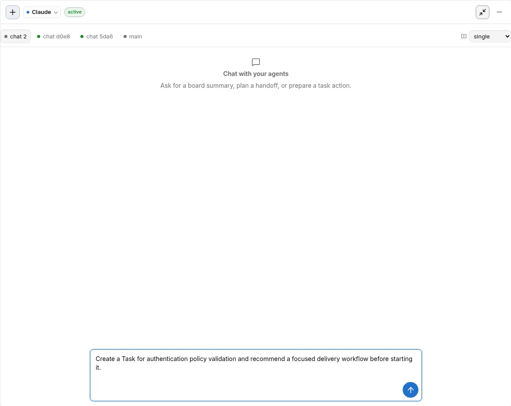

# First Verified Delivery

[中文](first-verified-delivery.md) · [Getting-started index](README.en.md)

> Goal: start from a source checkout and a target repository, create a real
> Task, approve its Workflow, and use Delivery to inspect execution, evidence,
> and terminal state. The complete branching path remains in the
> [Quick Start](../01-quickstart.en.md).

## 1. Prepare

You need Python 3.11+, `uv`, Git, `tmux`, and an authenticated Codex CLI or
Claude Code CLI.

```bash
git clone https://github.com/uisee-ai/zaofu /path/to/zaofu
cd /path/to/zaofu
uv sync --extra dev --extra web --extra stream-json
uv run zf --version
```

Start the Workspace Dashboard:

```bash
export ZAOFU_ROOT=/path/to/zaofu
"$ZAOFU_ROOT/tools/start-webkanban.sh" \
  --host 127.0.0.1 \
  --port 8001 \
  --workspace-only
```

Open `http://127.0.0.1:8001/`. Bind to `0.0.0.0` only on a trusted network.

## 2. Establish The Project

1. Complete the first-run Bootstrap.
2. Select `Add Project` and enter the target repository's real absolute path.
3. Review Project Name, Brief, Stack, Primary Provider, and Mixed Team.
4. Initialize and open the Project.

This creates the Project container, `zf.yaml`, and state directory. It does not
create a Task or start a Workflow.

## 3. Start The Runtime

From the target Project root:

```bash
cd /path/to/project
uv run --project "$ZAOFU_ROOT" zf validate --cold-start
uv run --project "$ZAOFU_ROOT" zf start
```

`validate` refreshes last-known-good and validation-report caches under the
state directory; it does not change Task, Run, or event facts.

Workers being idle before an approved Workflow exists is expected.

## 4. Create A Task And Approve A Workflow

Open Kanban Agent and provide an objective with an acceptance outcome:

```text
Add structured failure reasons and regression tests for login audit events.
Create a tracked Task first, then recommend a delivery Workflow and let me
approve it before execution.
```

The product path is fixed:

```text
Create Task proposal
  -> human confirms the Task
  -> Task-bound Workflow Plan
  -> choose a route, or Chat about / Customize
  -> exact Workflow proposal
  -> independent Approve
  -> workflow.invoke.requested
```

A Plan fixes the selection; it is not authorization. Only `Start workflow`
starts the Run.



## 5. Observe And Accept

Inspect the Web surfaces in this order:

1. `Tasks`: Task status, owner, contract, and current stage.
2. `Delivery -> Graph`: whether each mandatory Claim has a covering Task and closes across Plan,
   Implementation, Verification, and Closure, including Gaps and generation/currentness.
3. `Delivery -> Runs`: the Run graph plus Task attempts, gates, events, evidence, and regression actions
   in the Inspector.
4. `Traces`: drill down from a verified canonical Trace reference only when temporal or Span causation is needed.
5. `Monitoring -> Runs`: the terminal Goal Dossier.
6. `Inbox`: approvals, blockers, and owner-visible delivery.

The CLI reads the same facts:

```bash
uv run --project "$ZAOFU_ROOT" zf kanban --board
uv run --project "$ZAOFU_ROOT" zf task trace TASK-ID
uv run --project "$ZAOFU_ROOT" zf events --last 50
```

## Definition Of Done

A first delivery is complete only when:

- the Task is bound to an approved Workflow and Run;
- implementation and verification results have traceable evidence refs;
- mandatory Claims are closed or have an explicit blocker and next action;
- the Run converges to completed, blocked, failed, or cancelled instead of remaining active indefinitely;
- a completed Goal Dossier agrees with the owner receipt.

An agent's final “done” message is not one of these mechanical conditions.

## Stop

```bash
uv run --project "$ZAOFU_ROOT" zf stop
```

Do not run `tmux kill-server` on a shared host.
