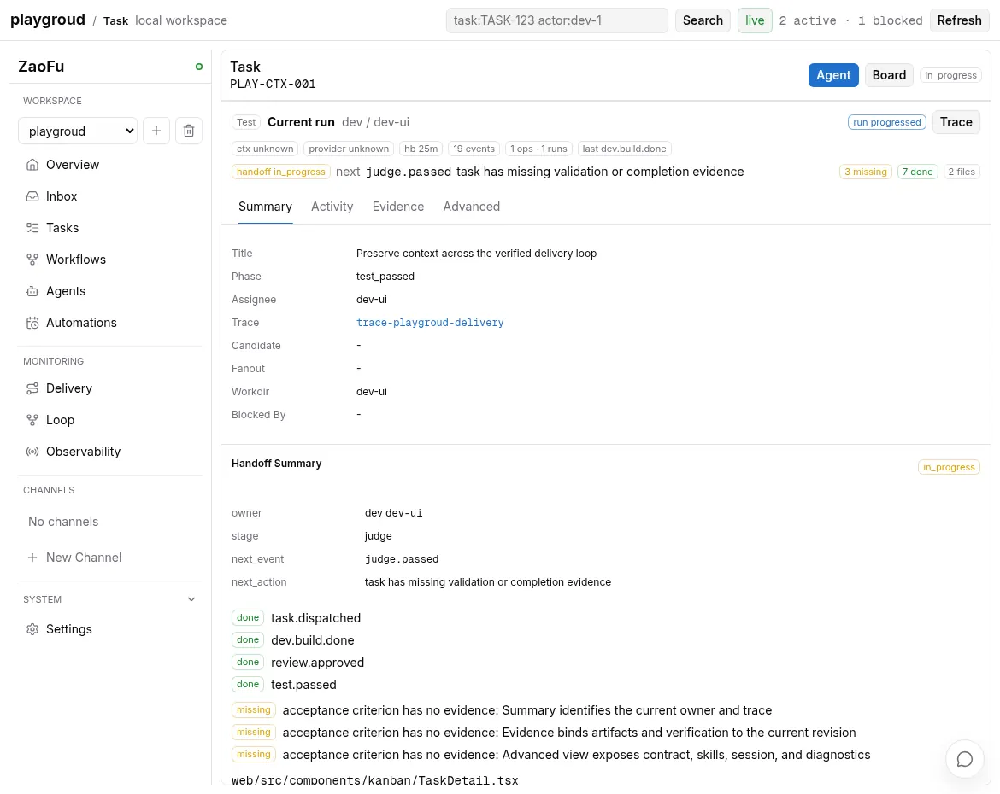

# Context, Artifacts, And Handoff

[中文](context-handoff-artifacts.md) · [Operations index](README.en.md)

> Goal: when an agent, session, provider, or stage changes, do not reconstruct
> the current objective, contract, code revision, and evidence from chat memory.
> Immutable artifacts/sidecars keep complete semantics; queries and briefings
> deliver only the current attempt's required slice.

## Keep Three Kinds Of Content Separate

| Content | Current carrier | Purpose |
|---|---|---|
| Current identity/state | Task/Session/TaskAttempt stores and EventLog verdicts/refs | Decide which run, generation, attempt, and contract are current |
| Complete semantic body | artifacts, sidecars, accepted packages | Preserve plans, Task Maps, results, evidence, diagnostics, and conversation bodies |
| Query/context projection | SQLite catalog, StatePacket, Goal Dossier, briefing sections | Find, aggregate, and deliver bounded context without becoming authority |

An event preview, filename, Web badge, or transcript excerpt does not replace a
required artifact body and digest check.

Task Summary, Activity, Evidence, Advanced, and Agent resources are different
read-only slices of the same delivery context; changing views does not mutate
canonical state:



## Attempt Source Manifest

Each provider attempt should receive an explicit input manifest containing:

- current TaskContract and revision;
- target/source revision;
- Task Map generation and Plan Package;
- stage required reads;
- previous admitted result, negative feedback, or recovery delta;
- artifact identity, locator, digest, access scope, and retention;
- actor, role, provider, and purpose.

The exact occurrence must be authorized before body hydration. Knowing a ref
exists does not authorize the current Actor to read it.

## Query Current Context

Agent-facing Task capsule:

```bash
zf ctx --task TASK-ID --mode implement --json
zf ctx --task TASK-ID --mode check --json
```

Attempt inputs and read state:

```bash
zf attempt inspect ATTEMPT-ID
zf artifact list --attempt ATTEMPT-ID --json
zf attempt missing-reads ATTEMPT-ID
```

Read an authorized bounded body:

```bash
zf artifact read \
  --attempt ATTEMPT-ID \
  --source SOURCE-ID \
  --artifact ARTIFACT-ID \
  --max-chars 12000
```

This command runs only inside a dispatched attempt's Worker context, where the
runtime injects an attempt-scoped credential. A normal operator shell fails
closed and appends denial audit evidence. A successful read appends read
evidence. A missing required read should be hydrated or
repaired within the same protocol attempt; “the Agent did not read its input”
must not become product-semantic rework.

## Artifact Catalog And Lineage

The SQLite catalog accelerates object, occurrence, and lineage queries but is
not a current selector:

```bash
zf artifact catalog list --help
zf artifact catalog show --help
zf artifact catalog lineage --help
zf projection status --json
zf projection doctor --projection artifact-catalog --json
```

One content digest may have several occurrences. Permission, Task, stage, and
event context belong to an occurrence and must not be unioned onto the content
object. When the catalog is stale or corrupt, dispatch-critical paths use the
canonical resolver or fail closed.

## Handoff And Session Continuity

Human-readable or Agent resume packets:

```bash
zf handoff --format md
zf handoff --format state-packet --task TASK-ID --score
```

A reliable handoff includes:

- current Task, Run, attempt, dispatch, and owner;
- objective, contract, scope, non-goals, and acceptance;
- target revision and worktree/branch evidence;
- completed work and admitted results;
- unresolved feedback, required reads, and next action;
- refs/digests instead of a copied full transcript.

Provider-session resume preserves conversational continuity but does not own
Task truth. After session rotation, provider change, or agent handoff, the new
briefing/context envelope is rebuilt from canonical facts, not from the old chat
as if it were the current contract.

## Freshness And Currentness

Before adopting a result, verify:

1. run, Task, attempt, operation, and dispatch identity;
2. Task Map generation and contract revision;
3. target/source commit;
4. artifact digest and schema;
5. admitted result event/ref;
6. required-read ledger;
7. superseded and terminal state.

Any mismatch produces a stale diagnostic, a ref repair, or a new attempt. A late
result must not replace the current result.

## Data And Authority Boundaries

- Large stdout/stderr, provider output, conversation bodies, and context packages belong in sidecars, not event previews.
- Artifact reads are constrained by PathGuard, access scope, actor/purpose, and retention.
- SQLite is rebuildable and cannot be written by an Agent to influence dispatch.
- Required artifact hydration fails closed; optional UI sidecars may degrade.
- Bodies and memory are not propagated across Projects automatically.

## Definition Of Done

A cross-Agent or cross-session handoff is complete when the receiver can obtain
the current Goal, Task, Contract, Target, required inputs, admitted results,
unresolved feedback, and next action without reading the old full transcript,
and required-read evidence is recorded.

## Related

- [Observe a delivery](observe-delivery.en.md)
- [Skills, workdirs, and Git evidence](../05-skills-workdirs-git-evidence.en.md)
