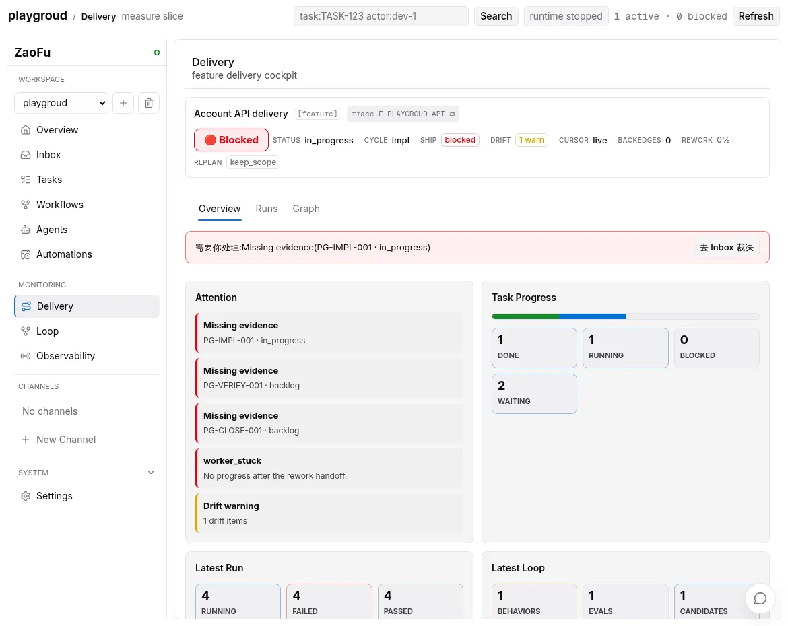

# Recover A Long-Running Run

[中文](recover-long-running-run.md) · [Operations index](README.en.md)

> Recovery does not guarantee every Run succeeds. It makes the Run produce
> material progress again or converge within bounded attempts to completed,
> blocked, failed, or cancelled with evidence.

## Four Responsibilities

| Component | Responsibility | It must not... |
|---|---|---|
| Supervisor | Observe and correlate failures/stalls, then raise attention | Kill, retry, or mutate state directly |
| Run Manager | Select at most one bounded recovery action from current facts | Execute conflicting actions from an old snapshot |
| ControlledActionService | Validate and apply an authorized deterministic action | Accept requests without currentness or authority |
| Autoresearch | Reproduce repeated fingerprints and produce diagnosis or an isolated repair proposal | Apply mainline changes directly or claim false success |

Agents may report findings and recommend replan. They cannot write the
continuation projection or Run terminal directly.

## Diagnose Before Retrying

```bash
zf status --workers
zf task trace TASK-ID
zf events --last 120
zf recover workflow --dry-run --json
zf projection doctor --projection all --json
```

Dry-run appends no recovery event and changes no canonical Task or Run state.
It still writes a rebuildable workflow-resume projection for Web readback and a
later apply.

Determine:

- provider/transport failure versus semantic verification failure;
- whether Task, Run, generation, attempt, and dispatch identities are current;
- whether a pending handoff is truly missing rather than settled or replayed;
- whether the blocker is setup, artifact, gate, lane, dependency, budget, or product semantics;
- whether a higher-priority replan, repair, or terminal decision already exists;
- whether stale projection state affects presentation only.

## Continuation Model

Each active Run's `run-continuation.v1` selects zero or one `next_operation`:

```text
events + stores + artifacts
  -> deterministic continuation reducer
  -> zero or one current next_operation
  -> ControlledAction
  -> outcome/progress evidence
  -> replay
```

Operation identity binds run, generation, scope, checkpoint, and failure
fingerprint. Replay reuses that identity; material progress or a new generation
creates a new operation.

The `playgroud` animation follows one Run from blocker, recovery planned, and
action applied to a passed post-verification check. Delivery then continues into
Verify; recovery success is not presented as completion of the whole Goal.



## Recover A Pending Handoff Manually

After the canonical-read-only preview, an operator may idempotently recover an exact checkpoint:

```bash
zf recover workflow \
  --resume-pending \
  --checkpoint-id CHECKPOINT-ID \
  --json
```

Provide `--task-map-ref` only for an operator-reviewed replacement Task Map.
`--force-gate-dispatch` is an explicit override of the normal gate dispatcher;
it requires separate rationale and audit and is not a normal retry button.

## When To Replan

Do not blindly retry the old action when:

- file, API, dependency, or environment assumptions are false;
- acceptance or its evidence producer is unsatisfiable;
- repeated identical fingerprints indicate a planning defect;
- scope, Tasks, ACs, dependencies, or topology must change;
- a stale-generation result or handoff cannot become current.

An Agent or Planner produces a semantic replan artifact/proposal. The Kernel
then validates identity, currentness, authority, and admission before
materialization. Completed Tasks are not silently rewritten; replacement or
correction Tasks preserve lineage.

## No Progress And Terminal State

Repeated resume is not progress. When the same scope/action reaches the
no-progress cap without a positive Task, fanout, verify, judge, or delivery
milestone, the system should:

1. record one no-progress break;
2. stop consuming the old recovery action;
3. record one `run.goal.blocked` with fingerprint and evidence ids;
4. stop selecting operations for the terminal Run.

This is more correct than indefinite active state and continued spend. A valid
new generation or human approval may begin another controlled continuation but
does not erase the old terminal evidence.

## Common Failure Classes

| Class | Direction |
|---|---|
| queued lane wait | Diagnose scheduler/lane state; do not consume a provider semantic attempt |
| transport/start failure | Repair provider/session/transport and redeliver idempotently |
| implementation failure | Return to the current implementation owner with the original finding |
| verification failure | Negative handoff or semantic replan, not a transport retry |
| candidate setup/gate | Repair setup or contract in the correct candidate worktree |
| artifact/currentness | Repair ref/digest/generation/read; never adopt a stale result |
| repeated harness fingerprint | Diagnose with Autoresearch instead of patching the same Run forever |

## Definition Of Done

Recovery is complete through one of these outcomes:

- the Run produces a new material progress milestone;
- a replan/replacement owns the issue and the old attempt is explicitly superseded;
- the Run converges to terminal with blocker, evidence, owner, and next action;
- a recurring harness problem becomes an isolated, verifiable Autoresearch result.

“The worker is alive” and “the command ran again” are not recovery completion.

## Related

- [Observe a delivery](observe-delivery.en.md)
- [Troubleshooting](../07-troubleshooting.en.md)
- [Autoresearch](../10-autoresearch-usage.en.md)
